# L2 Hostility

_**Note: These mechanics and recommendations are subject to change due to ongoing ATM: Arcana Balancing with the L2 system.**_

## Introduction

L2 Hostiles adds an adaptive difficulty system where mobs become **stronger** and gain special **abilities** (Traits) based on **player progression** and location. It aims for a **more dynamic** and **challenging** experience compared to vanilla or mods like Champions, Scaling Health, or Infernal Mobs, featuring player-specific difficulty scaling and mechanics for creating safe zones. [For information in the curios specific for L2Hostility click here.](../mods/curios-and-relics.md#hostility-curse-slot)

## Understanding L2 Difficulty & Mob Levels

L2 features an adaptive difficulty system. Mobs gain levels, Traits, increased health, and increased damage based on several factors. You generally won’t encounter high-level mobs with powerful traits early on.

* \*\*Mob Level Factors:\*\*A mob’s level is determined by:
  * The dimension it’s in.
  * The biome it’s in.
  * Its exact position (distance from origin/spawn).
  * The **difficulty level of nearby players**.
  * The entity type (some mobs have base level adjustments).
* **Player & Chunk Difficulty:** Difficulty is tracked per-player and per-chunk section. Killing mobs increases these values; dying decreases player difficulty.
* **Mob Equipment:** Higher mob levels can also affect the equipment and enchantments mobs spawn with (primarily applies to vanilla mobs using vanilla equipment).
* **Checking Difficulty:** Use the `Hostility Detector` item or check the `Difficulty Information` tab in your inventory/player screen to see the difficulty level of your current location and your personal difficulty.

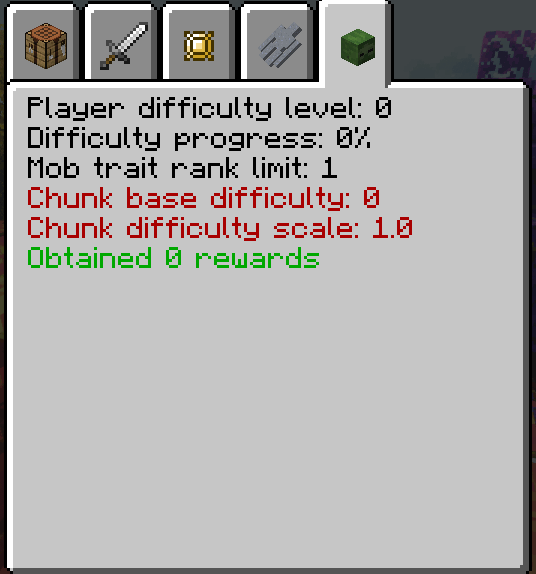

### Ways to Increase Player Difficulty

* **Kill Mobs:** The primary method of gaining difficulty.
* **Drink a Cursed Bottle:** The **most efficient** way to quickly raise difficulty, giving **+50 levels** per bottle consumed.
* **Wear Difficulty Curios:** Equip specific Curios that grant bonus of +50 difficulty levels. The currently available options are shown below:

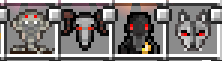

_(Note: From left to right: `Curse of Envy`, `Curse of Greed`, `Curse of Lust`, `Curse of Warth`)_

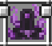

_(Note: `Abyssal Thorn` can only be wear in the `L2Hotility - Curse` curios slot while the other 4 can go in the `Charm` slot)_

* **Visit New Dimensions:** Entering dimensions for the first time can increase difficulty giving a +2 lvl of difficulty for each dimension. Most of the dimensions will add a multiplicative of 1.5x of you current level allowing to mobs to reach a maximum level of 3000; in the overworld this multiplicative vary between 1x and 1.5x.
* **Travel Far from Origin:** Moving a significant distance away from the world spawn point increases difficulty.
* **Explore High-Difficulty Areas:** Visit biomes or dimensions that inherently possess a higher base difficulty rating.

### Ways to Decrease Player Difficulty

* **Die:** Player death reduces difficulty (ensure the `keepInventory` gamerule is `false` for this to apply).
* **Drink a Bottle of Sanity:** The **most efficient** way to quickly lower difficulty.

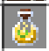

* **Use a Hostility Orb:** Creates a localized safe zone (chunk section) around the orb where difficulty is permanently nullified, preventing high-level mobs from spawning there. To use it, equip `Detector Glasses` and hold the `Detector Glasses` in your off-hand while placing/interacting with the `Hostility Orb`.

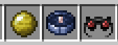

* ~~**Wear Difficulty Nullifying Curios:** Equip specific `Divinity Light` that force your difficulty rating to 0.~~ (Currently unobtainable due to the required trait `Killer Aura` being disabled by default).
* **Wear Difficulty Maintainer Curios:** Equip the `Curse of Sloth` to prevent gaining further difficulty levels from most sources.


## Expected L2 Progression Path

This outlines the general steps expected for progressing through L2 content:

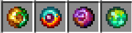

_(Note: From left to right: `Unpolished Looting Charm`, `Magical Looting Charm`, `Chaotic Looting Charm`, `Miraculous Looting Charm`)_



#### Craft the **Lv.1 Looting Charm**

`Unpolished Looting Charm`.



#### Use the Looting Charm to obtain vanilla materials not typically available in the Overworld

Use mob drops to obtain vanilla materials not typically available in the Overworld.



#### Craft the **Lv.2 Looting Charm**

`Magical Looting Charm`.



#### Collect `Cursed Droplets`

Kill mobs that possess specific Traits (`Adaptive`, `Cursed`, `Erosion`, `Corrosion`) to collect `Cursed Droplets`. Alternatively, burn mob drops in fire/lava for a low chance to obtain droplets (`Nether Stars` have the highest chance at 1/64 - check JEI/EMI for details). You can do the same automation setup as the one showed below for the `Hostility Essence`.

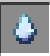



#### Craft a `Bottle of Curse`

Craft a `Bottle of Curse` using Cursed Droplets.

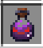



#### Obtain `Captured Wind`

Obtain `Captured Wind`. Craft `Wind Capturing Bottle`, get at least a `Novice Spell Book` from **Ars Nouveau** (higher tiers spellbooks and gear is recommended to have more mana), and create a spell like `Self -> Launch -> Amplify x3 -> Glide` _(Note: you need to be gliding to it to work)_. Spam this spell with empty bottles in your inventory to fill them.

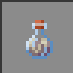 



#### Craft a `Chaos Ingot`

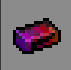



#### Craft the **Lv.3 Looting Charm**

`Chaotic Looting Charm`.



#### Craft the `Curse of Envy`

Equipping this enables mobs to drop **Trait Symbols** corresponding to their traits.



#### Continue killing mobs to collect specific **Trait Symbols**



#### Use Trait Symbols as crafting ingredients

Use Trait Symbols as crafting ingredients for better gear and potentially other L2 items.



#### Craft the `Curse of Gluttony`

This provides a more sustainable source for `Bottles of Curse`.





#### Burn `Bottles of Curse` to obtain `Hostility Essence`

Burn `Bottles of Curse` in lava/fire to obtain `Hostility Essence`. The chance is low (1 in 512), so automation is recommended. Example: A `Barrel` feeding bottles onto a **Create**`Chute` over lava, with a **Sophisticated Storage**`Barrel` + filtered `Magnet Upgrade` nearby to collect the essence.

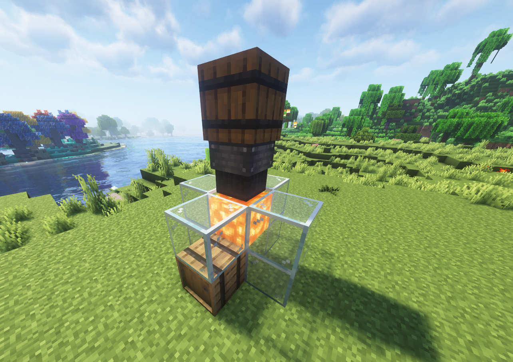

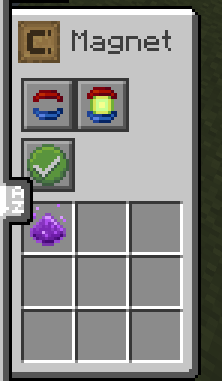



#### Craft a `Miracle Ingot`





#### Craft the **Lv.4 Looting Charm**

`Miraculous Looting Charm`.



_Note: You can equip multiple **Looting Charms** and **Curses** simultaneously to benefit from all their effects at once._

## Recommendations & Strategies

_Note: Enchantments from L2 Hostility can often be crafted using materials obtained via the Looting Charms._

* **Essential Enchantments:** Prioritize obtaining the `Hardened` (mitigates `Corrosion`/`Erosion`) and `Insulator` (reduces `Repelling`/`Pulling` force) enchantments.
* **Damage Types:** Focus on dealing `Magic` or `Abyss` damage types, as some traits resist physical damage (e.g., `Reflect`, `Dementor`). Be aware of the `Adaptive` trait, which allows mobs to gain resistance to damage types they’ve taken recently.
* **Potions & Magic:** Utilize potions and magic systems effectively (e.g., **Ars Nouveau**, **Iron’s Spellbook**). ~~`Cursed` potions/weapons are needed for the `Undying` trait~~ (but `Undying` is disabled by default).
* \*\*Helpful Gear/Items:\*\*Consider using items such as:
  * `Flame Thorn` (from **L2Hostility**) combined with magic damage wands (from **Glimmering Tales**).
  * `Imagine Breaker` (from **L2Hostility**).
  * Abyss weapons (from **L2Weaponry**).
  * `Void Touch` enchantment (from **L2Complements**).
  * `Detector Glass` (to see invisible mobs).
  * The various **Curio items** added by **L2Hostility** (28 total!) offer significant boosts and abilities.
  * `Hostility Detector` (to check current difficulty levels).
  * `Hostility Orb` (to create safe zones).

## L2 Traits Overview

Mobs gain traits based on their level and player difficulty. Higher-level traits appear as difficulty increases. Use the in-game Patchouli book (or JEI/tooltips if applicable) for detailed info on specific traits. To see how to make a Mob Farm to get these traits go to the [Enderman Farm (L2 Trait Symbol Focus)](../mods/mob-farms.md#__tabbed_3_2).

**(Default Disabled Traits: `Undying`, `Killer Aura`, `Ragnarok` are powerful Legendary traits that are DISABLED by default in the configuration but can be re-enabled via config/datapack.)**

### Regular Traits

* `Fiery`: Ignites attacker/target on hit.
* `Invisible`: Mob and equipment are invisible (use `Detector Glass`).
* `Protection`: Gains Damage Resistance effect.
* `Regenerate`: Regenerates health slowly.
* `Speedy`: Moves very quickly.
* `Tank`: Gains significantly more health and armor.
* `Shulker`: Shoots shulker-like projectiles applying carried potion effects (no levitation).
* `Gravity`: Increases gravity nearby (fall faster, jump lower).
* `Moonwalk`: Decreases gravity nearby (fall slower, jump higher).
* `Counter Strike`: Dashes back at the attacker after being hit and landing.

### Advanced Traits (Appear Lv.100+)

* `Adaptive`: Remembers damage types recently taken and gains resistance to them. Higher levels remember more types.
* `Reflect`: Reflects direct physical damage (use projectiles or magic).
* `Grenade`: Shoots explosive projectiles periodically.
* `Growth` (Slime-only): Grows larger when healed to full health. Can become very large.
* `Split`: Splits into two copies with half level and the same trait (`Split` level -1) upon death. Copies drop no loot.
* `Drain`: Removes random positive effects and extends negative effects on hit. Deals more damage if the target has negative effects.
* `Reprint`: Copies target’s equipment enchantments on hit. Damage increases based on target’s total enchantment levels.
* `Corrosion` (Lv.200+): Damages target equipment durability based on _missing_ durability on hit (Counter with `Hardened` enchantment).
* `Erosion` (Lv.200+): Damages target equipment durability based on _remaining_ durability on hit (Counter with `Hardened` enchantment).

### Potion Traits

Inflict corresponding status effects on hit:

* `Blinder`: Blindness
* `Distorter`: Nausea
* `Levitater`: Levitation
* `Stray`: Slowness
* `Weakener`: Weakness
* `Poisonous`: Poison
* `Withering`: Wither
* `Cursed`
* `Soul Burner`
* `Freezing`

### Legendary Traits (Unlock after killing Rank 5 trait mob, Appear Lv.100+)

* `Dementor`: Immune to physical damage; attacks bypass armor.
* `Dispelling`: Immune to magic damage; attacks bypass magic protection. Can temporarily disable enchantments on target’s gear.
* `Teleport`: Teleports to avoid physical damage (use **magic**).
* `Repelling`: Pushes entities away (Counter with full `Insulator` set).
* `Pulling`: Pulls entities closer (Counter with full `Insulator` set).
* `Undying` **(DISABLED BY DEFAULT)**: Respawns after death unless killed with `Cursed` effect.
* `Killer Aura` **(DISABLED BY DEFAULT, Lv.300+)**: Deals periodic AoE damage (range indicated by particles).
* `Ragnarok` **(DISABLED BY DEFAULT, Lv.600+)**: Temporarily “seals” target’s equipment/curios on hit. Hold the item to unseal.

## Mod Interactions & Trait Whitelists

L2 Hostiles includes specific configurations and mob assignments for several mods and traits.

### General Mod Interactions

* **Twilight Forest:**
  * Naga: Min Lv.50.
  * Mini-bosses: Min Lv.100.
  * Other bosses: Min Lv.150.
  * All bosses gain `Cursed` + 1 other fixed trait.
  * Boss spawners craftable using trophies, relevant trait symbols, and `Chaos Ingots`.
* ~~**Ice and Fire:**~~(Not ported to 1.21.1 yet)
  * ~~Dragons: Min Lv.100, 3 fixed traits (incl. `Regen`, `Adaptive`). Do NOT gain `Tank`. Handle high-level Regen/Adaptive carefully!~~
  * ~~Ghosts: Gain `Dementor` at high levels (Magic damage required).~~
  * ~~Sirens: Gain `Drain` and `Distorter` at high levels.~~
* **Cataclysm:**
  * Mini-bosses: Min Lv.100, 2 fixed traits.
  * Bosses: Min Lv.200, 3 fixed traits.
  * Bosses >Lv.600 may carry special Curios making them extremely dangerous.
  * Ignis & Ancient Remnant (v2.4.24+): Spawn minions; >Lv.400 spawn protectors that grant damage immunity.
  * _Note:_ Once a Cataclysm boss is killed, other mobs in the area might spawn with its weapons.

### Specific L2 Trait Whitelists

These lists indicate which specific mobs are eligible to spawn with certain L2 Traits (when difficulty is high enough).

#### Adaptive

```
twilightforest:carminite_golem
twilightforest:upper_goblin_knight
twilightforest:lower_goblin_knight
cataclysm:coral_golem
iceandfire:dread_knight
```

#### Dementor

```
twilightforest:wraith
twilightforest:mist_wolf
iceandfire:ghost
```

#### Dispell

```
deeperdarker:shattered
deeperdarker:stalker
deeperdarker:sculk_snapper
deeperdarker:sculk_leech
deeperdarker:sculk_centipede
deeperdarker:sludge
deeperdarker:shriek_worm
```

#### Reprint

```
twilightforest:minoshroom
twilightforest:minotaur
twilightforest:redcap
twilightforest:redcap_sapper
```

#### Split

```
minecraft:zombie
minecraft:zombie_villager
minecraft:zombified_piglin
minecraft:drowned
minecraft:husk
minecraft:skeleton
minecraft:wither_skeleton
minecraft:stray
minecraft:spider
minecraft:cave_spider
minecraft:creeper
```
