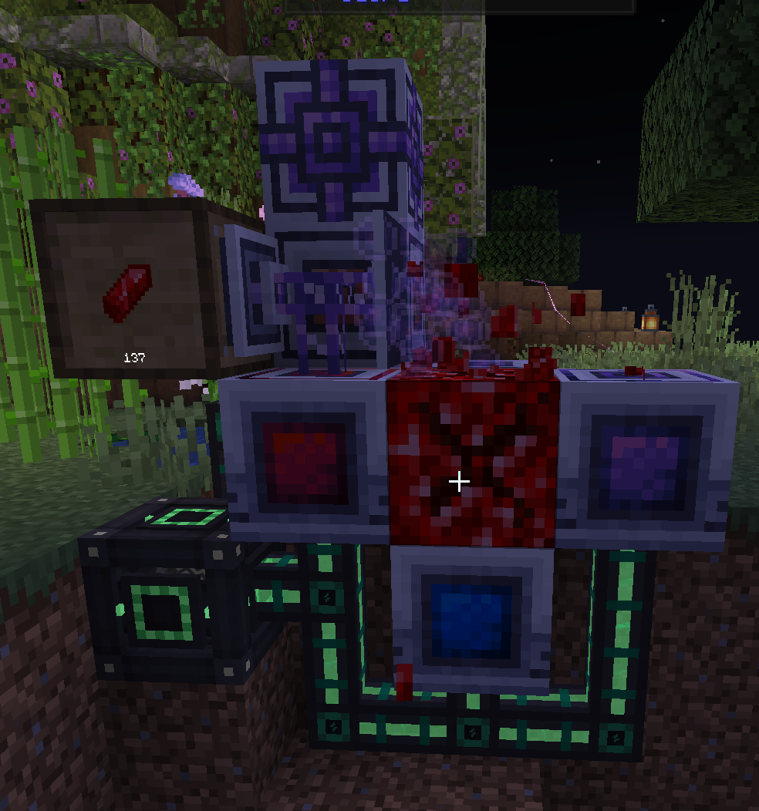

# ATM10TTS FAQ

**All The Mods 10 - To The Sky** Frequently Asked Questions

## Gameplay FAQs

How do I get to &#x3C;any dimension other than nether &#x26; end>?

Modded dimensions are not accessible in survival.

Why is my ender crafter not working?

You have to have at least one ender alternator within 4 blocks of the crafter

Why is my modular router/click machine/other fake player not sieving?

Fake players are unable to interact with sieves, use the Flux Sieve from Ex Machinis: Divitiae Deorum.

Where are all the Mystical Agriculture seeds?

Many Mystical Agriculture seeds have been removed so that there is more variety in resource generation (e.g. Productive Bees/GeOres)

What is a good setup for GeOres?

Sample nearly max GeOre setup (credit to @joeychin01 on Discord): ME annihilation pane on the GeOre crystal, and only storage for the shard to limit when it breaks. For the growth accelerators, there is a maximum of one boosted (red) accelerator, and you only want one directed (blue) accelerator, then the other sides besides the top can use normal accelerators.

Does the nether generate normally?

No. Strictly forts, and bastions, nothing else.

How do I make &#x3C;insert item/block here>?

Use JEI.

## Technical FAQs

Why isn’t ‘`insert name`’ mod in ATM10Sky yet?

ATM packs do not literally contain “All The Mods”. The main focus is having mods that are not: 1) buggy, 2) ruin performance or progression. If a mod supports Minecraft version **1.21.1**, and **NeoForge** (Not Forge), you may make a [suggestion](https://github.com/AllTheMods/All-the-mods-10-Sky/discussions).

I found a bug/dupe in the pack. How can I report it?

To report bugs, dupes or similar, head over to the [ATM10-TTS GitHub](https://github.com/AllTheMods/All-the-mods-10-Sky/issues) and open a new issue describing the occurrence.

I can’t complete ‘`name of quest`’ even though I fufilled the requirements

You can enable edit quests in the bottom right of the quest screen (you need OP for this) and then right click the broken quest and force complete it OR reset its progress if you still have the items.

I’m getting a warning when I launch the game that Amendments is not installed. Is it important?

No, click “Don’t show this again”.

I made a server and I spawned into a normal world. What do I do?

Stop the server, delete the world and open server.properties and change the level type to `level-type=skyblockbuilder\:skyblock`

I left clicked instead of right clicked my grave and it disappeared without giving me items Plz halp!

`/epitaphs recover <player> <timestamp>` and update the mod.

What are the recommended Java arguments for this pack?

* **Client arguments**: send `?args` in the **#bot-spam** channel in our [Discord](https://discord.com/invite/allthemods).
* **Server arguments**: send `?svargs` in the **#bot-spam** channel in our [Discord](https://discord.com/invite/allthemods).

Why does my game crash while launching?

Lack of RAM most likely. Send `?allocate` in the **#bot-spam** channel in our [Discord](https://discord.com/invite/allthemods) to learn how to allocate more RAM. If that’s not the problem, head to **#10sky-techsupport** and send `?logs` to see how to upload your crash/latest log.

