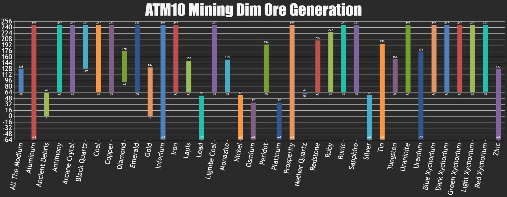

# Mining Dimension Ore Distribution

[Vidal’s Original Spreadsheet.](https://docs.google.com/spreadsheets/d/1WA9Ek1k17u6YA9JJBSayUL1x_D8OMp134oQeVXBftDU/edit?gid=0#gid=0)

## Max/Min Y-Level Sort Broken

The sorting for the y-levels is broken for numbers currently. Alphabetical sorting is the only one that works right now. I will fix sorting by numbers in the future.

## Ore Distribution Visualization

_Ore distribution visualization courtesy of_ [_@BookerTheGeek_](https://www.reddit.com/user/BookerTheGeek/)\
&#xNAN;_&#x53;ource:_ [_Reddit Post_](https://www.reddit.com/r/allthemods/comments/1h2affo/atm10_mining_dim_ore_generation/#lightbox)

## Stone Types

| Stone Type  | Max Y-Level | Min Y-Level |
| ----------- | ----------- | ----------- |
| Grass Block | 252         | 252         |
| Dirt        | 251         | 248         |
| Stone       | 247         | 129         |
| Deepslate   | 128         | 65          |
| Netherrack  | 64          | 1           |
| End Stone   | 0           | -62         |

## Ores

| Ore                   | Max Y-Level | Min Y-Level |
| --------------------- | ----------- | ----------- |
| Allthemodium Ore      | 128         | 65          |
| Aluminum Ore          | 247         | -62         |
| Ancient Debris        | 64          | 1           |
| Antimony Ore          | 250         | 65          |
| Arcane Crystal Ore    | 250         | 65          |
| Black Quartz Ore      | 250         | 65          |
| Coal Ore              | 247         | 65          |
| Copper Ore            | 247         | 65          |
| Dark Ore              | 129         | 65          |
| Diamond Ore           | 174         | 93          |
| Emerald Ore           | 247         | 65          |
| Gold Ore              | 155         | 65          |
| Inferium Ore          | 250         | 65          |
| Iridium Ore           | 146         | 65          |
| Iron Ore              | 247         | 65          |
| Lapis Lazuli Ore      | 146         | 65          |
| Lead Ore              | 34          | -62         |
| Lignite Coal Ore      | 250         | 65          |
| Mithril Ore           | 250         | 65          |
| Monazite Ore          | 154         | 65          |
| Nether Gold           | 64          | 1           |
| Nickle Ore            | 64          | -62         |
| Osmium Ore            | 64          | -62         |
| Peridot Ore           | 179         | 65          |
| Platinum Ore          | 34          | -62         |
| Prosperity Ore        | 250         | 65          |
| Quartz Ore            | 64          | 1           |
| Redstone Ore          | 205         | 65          |
| Ruby Ore              | 179         | 65          |
| Runic Stone           | 250         | 65          |
| Sapphire Ore          | 179         | 65          |
| Silver Ore            | 34          | -62         |
| Tin Ore               | 181         | -62         |
| Tungsten Ore          | 154         | 65          |
| Uraninite Ore         | 250         | 65          |
| Uranium Ore           | 157         | -62         |
| Xychorium Colored Ore | 250         | 65          |
| Zinc Ore              | 128         | -62         |
