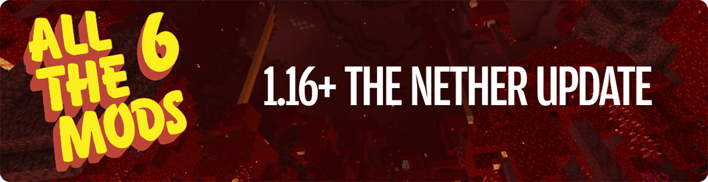

# All The Mods 6

**All the Mods** started out as a private pack for just a few friends of mine that turned into something others wanted to play! It has all the basics that most other “big name” packs include but with a nice mix of some of newer or lesser-known mods as well.

Can you get to the Creative items by making the “ **ATM Star**”?

In All the Mods 6 we will continue the tradition adding many new mods while going for more stability.

**Does “All The Mods” really contain ALL THE MODS? No, of course not.**

Minimum required ram **10GB**.

## Videos

**All The Mods 6 Feed The Bees! Episode 1 NEW SERIES**\
Sjin



**All The Mods 6 Ep. 1 New Mods New Builds**\
ChosenArchitect



> ATM6 | [CurseForge](https://legacy.curseforge.com/minecraft/modpacks/all-the-mods-6) | [GitHub](https://github.com/AllTheMods/ATM-6/)
