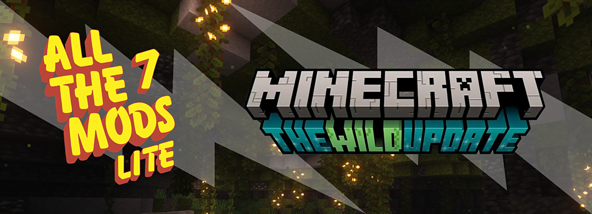

# All The Mods 7 Lite

All the Mods started out as a private pack for just a few friends of whatthedrunk’s that turned into something others wanted to play! It has all the basics that most other “big name” packs include but with a nice mix of some of newer or lesser-known mods as well.

With a selection of classic favourites and newly discovered mods, ATM7 Lite aims to have excellent performance on all machines whilst still being packed with content.

For those with an itch to build an amazing factory, we have Create and Immersive Engineering for setting up complex systems that look great, Customize your weapons and tools using either Silent Gear or Tinkers Construct, or settle for looting some epic gear from the Apotheosis bosses that will spawn in your world, Found a Civilization with Minecolonies, Or perhaps a remote tower to privately plot your progression through Ars Magica Legacy, BloodMagic, or Mahou Tsukai? The choices are many, and more importantly, yours!!

Recipe modification has been kept to a bare minimum, aiming to avoid recipe conflicts only.

Does “All the Mods 7 Lite” really contain ALL THE MODS? No, of course not. This is a lite pack after all

> All The Mods 7 - Lite | [CurseForge](https://legacy.curseforge.com/minecraft/modpacks/all-the-mods-7-lite-spark) | [GitHub](https://github.com/AllTheMods/7lite)
