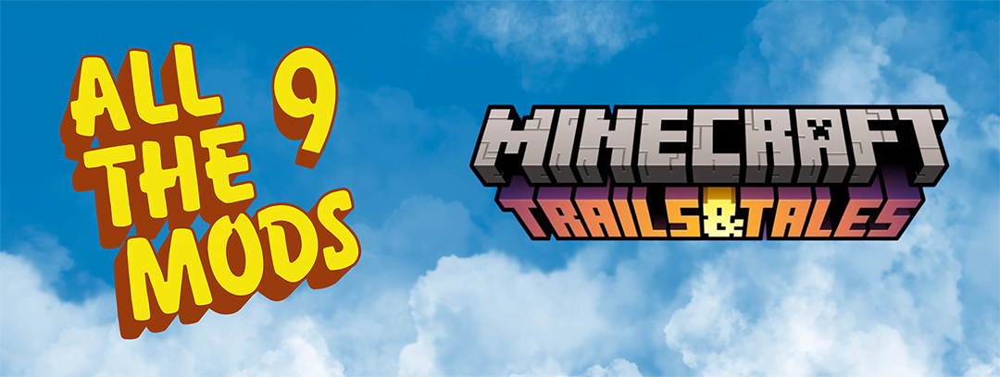

# All The Mods 9

<figure><figcaption></figcaption></figure>

**ATM9** has over **400 mods** and countless quests and a built in proper endgame. Can you craft the **ATM Star**? Do you dare take on the **Gregstar**?

**All The Mods** started out as a private pack for just a few friends that turned into something others wanted to play! It has all the basics that most other “big name” packs include but with a nice mix of some of newer or lesser-known mods as well.

In **All the Mods 9** we will continue the tradition adding many new mods while going for more stability.

Does “**All the Mods**” really contain **ALL THE MODS**? No, of course not.

We use a few versions of [**Complementary Shaders**](https://www.complementary.dev/shaders/) and if there are any issues with them that all falls on us for using them in our pack. If you want to learn more about them please check them out on their [website](https://www.complementary.dev/).







> All The Mods 9 | [CurseForge](https://legacy.curseforge.com/minecraft/modpacks/all-the-mods-9) | [GitHub](https://github.com/AllTheMods/ATM-9)
