# AllTheModium

In **ATM9**, All The Modium has changed in ways different from previous packs. We’ll explain where to find, how to obtain, and how **Templates** works to craft armor & tools!

### Where & How

**AllTheModium** ores can be found across 3 dimensions: **Overworld**, **Nether**, and **The End**, normally exposed to **AIR**.

* **AllTheModium**: (Overworld) 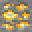
  * Found in [Deep Dark](https://minecraft.wiki/w/Deep_Dark) Biome, also in **Mining Dimension** Deep Slate layer (Y 65-129).
    * **Mining Dimension** is more rare, at-least 1 ore per chunk.
    * Killing **Warden** also grants a Quest reward ATM Ingot.
  * Obtained with a **Netherite** level pick or better.
* **Vibranium**: (Nether) 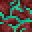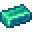
  * Found in **Nether** dimension (no longer biome specific).
    * Elevation between Y 64-127
  * Also Found between Y 0-40 within **The Other** dimension.
  * Obtained with an **AllTheModium** level pick or better.
* **Unobtainium**: (End) 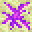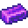
  * Found within **End Highlands**.
    * More rare than other ores
  * Obtained with **Vibranium** level pick or better

Ores Can Only Be Mined By A ‘Real Player’

### Templates

* **AllTheModium**: 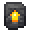
  * Found in **Sus Clay** in **Ancient Cities** within the **Overworld**.

* **Vibranium**: 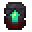
  * Found in **Sus SoulSand** in **Bastions** within the **Nether**.

* **Unobtainium**: 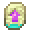
  * Found in **The Other** dimension, as chest loot in the underground library of `allthemodium:dungeon` structure.

## Smithing Recipe Example

| Template                                                           | Armor                                               | Ingot                                          | Output                                              |
| ------------------------------------------------------------------ | --------------------------------------------------- | ---------------------------------------------- | --------------------------------------------------- |
| 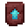    |       | 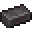    | 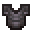    |
|  |     |  |  |
|     |  |     | 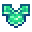    |
|   |     |   |   |
