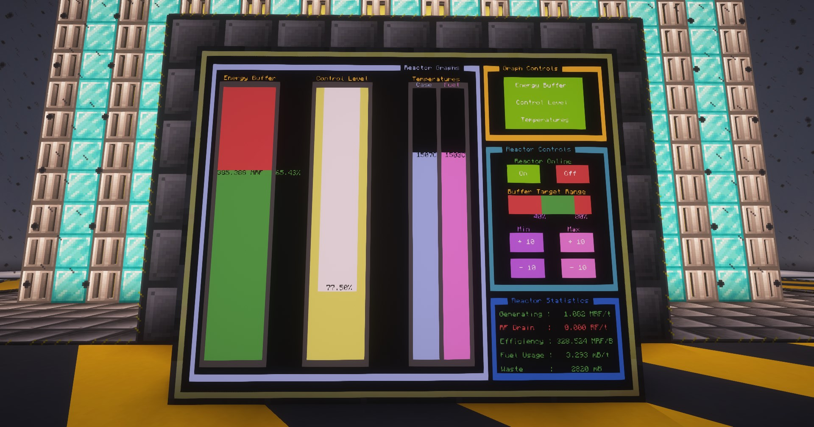

# Extreme Reactors

**Extreme Reactors** is a custom sized multi-block reactor for power generation, similar to [Bigger Reactor](https://legacy.curseforge.com/minecraft/mc-mods/biggerreactors) & [Big Reactor](https://legacy.curseforge.com/minecraft/mc-mods/big-reactors).

## Setups and Sizes

| Object           | Max Height (Y) | Max Size (X/Z) |
| ---------------- | -------------- | -------------- |
| Basic Reactor    | 5              | 5              |
| Hardened Reactor | 48             | 32             |
| Turbine          | 32             | 32             |
| Fluidizer        | 16             | 16             |

**FunshineX** has made a very detailed video going over all the different sizes of reactors, efficiencies, placement of moderators, and turbine setups. Your RF/t numbers will be higher than his numbers in the video due to the **Power Gen Changes** mentioned above.



Some additional information regarding other aspects on how the turbines work and other tips specific to ATM.

**Disastrous\_Site\_6352** [via Reddit](https://www.reddit.com/r/allthemods/comments/15ih6ug/comment/juw8es4/)

* Wider is more efficient than taller for fuel.
* The most efficient setup for rods is a checkerboard pattern with three spaces between the outermost rod and the interior wall. Heat manifolds placed on the interior walls of the reactor also in a checkerboard pattern in the cardinal directions of any rods (North, South, East, West).
* Passive cooled reactors generate rf, active cooled with water produces steam for turbines. You will need to run passive for a while to produce cyanite for blutonium to make turbines.
* One actively cooled reactor can produce enough steam for several turbines.
* Liquid sodium from [Mekanism](mekanism-power.md) can be used to actively cool the reactor, making superheated liquid sodium then pumping it into a heat exchanger to produce even more steam powers even more turbines.
* Heat exchanger setup isn’t really necessary in atm because of other more efficient setups for power. It’s much like creating 5x ore processing in a modpack with mystical agriculture, fun but overkill.

***

## Moderators

| Moderator  | FE/t   | % of top | μB/t |
| ---------- | ------ | -------- | ---- |
| Air        | 13,406 | 91.23%   | 198  |
| Dry Ice    | 13,525 | 92.06%   | 198  |
| Iron       | 13,862 | 94.34%   | 190  |
| Manasteel  | 13,912 | 94.68%   | 191  |
| Lead       | 14,277 | 97.16%   | 187  |
| Graphite   | 14,342 | 97.60%   | 182  |
| Tangerium  | 14,422 | 98.15%   | 184  |
| Electrum   | 14,466 | 98.45%   | 187  |
| Emerald    | 14,475 | 98.51%   | 184  |
| Cryomisi   | 14,502 | 98.69%   | 186  |
| Elementium | 14,527 | 98.86%   | 185  |
| Diamond    | 14,573 | 99.18%   | 184  |
| Terrasteel | 14,625 | 99.53%   | 185  |
| Netherite  | 14,629 | 99.56%   | 183  |
| Redfrigium | 14,694 | 100.00%  | 181  |

***

## Computer Craft Integration

You can use **Computer Craft** with scripts such as [Kasra-G’s Automated Reactor Controller](https://github.com/Kasra-G/ReactorController) to easily automate your reactor with the **Reactor Computer Port**. There are other Computer Craft scripts that will integrate with Extreme Reactor Turbines as well.

You must enable HTTP API for Computer Craft Integration

To pull the script above as outlined in the repo’s instructions, you must edit the following file:

`/yourWorldName/serverconfigs/computercraft-server.toml`

Search for `http` and make sure it is set to `enabled = true` as shown below.

`computercraft-server.toml`

```toml
    [http]
        #Enable the "http" API on Computers. Disabling this also disables the "pastebin" and
        #"wget" programs, that many users rely on. It's recommended to leave this on and use
        #the "rules" config option to impose more fine-grained control.
        enabled = true
```

Your server _must_ be **OFF** when changing this file. Otherwise the changes will not apply.



***

## Power Gen Changes

**Overall Power Gen:** ~~1x~~ 3x | 53 can produce \~15k RF/t

> Extreme Reactors | [CurseForge](https://legacy.curseforge.com/minecraft/mc-mods/extreme-reactors)
