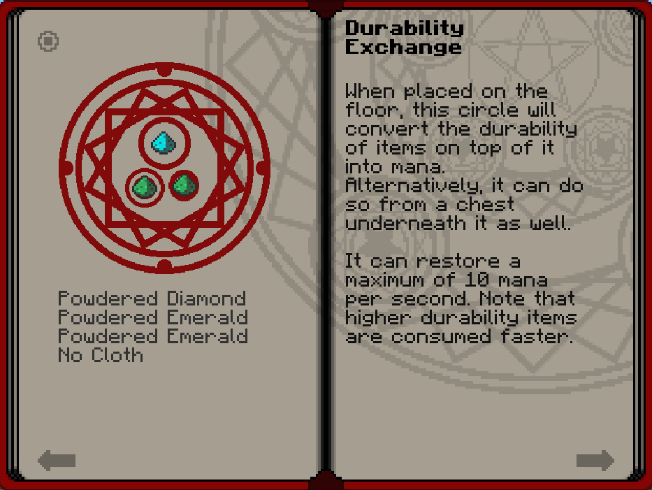
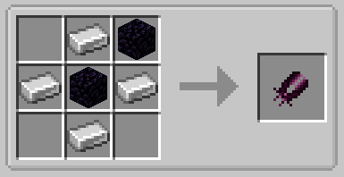
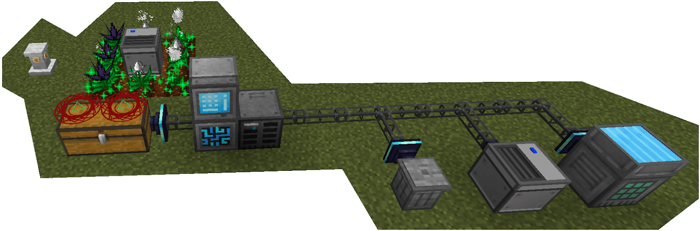
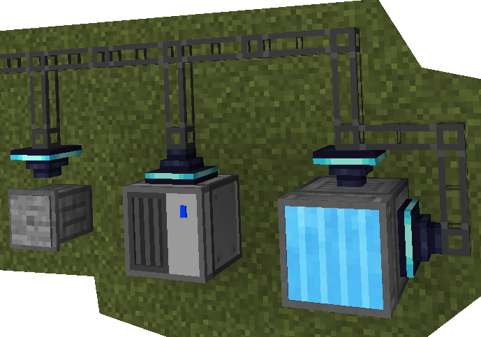

# Durability Exchange

**Obsidian Sheaders** have over a million durability, but Mahou Tsukai caps durability exchange at like **2,500** durability. The recipe is cheap and easy, so that’s why I use it. Each **Durability Exchange** spell circle can restore a maximum of 10 mana per second, so you will need a large amount of spell circles and chests for you to be able to gain the mana you need to efficiently swing your [Morgan](morgan.md) at villagers for damage gain.

 

> Mahou | [CurseForge](https://legacy.curseforge.com/minecraft/mc-mods/mahou-tsukai)
