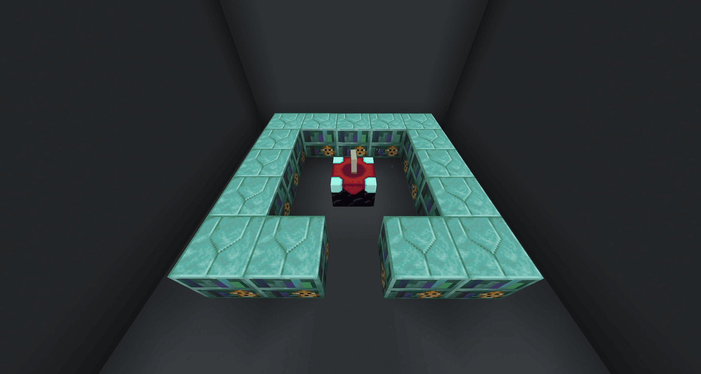
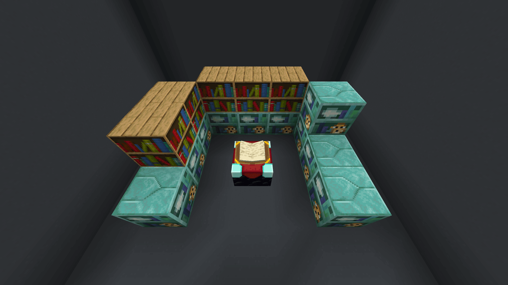
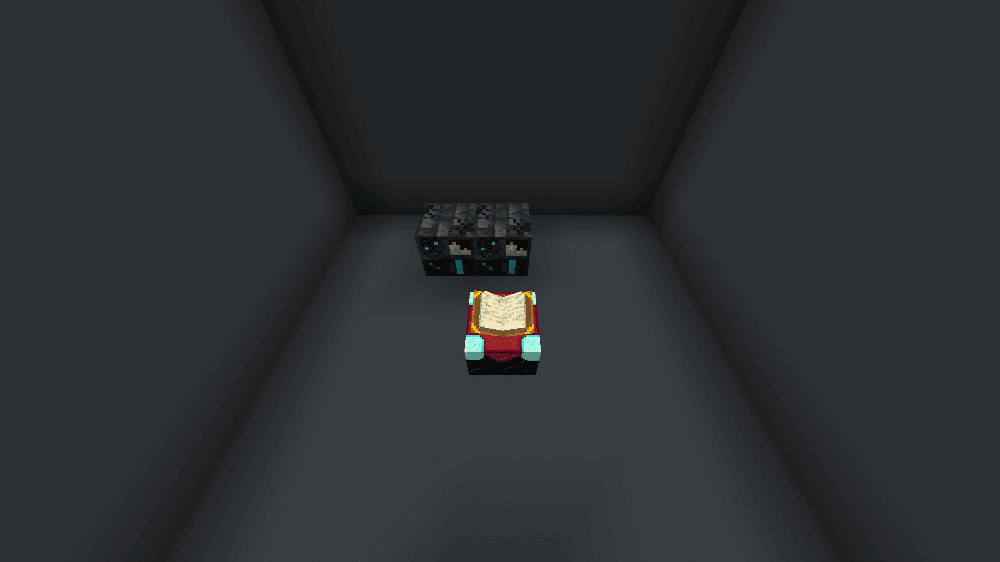

# Apothic Enchanting

## Max Enchanting Setup

Max Enchanting Shelves List



#### Craft and infuse Seashelves

Craft 16x **Seashelf** and place all but one in the usual enchanting configuration.

Now take your last Seashelf and **infuse it**. You should see an infusion option for 3 EXP. Now replace one of the uninfused **Seashelf** with your **Infused Seashelf**. Repeat this until all 16 `Seashelf` are `Infused Seashelf`. You will have one extra `Infused Seashelf`.

You must be level 45+ to infuse Seashelves



#### Craft Crystalline Seashelves

After all of shelves are infused, you’ll need to break 13x Infused Seashelf and craft 13x **Crystalline Seashelf**. After you’re done crafting them, place them down.



#### Craft and infuse Dormant Deepshelves

Now craft 10x **Dormant Deepshelf** and infuse them into their **Deepshelf** varient.

You must be level 60+ to infuse Dormant Deepshelves

After infusing all 10 dormant deepshelves, use them to craft 5x **Soul-Touched Sculkshelf** and 5x **Echoing Sculkshelf**.

Remember to use JEI to see the recipes. You’ll need to kill a few Wardens



#### Craft the Geode-Encased Bookcase of Stability

Now you’ll need to craft 1x **Geode-Encased Bookcase of Stability**.

You can infuse a **Block of Amethyst** to get **Budding Amethyst**. Place 10x **Crystalline Seashelf** and 5x **Normal Bookshelves** to infuse it.

You must be level 65+ to infuse Block of Amethyst




#### Craft the Draconic Endshelf

To craft 1x **Draconic Endshelf** we need **Infused Dragon’s Breath**.

* 5x **Echoing Sculkshelf**
* 2x **Soul-Touched Sculkshelf**
* 5x **Melonshelf**
* 5x **Normal Bookshelf**
* 1x **Geode-Encased Bookcase of Stability**

You must be level 80+ to infuse Dragon’s Breath




#### Final max enchanting setup

After making the **Draconic Endshelf**, craft 1x **Deepshelf of Arcane Treasures** and then place your crafted shelves for max enchants!

* 5x **Echoing Sculkshelf**
* 5x **Soul-Touched Sculkshelf**
* 1x **Deepshelf of Arcane Treasures**
* 1x **Draconic Endshelf**
* 1x **Geode-Encased Bookcase of Stability**

You can place a **Seashelf of Aquatic Filtration** to filter out enchants you don’t want.




## Infusion Setups

You do not have to place the blocks exactly as I do, these are just an example.

### Unbreakable Potion Charms

5x Draconic Endshelf, 2x Echoing Deepshelf, 1x Melonshelf, 1x Endshelf

### Tome of Superior Scrapping

3x Echoing Sculkshelf, 1x Draconic Endshelf

### Tome of Extraction

4x Echoing Sculkshelf, 1x Draconic Endshelf

### Library of Alexandria

6x Echoing Sculkshelf, 3x Melonshelf, 2x Draconic Endshelf, 2 Infused Seashelf

### Trident

4x Echoing Sculkshelf, 1x Melonshelf, 1x Normal Bookshelf

### Bottle o’ Enchanting



2x Echoing Sculkshelf




5x Echoing Sculkshelf, 1x Soul-Touched Sculkshelf




5x Echoing Sculkshelf, 3x Soul-Touched Sculkshelf, 1x Draconic Endshelf



