# Botania Mana Enchanter

**Botania Mana Enchanter** is a structure added by **Botania**. It uses **Mana** provided with **Sparks** or **Mana Spreaders** to enchant equipment with enchantments defined by **Enchanted Books** dropped nearby, _without consuming the books._ This is the slowest, yet only way to automate the process of duplicating and enchanting books using the applicator.

## Building Enchanter

**Botania Mana Enchanter** and **Enchantment Applicator** can both be automated with the required materials.

??? Note "Materials"
    - 3 Routers
    - 3 Activator Modules
    - 1 Wand of the Forest
    ---
    - 17 Obsidian
    - 1 Lapis Block
    - 1 Mana spark
    - 6 Mana Pylons
    - 10 Dirt/Grass blocks
    - 10 Mystical Flowers
    ---
    - 1 Cyclic Dropper
    - 3 Building blocks
    - 1 Cyclic Item detector
    - 2 Redstone
    - 1 Redstone Torch
    - 1 RFtools Timer
    - 1 Vacuumulator
    ---
    - 5 Pipez (+1 upgrade for filtering)
    - Black hole Tank
    - Enchantment Applicator
    - Disenchanter
    - Entangled Block
    - Trash can

Build the **Multi-Block** structure shown below. **Botania Lexica** will help visually seeing block positions, then place down 3 **Modular Routers** facing into the **Mana Enchanter**, as shown below.

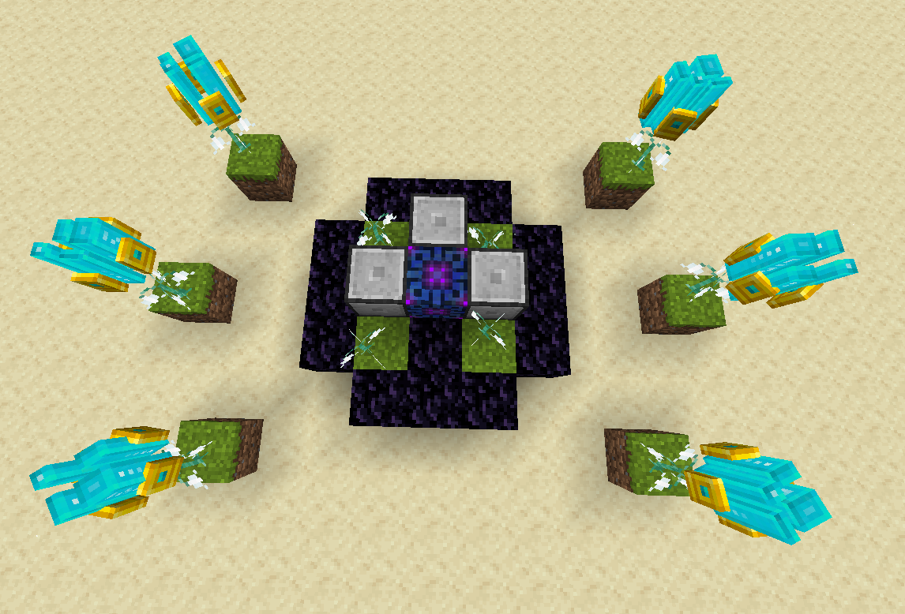{.center}

## Routers Configuration

: **Activator Module** for ALL 3 routers should look like this. Set the the **FRONT** face directory (_middle part of GUI_) as shown below.

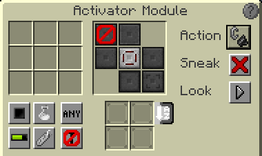{.center}

=== "Left Router"

    Tool/Weapon input, keep this fed with new tools or weapons. (Ex: RS with crafting card). Be sure this is always full with a tool and set it to Pulse
    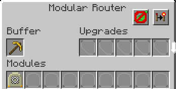{.center}

=== "Top Router"
    Tool/Weapon Output. Be sure to set this to Redstone Mode: High
    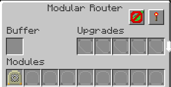{.center}

=== "Right Router"
    **Wand Of The Forest**. Give it speed upgrades if possible and a wand of the forest and set it to always on, this router always tries to start an enchanting process
    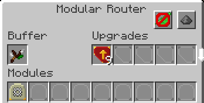{.center}

## Automation Setup

Place a **Cyclic Dropper** 1 block away from the **Enchanter** and set to **Always Active**. Place an **Item Detector** ontop of the bottom left flower, and a redstone line on the **LEFT** router

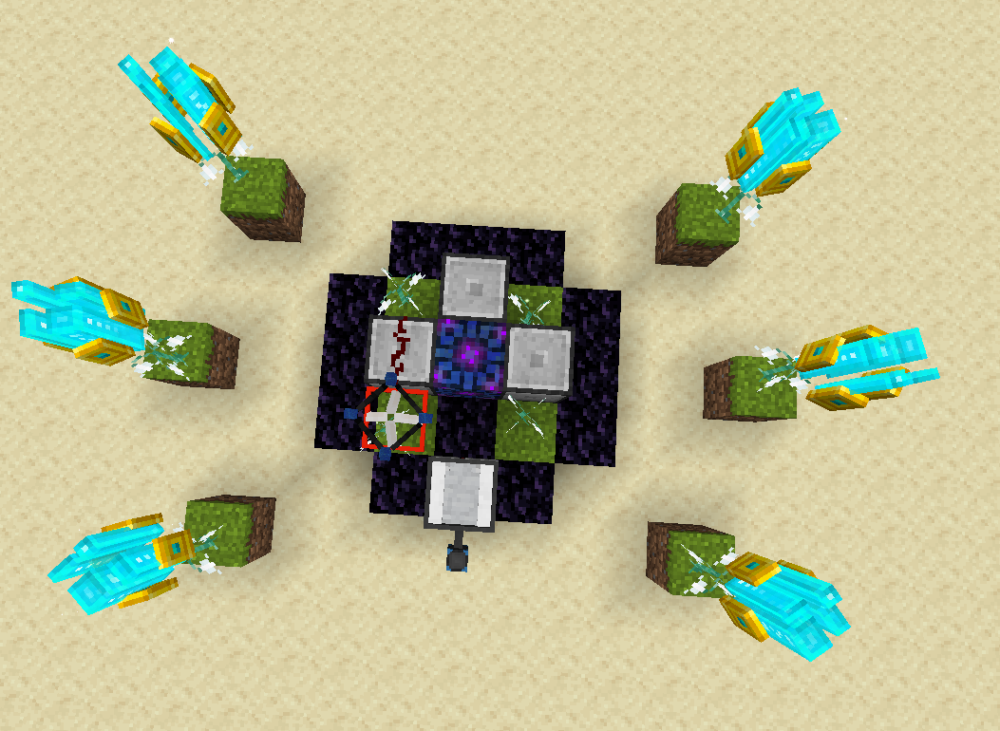{.center}

!!! Info
    The Dropper will drop an enchanted book triggering the **Item detector**, which triggers the **LEFT** router, which then puts 1 tool into the **Enchanter**. The **RIGHT** Router (with the **Wand of the Forest**) will iniate the enchanting process.

- Place 3 blocks (_as shown below_)
- Redstone Torch on the **TOP** router (against left block)
- **RFTools Timer** (_100 Delay, with "Pause while redstone is active" enabled_) on 3rd block _facing right_
- **Vacuumulator** with redstone on top (Set **Redstone Control** HIGH). 

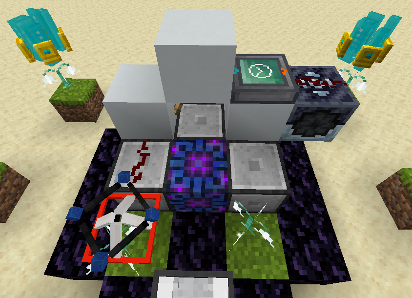{.center}

Setup pipes to pull out from the **TOP** router (_Enchanted Tool_), and the **Vacuumulator** (_Enchanted Book_).

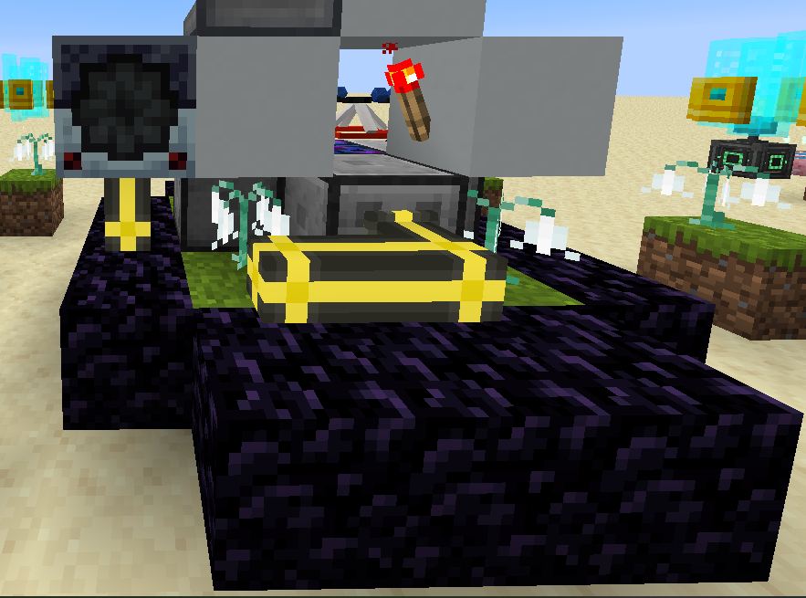{.center}

Pipes will then go into the **Enchantment Applicator**. **Black Hole Supreme Tank** on top of the **Enchantment Applicator**.

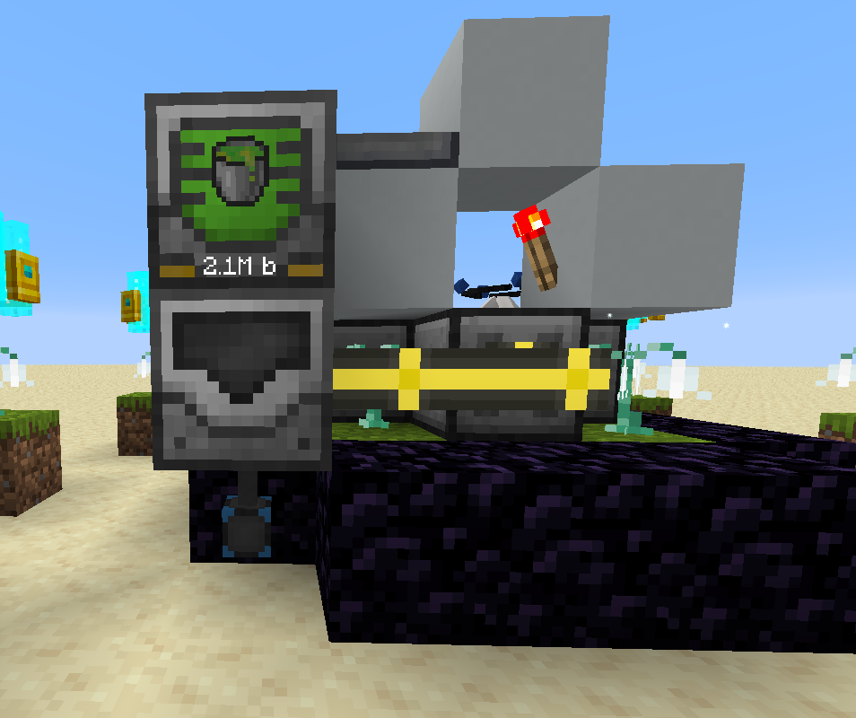{.center}

!!! Info
    Enchanting higher levels will take more than 64 buckets (internal applicator buffer) of XP/Essence, which a **Black Hole Tank** will be required on top of the applicator to act as a secondary buffer. **Liquid XP** will work up too _level 20_, afterwards **Mob Essence** will be required. The [Applicator](applicator.md) page will explain best methods of generating XP or Mob Essence.

Pipe the new combined Tool out of the **Applicator** and put it into a **Cylic Disenchanter** to split the 2 again

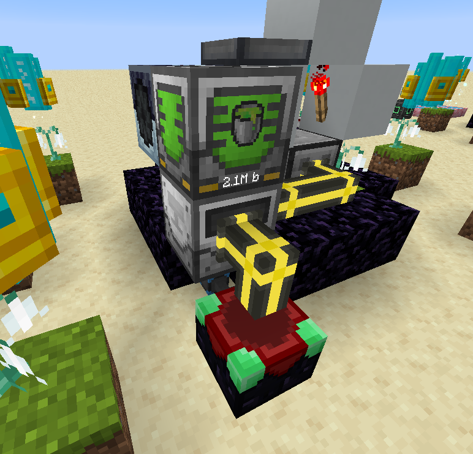{.center}

Add a pipe, an **Entangled block** (linked to the **Dropper** at the beginning) and a **Trashcan**. Now set filters in your Pipez extraction point together with a destination tool. This makes the Book go in a loop and come back to the start of the cycle

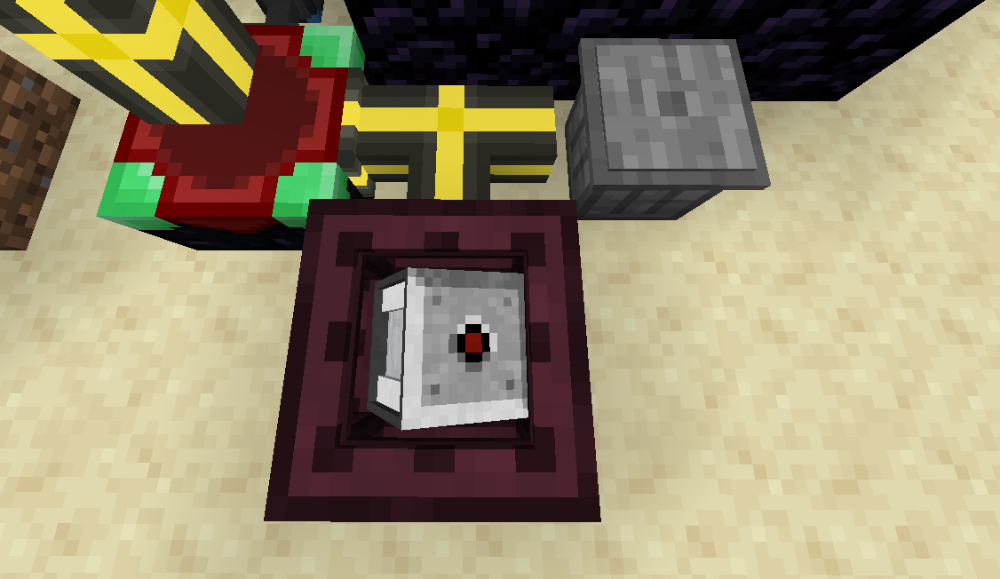{.center}

Rightclick the side of the Entangled block which has the pipe leading into it with the destination tool, add the Book to the filter and remove the NBT tag so all books go to the dropper

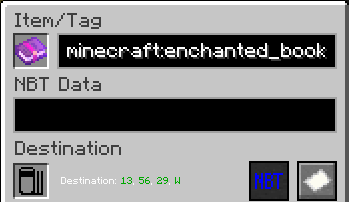{.center}

do the same with your pickaxe, remove the NBT data, so all (old) tools go to the bin

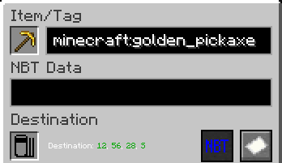{.center}

That should look something like this

{.center}

Dont forget to put a spark on your Mana Enchanter and get a decent Mana Supply!
put a book into the dropper and the whole process should work automaticly.

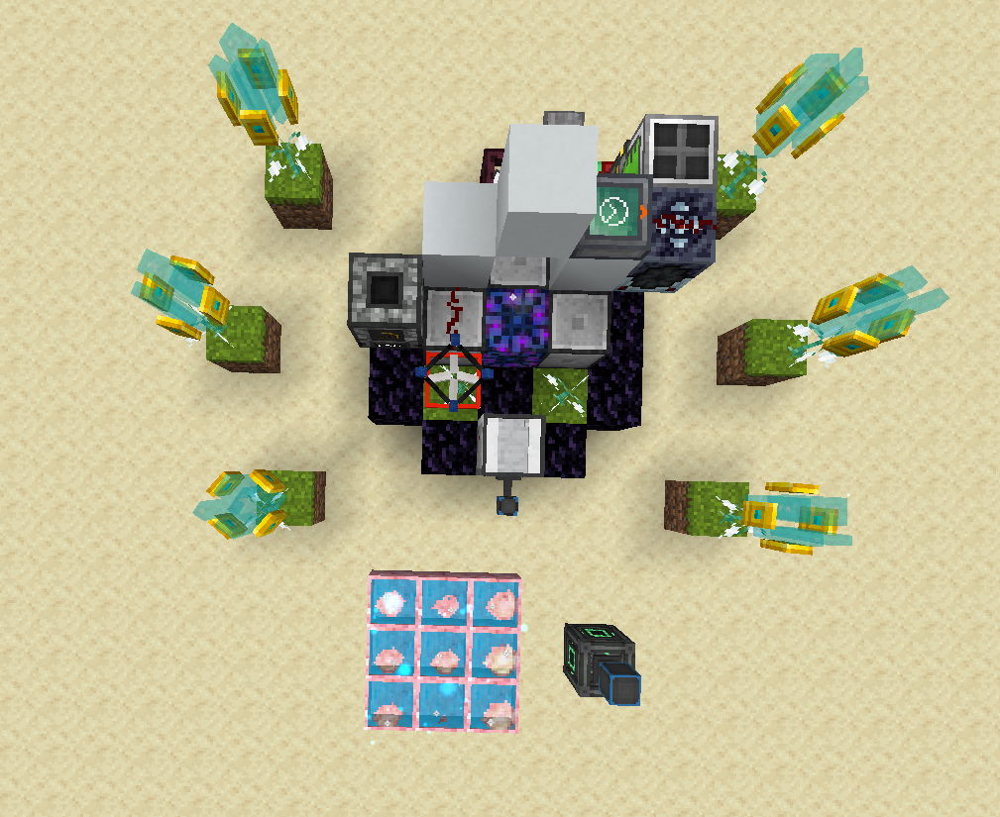{.center}

<video style='width:500px' class='center' loop autoplay='true'>
    <source type='video/mp4' src='../img/How-to-AutoEnchant-ATM6-Sky.mp4'>
</video>

