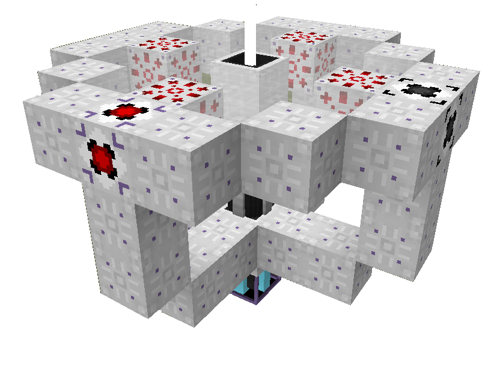

# Environmental Tech

## Void Miner

Is a multi-block structure added by **Environmental Tech**. It generates various ores, crystals, and botanicals using energy. It comes in **8 tiers**.

{width='300px'}

### Introduction

There's 2 **IO** blocks that is needed for **Void Miner**. At-least 1 **Item Output** and 1 **Energy (FE) Input IO Block**, though more can be used. When supplied enough power via **FE Input IO**'s, the **Void Miner** (Based on _Tick Duration_) will output items of various types through the **Item Output IO**.

This process can be sped up by using **Frequency** modifiers, placing them in the **Void Miner** modifier slots. Specific items can be made more likely to appear by using a colored **Laser Lens**, while this effect can be amplified by using **Amplification** modifiers.

**Void Miner** also requires it's **Laser Core** to have a straight view to either **Bedrock** or **The Void** in order to work.

!!! Tip "Transparent blocks such as Glass, walls, or fences may be used to provide a safe path under the structure without blocking the beam."

### Modifiers

Modifiers are optional to use / replaced with **Null** Modifiers if you cannot afford to craft them. You can use higher and lower tiers of **Modifiers** and **IO's** on any tier **Void Miner** multi-block, such as **Tier 5 Frequency Modifiers** on a **Tier 2 Void Miner** multi-block.  This is important to note, as the **Tier 1 Void Miner** needs more power than one **Tier 1 FE Input** can give the multi-block.  The solution is to either use your first two Erodium to upgrade your **FE Input**, or to use two **Tier 1 FE Inputs** on your **Tier 1 Void Miner**.

??? Information "What is Duration & Tick Costs?"

    `Duration`
    : Is how long it will take the miner, provided that it has the tick cost worth of energy supplied, to generate an item. 

    `Tick Cost`
    : Is the energy required per tick to allow the miner to mine at the maximum speed that is currently possible with all modifiers included. If you don't provide the tick cost amount of energy or more then your Void Miner will be slower.

??? Information "View Modifiers"

    ``` title="Frequency | Speeds up miners - Duration."
    Increases the speed of the Void Miner operation. This is visually displayed on the Void Miner CCU labeled as 'Duration'. Duration is measured in ticks needed per operation. 20 ticks is equal to 1 second in real life if you are running at 20 FPS. 1,000 Duration (or 1,000 ticks) is equal to 50 seconds. 
    
    The Duration is lowered by upgrading your Frequency Modifiers, or by adding more Frequency Modifiers. Once your Duration hits 0, the item generation rate cannot go faster. Any further Frequency Modifiers will not affect the Void Miner's speed. They will only increase the Tick Cost.
    ```

    ```title="Bandwidth | Increases amount of mined items"
    Increases the possible maximum stack size of each mined drop up to 64 items per single operation. Bandwidth Modifiers cannot be crafted until you generate Tier 5 Ionite Crystals at Tier 4 Void Miner (Pladium). Without any Bandwidth Modifiers, a Void Miner will produce 1 item per operation always
    ```

    ```title="Amplification | Gives Lenses more Accuracy (High Drop Rate)."
    Increases the chance of getting the preferred ores with the Colored Lens the player is using. This is not a commonly used Modifier as in the later tiers of the Void Miner you will be producing hundreds of ores in fractions of a second (lmao)

    For example:
        - Tier 2 Void Miner / Four Tier 2 Frequency Modifiers / No Lens = 5.61% chance for Gold Ore at 180 Duration (one operation per 9 seconds)
        - Tier 2 Void Miner / Four Tier 2 Frequency Modifiers / Yellow Lens = 32.22% chance for Gold Ore at 180 Duration
        - Tier 2 Void Miner / Four Tier 2 Amplification Modifiers / Yellow Lens = 38.24% chance for Gold Ore at 320 Duration (one operation per 16 seconds)
    ```

    ```title="Dimensional"
    Allows Void Miner to gain any drop in the current dimension and requires two Tier 5 structure frames to craft. Interdimensional Modifier allows Void Miner to gain any drops from any dimension. 
    ```

    ```title="Piezo"
    Allows solars to gen in rain/thunderstorms from vibrations.
    ```

    ```title="Electrostatic"
    Allows Lightning rods to gen passively in rain and thunder.
    ```

    ```title="Radian"
    Allows lightning rod to gen passively in sunny weather.
    ```

> **Note**: Modifiers also have tiers based on crystal tiers respectively

### Flash Memory

Creating a **Flash Memory** Card for **Void Miner** is vital for **Void Miner** resource generation. The **Flash Memory** tells **Void Miner** from which loot table you want to generate resources from.

- Craft a **Flash Memory** and a **Memory Programmer**
- Give the **Memory Programmer** power and place the **Flash Memory** in the top right box
- Select the **Miner Program** you want to run, taking note of the link below 

**Void Miner** needs to generate **Crystals** from **Environmental Tech** to upgrade to the next tier. These **Crystals** are generated through the **Multi-Miner** section of the **Memory Programmer** using the **Crystal Program**.

{width='100%' height='auto'}

### Lens

**Lenses** are crafted with 5 glass in a + pattern in any crafting grid. You will need to also craft a **Lens Grinder** and supply it power to color your crafted Lens. Using lenses inside the **Lens Holder** on the **Void Miner** will increase the mine rate of certain items. 

For example, if you used a **Yellow Lens** on a **Metallic Flash Memory Program**, your miner would produce more **Gold Ore** than it usually would without the lens. You can also increase that rate even further using **Amplification** Modifiers.

#### Crystal Lens

**Crystal Lenses** can be crafted by placing 3x3 of the same tier crystals in a crafting grid to create a **Crystal Block**. Use this **Crystal Block** in the **Lens Grinder**. **Crystal Lenses** are highly encouraged to be used. **Crystal Lenses** often double the chance of generating the crystal matching your Lens.

### Tiers

??? Information "View Tiers"

    - **Litherite**: `27 Litherite`
    - **Erodium**: `70 Erodium, 32 Litherite`
    - **Kyronite**:` 194 Kyronite, 94 Erodium, 48 Litherite`
    - **Pladium**: `224 Pladium, 224 Kyronite, 114 Erodium, 58 Litherite`
    - **Ionite**: `276 Ionite, 278 Pladium, 278 Kyronite, 142 Erodium, 72 Litherite`
    - **Aethium**: `362 Aethium, 358 Ionite, 358 Pladium, 358 Kyronite, 182 Erodium, 92 Litherite`
    - **Nanorite**: `378 Nanorite, 558 Aethium, 374 Ionite, 374 Pladium, 374 Kyronite, 190 Erodium, 96 Litherite`
    - **Xerothium**: `410 Xerothium, 606 Nanorite, 606 Aethium, 406 Ionite, 406 Pladium, 406 Kyronite, 206 Erodium, 104 Litherite`

??? Tip "Tips & Tricks"

    !!! Quote "Seg: You know you can use T6 modifiers with T5 void miner, right? "
    !!! Quote "Bamboo: The inter-dimensional modifier requires one bandwidth modifier (on the right) and one amplification modifier (on the left)"

### Void Miner Drops

??? Tip "Void Miner Drops Based On Lens"

    ??? Note "Mineral Resource Drops"

        | **Ore** | **Color** | **Dimension** |
        | ------- | --------- | ------------- |
        | Draconium | Purple | All
        | Sulfur | Yellow | All
        | Cinnabar | Brown | Overworld
        | Coal | Black | Overworld
        | Redstone | Red | Overworld
        | Niter | White | Overworld
        | Glowstone | Yellow | Nether
        | Biotite | Light Grey | End

    ??? Note "Magical Resource Drops"

        | **Ore** | **Color** | **Dimension** |
        | ------- | --------- | ------------- |
        | Arcane Crystal | Grey | All
        | Dark Runestone | Grey | All
        | ~~Rock Crystal~~ | White | All
        | Runestone | Grey | All
        | ~~Starmetal~~ | Blue | All
        | ~~Stella Arcanum~~ | Grey | All
        | Vinteum | Blue | All
        | Xpetrified | Green | Overworld
        | Inferium | Green | Overworld
        | Prosperity | Light Grey | Overworld

    ??? Note "Gemstone Resource Drops"

        | **Ore** | **Color** | **Dimension** |
        | ------- | --------- | ------------- |
        | Apatite | Light Blue | All
        | Certus Quartz | Light Blue | All
        | Charged Certus Quartz | Light Blue | All
        | Dimensional Shard | White | All
        | Ruby | Red | All
        | Sapphire | Blue | All
        | Diamond | Cyan | Overworld
        | Emerald | Lime | Overworld
        | Fluorite | Pink | Overworld
        | Lapis | Blue | Overworld
        | Nether Quartz | White | Nether

    ??? Note "Metallic Resource Drops"

        | **Ore** | **Color** | **Dimension** |
        | ------- | --------- | ------------- |
        | Tin | Grey | All
        | Uraninite | Green | All
        | Aluminum | White | Overworld
        | Copper | Orange | Overworld
        | Gold | Yellow | Overworld
        | Iron | White | Overworld
        | Lead | Purple | Overworld
        | Nickel | Grey | Overworld
        | Osmium | Light Blue | Overworld
        | Platinum | Light Blue | Overworld
        | Silver | Light Grey | Overworld
        | Uranium | Green | Overworld
        | Yellorite | Green | Overworld
        | Zinc | Pink | Overworld
        | Ancient Debris | Brown | Nether
        | Cobalt | Blue | Nether
        | Nether Gold | Yellow | Nether
        | AllTheModium (**T3+** - **T6 20x More**) | Yellow | End
        | Vibranium (**T4** - **T7 10x More**) | Green | End
        | Unobtainium (**T5** - **T8 10x More**) | Purple | End

    ??? Note "Rocky Resource Drops"

        | **Ore** | **Color** | **Dimension** |
        | ------- | --------- | ------------- |
        | Crying Obsidian | Purple | All
        | Obsidian | Purple | All
        | Bone | White | Overworld and Nether
        | Mica | None | Nether and End
        | Andesite | Light Grey | Overworld
        | BOP Sandstone | Based on Colour | Overworld
        | Cobblestone | Grey | Overworld
        | Diorite | White | Overworld
        | Granite | Pink | Overworld
        | Orange Sandstone | Orange | Overworld
        | Red Sandstone | Red | Overworld
        | Sandstone | Yellow | Overworld
        | Stone | Grey | Overworld
        | Terracotta | Based on Colour | Overworld
        | Basalt | Black | Nether
        | Blackstone | Black | Nether
        | Gilded Blackstone | Black | Nether
        | Magma Block | Orange | Nether
        | Netherrack | Red | Nether
        | Endstone | Yellow | End

    ??? Note "Frozen Resource Drops"

        | **Ore** | **Color** | **Dimension** |
        | ------- | --------- | ------------- |
        | Black Ice | Black | Overworld
        | Blue Ice | Light Blue | Overworld
        | Dry Ice | White | Overworld
        | Ice | Light Blue | Overworld
        | Snow | White | Overworld

    ??? Note "Loose Resource Drops"

        | **Ore** | **Color** | **Dimension** |
        | ------- | --------- | ------------- |
        | Gravel | Grey | OW and Nether
        | Black Sand | Black | Overworld
        | Blue Sand | Light Blue | Overworld
        | BYG Glowcelium | Brown | Overworld
        | Clay | Light Grey | Overworld
        | Dirt | Brown | Overworld
        | Limesand | Light Grey | Overworld
        | Meadow Dirt | Brown | Overworld
        | Mud | Brown | Overworld
        | Origin Grass | Green | Overworld
        | Peat | Brown | Overworld
        | Pink Sand | Pink | Overworld
        | Purple Sand | Purple | Overworld
        | Sand | Yellow | Overworld
        | Sponge | Yellow | Overworld
        | White Sand | White | Overworld
        | Grassy Netherrack | Green | Nether
        | Nylium Soul Sand | Green | Nether
        | Quartzite Sand | White | Nether
        | Soul Sand | Brown | Nether

## Solar Panel

> Environmental Tech | [CurseForge](https://legacy.curseforge.com/minecraft/mc-mods/environmental-tech)