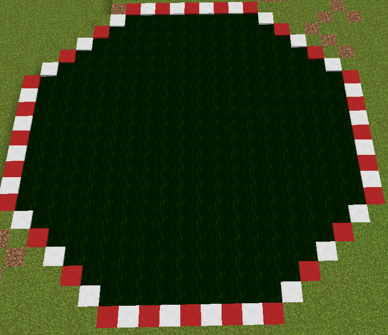
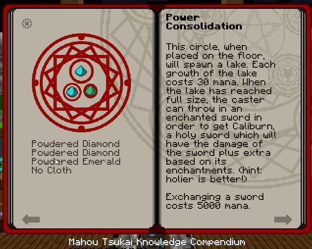

---
authors:
    - Xarrah
    - BigFire
    - Ultrameta
    - Seg
---

# Caliburn

#### Step 4
Allocate three large areas to your **Mahou Tsukai** adventure (_I use a **19x19** area for the Mahou lake, a **10x10** area for the mob damage farm, and a **11x9** area for the villager kill farm_)

{width='250px'}

#### Step 5. Enchant a diamond sword

> **Note**: The more **Smite** levels your sword has, the greater the base damage the **[Caliburn](caliburn.md)** will have.

#### Step 6. Creating The Lake

After you have gathered enough **Mahou Tsukai** [Mana](mana.md) (about **10,000**, or a full **Attuned Diamond**) you are ready to place 
A **Blood Circle** in the center of your **19x19** area. Fill this **Blood Circle** with two **Powdered Diamond**, and **One Powdered Emerald** (FROM **MAHOU**!)
Once the Lake is fully formed, there will be **FOG**! 

{width='350px'}

Drop your **enchanted** diamond sword in and ensure you have at-least **5000** [Mana](mana.md). 
Search for the **[Caliburn](caliburn.md)** in the lake to retrieve it!

#### Attuned Diamond / Emerald

Acts as [Mana](mana.md) capacitors. [Mana](mana.md) slowly decreases over time - Attuned Diamond / Emerald store unused [Mana](mana.md) for later use ([Mana](mana.md) in these do not decrease over time)

[Continue To Morgan](morgan.md)

> Mahou Tsukai | [CurseForge](https://legacy.curseforge.com/minecraft/mc-mods/mahou-tsukai)