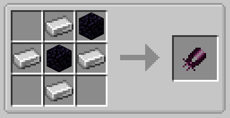
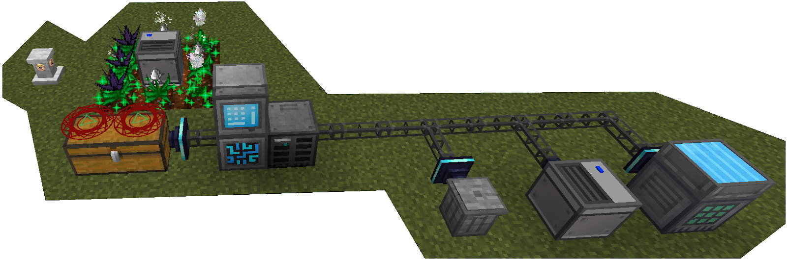
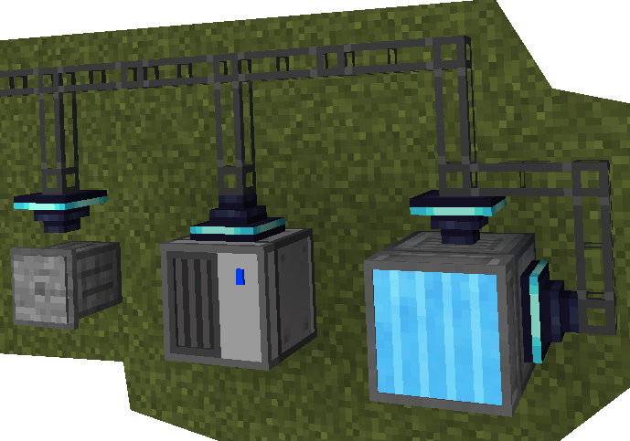

---
authors:
    - Xarrah
    - BigFire
    - Ultrameta
    - Seg
---

# Durability Exchange

{width='350px'}

**Obsidian Sheaders** have over a million durability, but Mahou Tsukai caps durability exchange at like **2,500** durability but the recipe is cheap and easy so that's why I use it since each **Durability Exchange** spell circle can restore a maximum of 10 mana per second, you will need a large amount of spell circles and chests for you to be able to gain the mana you need to efficiently swing your [Morgan](morgan.md) at villagers for damage gain

{width='250px'}

{width='100%'}
{width='50%'}

> Mahou | [CurseForge](https://legacy.curseforge.com/minecraft/mc-mods/mahou-tsukai)