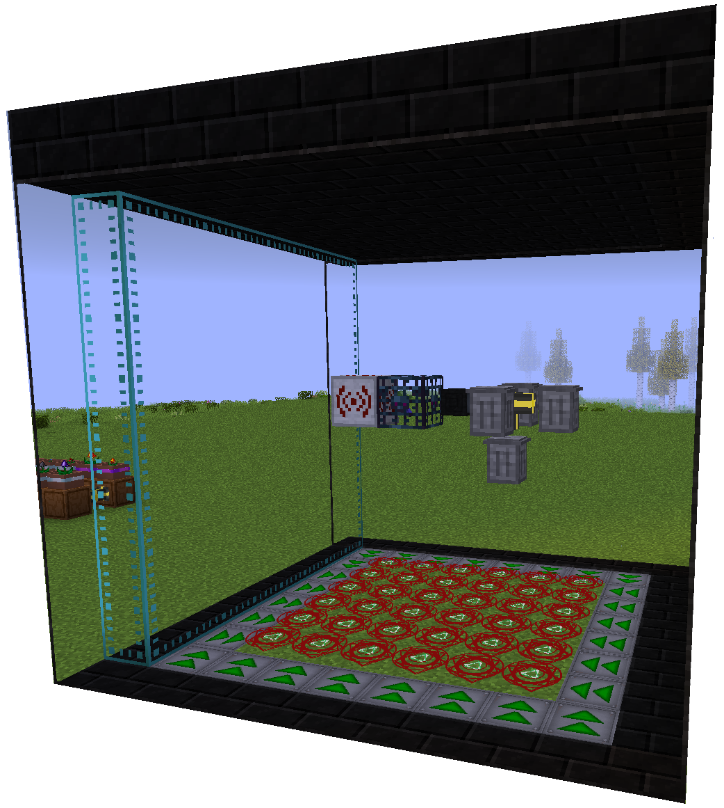
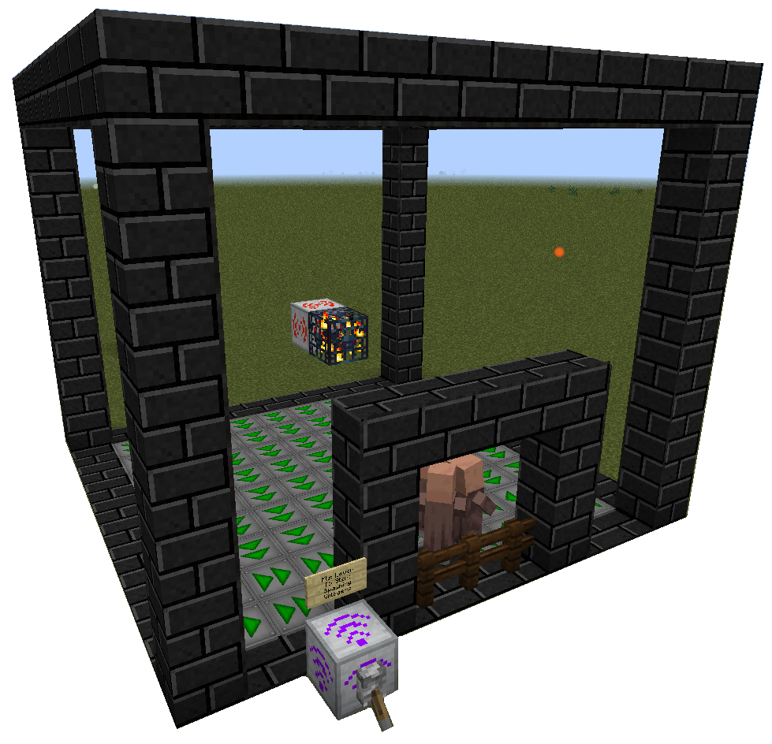
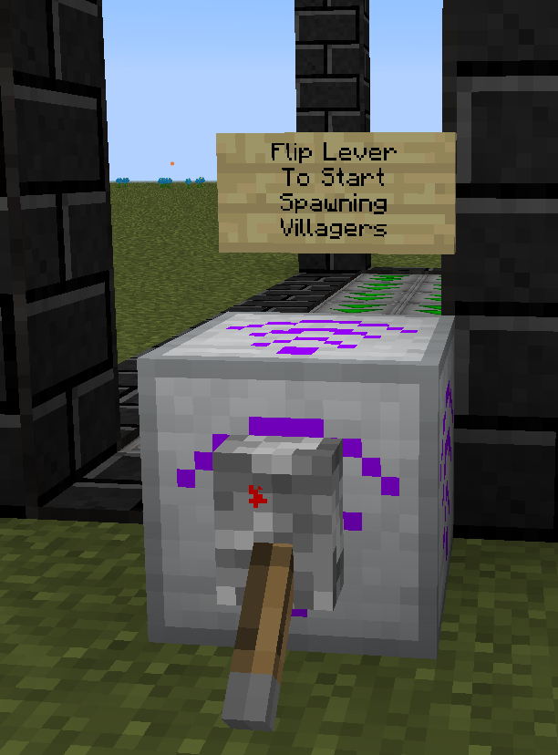
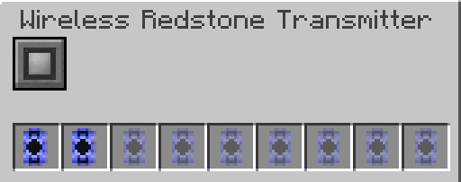

---
authors:
    - Xarrah
    - BigFire
    - Ultrameta
    - Seg
---

# Mana

Top left you should see a Mahou manu bar. If not run `/showmahou`

#### Step 8. Create an enclosure for Mahou Mana generation

- **Ethereal Glass** is solid for mobs, but players can pass through it.
- **Conveyor Belts** push the mobs into the Mahou spell circles (_that damage them for mana_)
- **Wireless Redstone Reciever** is used to toggle the mob spawner on from a distance. (_spawner must have redstone comparator upgrade_)
- **Absorption Hopper** sucks up the mob drops and experience orbs. (_it is recommended to hook up a tank for the absorption hopper to deposit liquid XP into_)
- **Item Pipez** move the drops from the absorption hopper into the trash cans. (_My item pipe has an Ultimate Pipe Upgrade inside for quick item transfering_)
- **Dark Connected glass** prevents light from passing through and makes for a clear viewing window

The purpose of this farm is to drop mobs onto the Mahou damage spell circles, where they lose life (this gains you mana and increases your mana cap since the spell circles use 5 mana per 1 second) and then trash the drops (optional).

> Image has 36 Boundary of Drain Life spell circles (6x6).

#### Step 9. Create an enclosure for your Villager spawner

- My enclosure uses **Solid Dark Zychorium Bricks** and **Dark Connected Glass**, but any blocks may be used (_as with the Mahou Mana Generation enclosure_)
- I have a **Wireless Restone Reciever** attached to the Villager spawner; the spawner is upgraded with a **Redstone Comparator**
- Use **GPS Data Cards** on the **Wireless Redstone Recievers** to link the **Wireless Transmitter** so that the Lever starts up both the Mana Generation Farm and the Villager Spawner - this will increase your mana (and cap) at the same time as you kill villagers for the **Morgan**.

{width='250px'}
{width='250px'}
{width='500px'}

> Mahou | [CurseForge](https://legacy.curseforge.com/minecraft/mc-mods/mahou-tsukai)