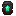
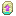

# All The Modium

In **ATM9**, All The Modium has changed in ways different from previous packs. We'll explain where to find, how to obtain, and how **Templates** works to craft armor & tools!

### Where & How

**AllTheModium** ores can be found across 3 dimensions: **Overworld**, **Nether**, and **The End**, normally exposed to **AIR**.

- Overworld: (**AllTheModium**)
    - Found in **Deep Dark** Biome, also **Mining Dimension**.
        - Killing Warden also grants a **Quest** reward Ingot.
    - Obtained with a **Netherite** level pick or better. 
- Nether: (**Vibranium**)
    - Found in **Crimson** and or **Warped** forests.
        - Elevation between Y 60-123
    - Also Found between Y 0-40 within **The Other** dimension.
    - Obtained with an **AllTheModium** level pick or better.
- End: (**Unobtainium**)
    - Found within **End Highlands**.
        - More rare than other ores
    - Obtained with **Vibranium** level pick or better

!!! Warning "Ores Can Only Be Mined By A 'Real Player'"

### Templates

- AllTheModium: {width='32px'}
    - Found in **Sus Clay** in **Ancient Cities** within the **Overworld**.

{width='300px'}

- Vibranium: {width='32px'}
    - Found in **Sus Soulsand** in **Bastions** within the **Nether**.

{width='300px'}

- Unobtainium: {width='32px'}
    - Found as loot in **The Other** dungeons inside **Libraries** 