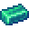
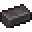
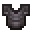
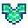

# AllTheModium

In **ATM9**, All The Modium has changed in ways different from previous packs. We'll explain where to find, how to obtain, and how **Templates** works to craft armor & tools!

### Where & How

**AllTheModium** ores can be found across 3 dimensions: **Overworld**, **Nether**, and **The End**, normally exposed to **AIR**.

- **AllTheModium**: (Overworld) {.absolute style='margin-left:5px'} {.absolute style='margin-left:45px'}
    - Found in [Deep Dark](https://minecraft.fandom.com/wiki/Deep_Dark) Biome, also in **Mining Dimension** Deep Slate layer (Y 65-129).
        - **Mining Dimension** is more rare, at-least 1 ore per chunk.
        - Killing **Warden** also grants a Quest reward ATM Ingot.
    - Obtained with a **Netherite** level pick or better. 
- **Vibranium**: (Nether) {.absolute style='margin-left:5px'} {.absolute style='margin-left:45px'}
    - Found in **Nether** dimension (no longer biome specific).
        - Elevation between Y 64-127
    - Also Found between Y 0-40 within **The Other** dimension.
    - Obtained with an **AllTheModium** level pick or better.
- **Unobtainium**: (End) {.absolute style='margin-left:5px'} {.absolute style='margin-left:45px'}
    - Found within **End Highlands**.
        - More rare than other ores
    - Obtained with **Vibranium** level pick or better

!!! Warning "Ores Can Only Be Mined By A 'Real Player'"

### Templates

- **AllTheModium**: {.absolute style='margin-left:5px'} 
    - Found in **Sus Clay** in **Ancient Cities** within the **Overworld**.

{width='300px'}

- **Vibranium**: {.absolute style='margin-left:5px'}
    - Found in **Sus SoulSand** in **Bastions** within the **Nether**.

{width='300px'}

- **Unobtainium**: {.absolute style='margin-left:5px'}
    - Found in **The Other** dimension, as chest loot in the underground library of `allthemodium:dungeon` structure.

## Smithing Recipe Example
| Template | Armor | Ingot | Output |
| :------: | :---: | :---: | :----: |
|  |  |  | 
|  |  |  | 
|  |  |  | 
|  |  |  | 
