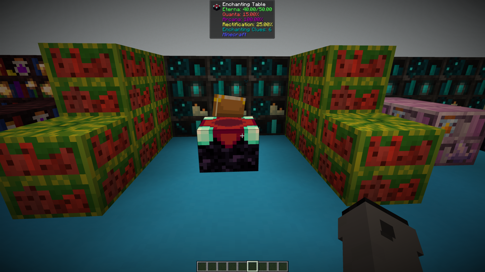
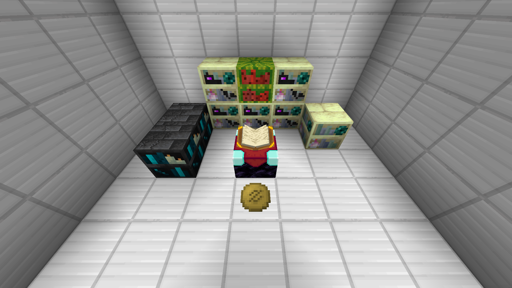
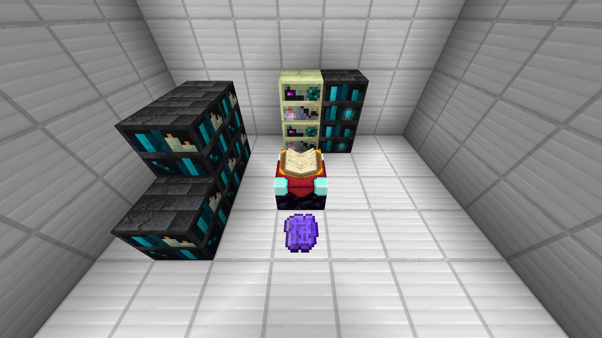
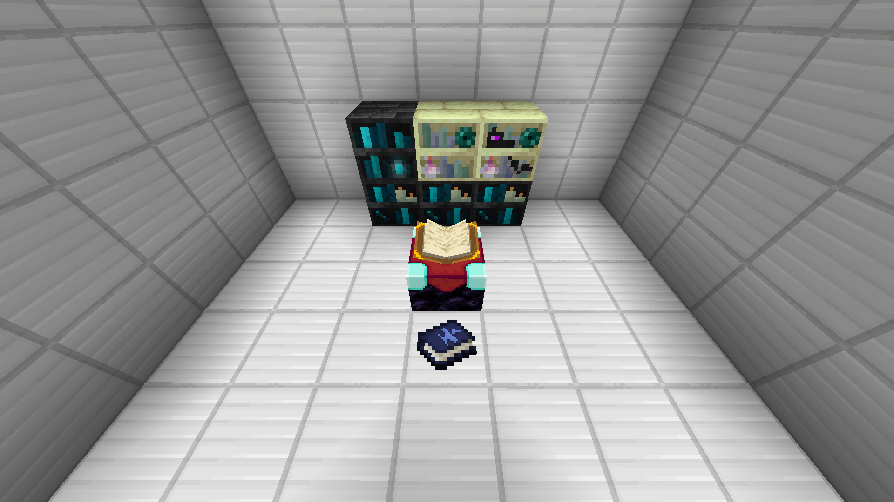
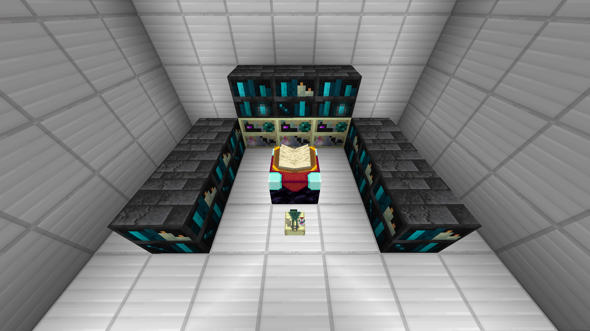

# Apotheosis

## Starting Setup (JEI REQUIRED)

### Requirements

Recipes for the shelves in this guide **WILL NOT BE PROVIDED**. Please use JEI. Other requirements include a brain and some sort of sensory organ to perceive this with.

### Seashelf Method

To start, make 16 **Seashelf** and place down all but one in a formation like the one below.  

{.center}  

Once you've got those down, take your 16th **Seashelf** and place it in the enchanting table. You should see an Infusion option for 3 EXP. Now replace one of the uninfused **Seashelf** with your **Infused Seashelf**. Repeat this until all 16 `Seashelf` are `Infused Seashelf`. You will have 1 extra `Infused Seashelf` at the end.

!!! info "You must be level 45+ to infuse Seashelves"

After this, you'll need to break 9 **Infused Seashelf** and make 2 **Heart-Forged Seashelf** and 7 **Crystalline Seashelf**. Place these down where the original 9 were.

Now, you will need to make 10 **Dormant Deepshelf** and infuse them to their **Deepshelf** varient. You should be able to infuse them with your current setup.

!!! info "You must be level 60+ to infuse Dormant Deepshelves"

After infusing all 10, make 5 **Soul-Touched Deepshelf** and 5 **Echoing Deepshelf**. Then, upgrade them to their **Sculkshelf** variant. *Press `U` or `right click` on the respective shelf in JEI to see what the recipe is to upgrade them.* 

Now you'll need to make 3 **Shelf of End-Fused Rectification**. This might require some work.  

You will also need to make 1 **Draconic Endshelf**. To make the **Infused Dragon's Breath**, place down the 10 **Sculkshelves** made earlier and add 10 **Melonshelf**. A setup for this can be seen below; the placement of the shelves does not have to be exact.  

!!! info "You must be level 80+ to infuse Dragon's Breath"

{.center}  

After making the `Draconic Endshelf`, remove all the `Melonshelf`. Place the 3 **Shelf of End-Fused Rectification** and the **Draconic Endshelf** in a similar formation as shown in the `Seashelf` image above. This will get you the maximum level of enchanting. Your setup does not have to be in the exact same order as the one below; it is only an example.  

{.center}

---
## Infusion Setups

You do not have to place the blocks exactly as I do, these are just an example.

### Unbreakable Potion Charms

!!! info "5x Draconic Endshelf, 2x Echoing Deepshelf, 1x Melonshelf, 1x Endshelf"
	
{.center}

### Superior Sigil of Socketing

!!! info "5x Echoing Deepshelf, 2x Draconic Endshelf, 2x Soul-Touched Deepshelf"

{.center}

### Tome of Superior Scrapping

!!! info "3x Echoing Deepshelf, 1x Soul-Touched Deepshelf, 1x Endshelf, 1x Draconic Endshelf"

{.center}

### Tome of Extraction

!!! info "3x Echoing Deepshelf, 2x Draconic Endshelf, 1x Soul-Touched Deepshelf"

{.center}

### Library of Alexandria

!!! info "7x Echoing Deepshelf, 3x Draconic Endshelf, 2x Soul-Touched Deepshelf"

{.center}

---
## Spawner Changes

- **Remove AI**: {~~Chorus Fruit ~> Golden Apple ~~}
- **Ignore Players**: {~~Nether Star ~> Conduit ~~}
- **Increase Entities**: Ghast Tears | Max {~~ 32 ~> 16 ~~}
- **Increase Spawn Count**: {~~Fermented Spider's Eye ~> Piglich Heart~~} | Max {~~ 16 ~> 8 ~~}
- **Decrease Minimum Spawn Delay**: {~~ Sugar ~> AllTheModium Ingot ~~} | Min {~~ 20 ~> 100 ~~}
- **Decrease Maximum Spawn Delay**: {~~ Clock ~> Unobtainium Ingot ~~} | Min {~~ 20 ~> 100 ~~}

 The aim of these changes are to make removing **AI** easier, give **Conduits** more of a use, encourage people to look out for good spawners in the world, and bring spawners more in line with the other options available for farming mob drops, like **Hostile Neural Networks** or **Mystical Agriculture** or **Productive Bees** WannaBee mob farms.

> Apotheosis | [CurseForge](https://legacy.curseforge.com/minecraft/mc-mods/apotheosis)
