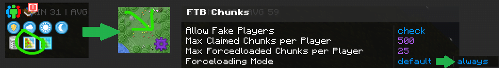
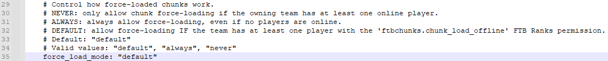

# FAQ

**All The Mods 9** Frequently Asked Questions

---

???+ Abstract "Gameplay FAQs"
	??? Question "What's the little 3D cube next to my crosshair?"
		It's from Quark, the default keybind to toggle it is ++k++.
		
	??? Question "There are yellow numbers on all my inventory slots!"
		It's from Super Factory Manager, the default keybind to toggle it is ++ctrl+i++.
	
	??? Question "There's a ghost/easter egg that appears every few minutes!"
		The ghost is from Corail Tombstone, you can disable by doing `/tbgui` locate the ghost toggle under effect. This toggle will only show if your GUI scale is set to 4.

		If you want to prevent the ghost/easter eggs and all other Corail holiday events **permanently**, you can download [BadCorailNoHolidays](https://legacy.curseforge.com/minecraft/mc-mods/badcorailnoholidays), if you want keep some events enabled, it does have a config at `atmInstall/configs/badcorailnoholidays-common.toml`.

	??? Question "Items in my RS storage aren't showing, I can't access items through any means."
		It's most likely due to your controller reaching 64kFE/t power draw, when this threshold is reached, RS starts glitching out. 
		
		You can remedy this by increasing the energy capacity of the controller in `saves/worldName/serverconfig/refinedstorage-server.toml` on line 36.
		
	??? Question "Why can't I use modular router and watering can?"
		By default, **Mystical Agriculture** does not allow fake players to automate watering cans. If you dislike this change, it can be changed within `config/mysticalagriculture-common.toml` > `fakePlayerWatering = true`.

	??? Question "Do I need to chunkload all the chunks my Chunk Destroyer is going to mine?"
		You do *not* need to load chunks you're mining. You only need to chunkload the chunk the **Chunk Destroyer** is in.

	??? Question "How do I remove enchants from a book/weapon?"
		- Drop an anvil onto **Obsidian** with the enchanted book/weapon along with **Books** for each separate enchantment (EX: You have a book with 3 different enchants, you'd need 3 books to split those enchants). 
		- Enchant the anvil with **Splitting** (Only splits books/weapons with 1 enchant) or **Obliteration** (Splits any number of enchants)
		- Use the **Enchantment Extractor** from Industrial Foregoing. Provide it with **Books** and **Power**, and it will extract each enchantment on all enchanted items/books to singular books. It can also be configured to push extracted enchantments into the **Enchantment Library** from Apotheosis.
		
	??? Question "When I mine Allthemodium/Vibranium/Unobtainium it doesn't drop anything!"
		It's caused by the `Miner's Fervor` enchantment, remove it and try breaking it again.

	??? Question "How do I find '`insert name`' biome?"
		**Nature's Compass** is a really nice tool to find any and all biomes in the modpack. Craft it, right click with it in your hand, and you can run the search for any biome you are looking for (such as the Deep Dark).

	??? Question "How do I change `/home`, `/tpa` etc cooldown?"
		To change the behavior of `/home` or to re-enable `/back` and `/rtp`, edit `saves/worldName/serverconfig/ftb-essentials.snbt`. **The world/server has to be stopped for the changes to take effect.**

	??? Question "Why is flight disabled?"
		Flight is disabled in certain dimensions (**The Other**, **Blue Skies**, and **Twilight Forest**), to add more difficulty towards progression. If you dislike this change, it can be disabled in `worldName/serverconfig/noflyzone.snbt`
		
	??? Question "I can't complete '`questName`' even though I fufilled the requirements?"
		You can enable edit quests in the bottom right of the quest screen (you need OP for this) and then r-click the broken quest and `Complete Instantly` it OR click the quest then r-click the reward and `Reset Progress` if you still want the rewards.

	??? Question "How do I increase claimed/force loaded chunks?"
		- Add claimed chunks: `/ftbchunks admin extra_claim_chunks <player> <set/add> <amount>`
		- Add force-loaded chunks: `/ftbchunks admin extra_force_load_chunks <player> <add/set> <amount>`

???+ Warning "Technical FAQs"
	??? Question "My screen is shaking like im getting hurt and I can't do anything!"
		
		Backup your world, then download [NBT Explorer](https://github.com/jaquadro/NBTExplorer) from GitHub.
		
		!!! warning "Make sure you shutdown your world/server before attempting this!"
	
		=== "Singleplayer"
			1. Go to `AlltheMods9ATM9\saves\theNameOfYourWorld` and open `level.dat` with NBT Explorer.
			2. Go to `Date -> Player` and set `AbsorptionAmount` to `1`.
			3. Scroll down and set `Health` to `1`.
			4. Save the file and start your world

		=== "Multiplayer"
			1. Go to `world/playerdata` and find the affected player's UUID `playerUUID.dat` file and open it with NBT Explorer.
			2. Go to `Date -> Player` and set `AbsorptionAmount` to `1`.
			3. Scroll down and set `Health` to `1`.
			4. Save the file and start your server.
		
		<video controls>
		  <source src="../img/faqNAHealthvid.mp4" type="video/mp4">
		</video>

	??? Question "I have my chunks force loaded, but they don't run when I'm logged off."
		??? Info "In-game (Requires OP)"
			1. Press ++m++ to open the map.
			2. Press ++ctrl+s++ to open the server settings (requires OP).
			3. Change `Forceloading Mode` to `always`.
			
		
		??? Info "With the Config File"
			1. Stop server.
			2. Navigate to `world/serverconfig/ftbchunks-world.snbt` and look for `force_load_mode: default` change that from `default` to `always`.
			3. Save and start the server.
			
		
	??? Question "What's the difference between ATM9 and ATM9: No Frills?"
		[Here is a comparison](https://www.modpackindex.com/modpacks/compare?modpacks=64056,74905)
		
	??? Question "Why isn't '`insert mod name`' in ATM9?"
		ATM packs does not literally contain "All The Mods". Our main focus is having mods that's not: 1) buggy, 2) ruins performance or progression. If a mod supports Minecraft version **1.20.1**, and **Forge** (Not NeoForge), you may make a [suggestion](https://github.com/AllTheMods/ATM-9/issues/1).
	
	??? Question "I found a bug/dupe in the pack. How can I report it?"
		To report bugs, dupes or similar, head over to the [ATM9 GitHub](https://github.com/AllTheMods/ATM-9/issues) and open a new issue describing the occurrence.

	??? Question "What are the recommended Java arguments for this pack?"
		- **Client arguments**: send `?args` in the **#bot-spam** channel in our [Discord](https://discord.com/invite/allthemods).
		- **Server arguments**: send `?svargs` in the **#bot=spam** channel in our [Discord](https://discord.com/invite/allthemods).

	??? Question "Why does my game crash while launching?"
		Lack of RAM most likely. Send `?allocate` in the **#bot-spam** channel in our [Discord](https://discord.com/invite/allthemods) to learn how to allocate more RAM. If that's not the problem, head to **#atm9-techsupport** and send `?logs` to see how to upload your crash/latest log.

	??? Question "I crashed and got `Error code 1`, please help"
		`Exit code 1` is a generic error from Minecraft. It is no different than "game didn't load, no longer attempting to load. Please refer to the output error log created by your launcher" if you are unsure... please feel free to ask for further instructions on how to locate, post, and get help for your specific error so that we may further assist you in our [Discord](https://discord.com/invite/allthemods). Try running `?logs` instead.

	??? Question "I'm having issues connecting to a LAN/Essentials world"
		To fix LAN/Essential some people have removed Logprot, some Oculus, some Supplementaries. None are guaranteed, none are the actual fix. We are unable reproduce it in Dev to properly diagnose it. LAN is highly unstable in big modpacks like these.
