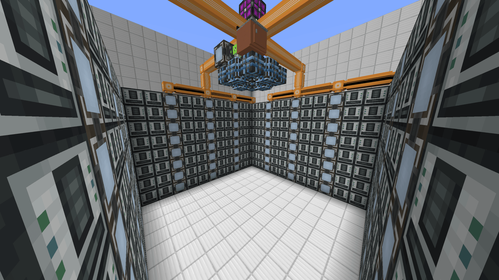
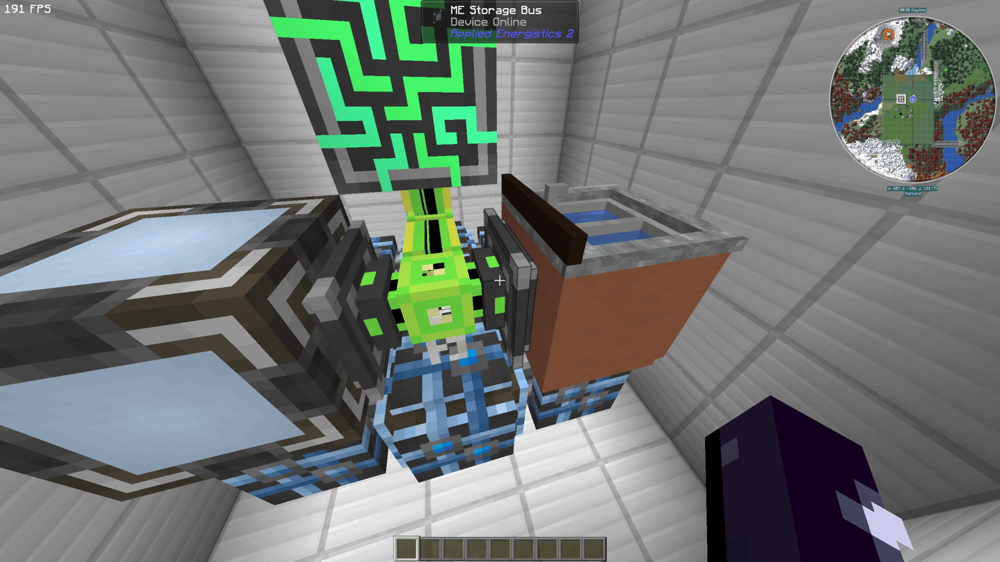
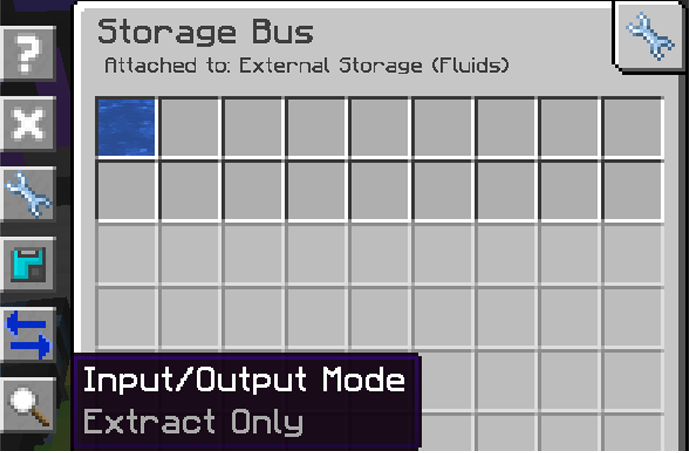
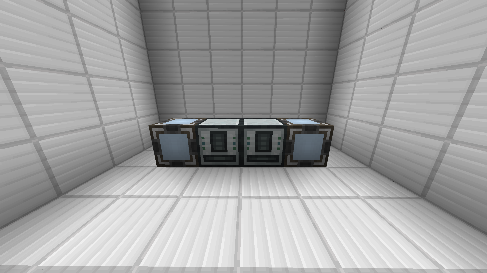
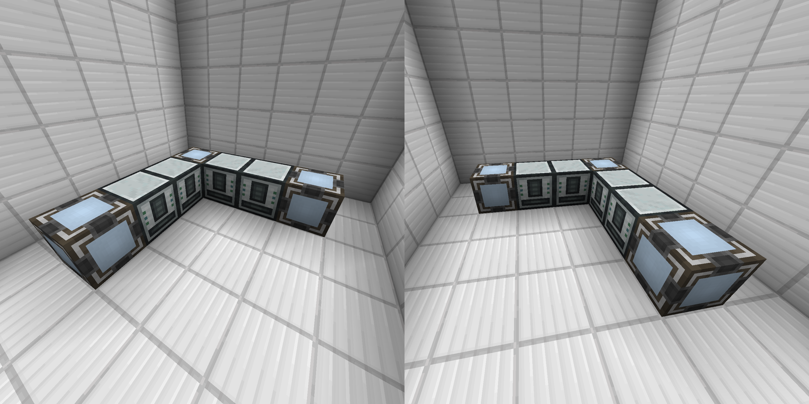
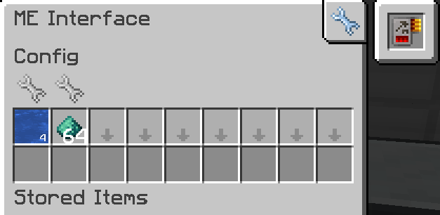
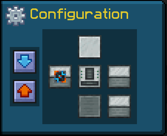

# Mystical Agriculture

## Infusion Changes

ATM9 adds **Mystical Agriculture Tiered Crystals** which, as the name suggests, adds tiered crystals. You must use a crystal of the same tier to upgrade to the next one (EX: You have to use an **Imperium Crystal** to craft **Supremium Essence**).

- **Master Infusion Crystals** now requires 4 {~~Supremium~>Insanium~~}.

---

## Farm Designs

### AlfredGG's Farm

??? Question "My Watering Can/Scythe isn't working"
    **Mystical Agriculture** doesn't allow fake players by default. The config can be changed in `config/mysticalagriculture-common.toml` -> `fakePlayerWatering = true`.

??? Question "My Modular Routers aren't working"
    You will need to add a **Security Upgrade** since you are working in a claimed chunk (even though it's yours)

### KJM's Full-Auto Phytogenic Insolator with AE2 

{.center}

#### Requirements

??? abstract "Minimum Building Materials"
	- These materials set the ground work to build the full thing.
	- [ ] 3x ME Interface
	- [ ] 2x ME Storage Bus
	- [ ] 2x Quartz Fiber or Cable Anchor
	- [ ] 2x AE2 Crafting Card
	- [ ] 2x Phytogenic Insolator
	- [ ] 1x ME Controller
	- [ ] 1x Pair of Quantum Rings
	- [ ] 1x Sink/Eternal Water Block
	- [ ] 1x of **any** colored cable *(Examples are using Magenta cables)*
	- [ ] 2x of a **different** colored cable *(Examples are using Lime cables)*
	- [ ] 8x of **another different** colored **Dense** cable *(Examples are using Orange dense cables)*
	
??? abstract "All Building Materials"
	- [ ] 129x ME Interfaces
	- [ ] 2x ME Storage Bus
	- [ ] 2x Quartz Fiber or Cable Anchor
	- [ ] 128x AE2 Crafting Card
	- [ ] 256x Phytogenic Insolator
	- [ ] 1x ME Controller
	- [ ] 1x Pair of Quantum Rings
	- [ ] 1x Sink/Eternal Water Block
	- [ ] 1x of **any** colored cable *(Examples are using Magenta cables)*
	- [ ] 2x of a **different** colored cable *(Examples are using Lime cables)*
	- [ ] 68x of **another different** colored **Dense** cable *(Examples are using Orange dense cables)*

!!! info "Each image has a caption that shows when you click on it that you can read if you are stuck."

!!! warning "This farm requires a general understanding of **AE2** and **Thermal Series**"

#### The "Brain"

First I'll show you how to build the "brain" of those whole system. You can place it above everything (like in the image above) or underneath the floor.

1. Place a **Sink/Eternal Water Block** and an **ME Interface** on the corners of a **Quantum Ring** and then place **2x Quartz Fibers/Cable Anchors** between the Sink and ME Interface and on the center of the Quantum Ring. 
2. Then place your **2x colored cables** (Lime cables) on top of them along with an **ME Controller**.
3. The **1x colored cable** (Magenta cable) should connect the quantum ring and the ME Interface.

* Make sure to link your Quantum Rings.

{.center}

4. Place **2x ME Storage Bus** on the ME Interface and Sink, facing each other.

{.center}

5. Have the ME Interface stock **Water** and **Phyto-Gro** and set the priority to **-1**.
{.center}

6. For the ME Storage Bus settings, have the **Input/Output Mode** to **Extract Only** and put **Water** in the filter by dragging it from JEI.
{.center width='489' height='253'}

---

#### The Modules

Now we'll build one of the "modules" that make up the entire thing. Each column of Phyto/Interface pairs is **8 blocks tall** since an AE2 subnet without a controller only has 8 channels. Each wall will use all 32 channels of a dense cable.

1. Each module consists of **2 Phytos** next to each other and an **ME Interface** on each side.
{.center}

1.5 If you build the full size farm, the corners will look like this. One of the Phytos will move 90° to one side depending on which corner it's on.
{.center}

2. For the **ME Interface**, put a **Crafting Card** in and set **Water** and **Phyto-Gro** in the filter by dragging it from JEI.
{.center}

3. For the Phytos it'll be slightly different depending on which side the ME Interface is on. You will have it **Auto Input/Output** the side touching the interface. The image below is for a phyto with an interface to the left.
{.center}

4. Each Phyto will have **1x Draconic Integral Component & 3x Twinite Flux Linkages**. This combination provides maximum efficiency, of course you can put the lower tier ones in as you are working up to these.
{.center}

??? Question "Why not use Shellite instead of Twinite? KJM explains"
	The stats for Shellite Flux Linkage is 120% & 1.1x. The stats for the Twinite Flux Linkage is 110% & 1.01x. An MA seed uses 20,000FE to complete one growth operation, and Phytos fill at 20FE/t by default. That 20,000 number is multiplied by the process energy statistic. A single Shellite upgrade would modify it to 22,000FE, and Twinite goes to 20,200FE. The second stat modified is energy usage. Shellite increases the per-tick power consumption to 44FE/t, and Twinite increases it to 42FE/t. A recipe runs for 50 seconds by default since 20,000 divided by 20 divided by 20 (the number of ticks per second) is 50. Placing the numbers in for shellite 22,000/44/20 = 25 and for Twinite 20,200/42/20 = 24. Therefore, Twinite at a base level with a single upgrade is 1 second faster than Shellite. This number is further modified by adding multiple linkages and the integral component. 

You'll stack these modules to a **maximum of 8 tall** and arrange them into 4 walls.

???+ tip "Tips"
	- Use an AE2 **Memory Card** to copy **ME Interface** settings (`Shift + R-Click` to **Copy**, `R-Click` to **Paste**)
	- Use **Redprint** to copy **Phytogenic Insolator** settings (`R-Click` to **Copy**, `Shift + R-Click` to **Paste**)

---

#### Connecting and Powering

You'll put your **Colored Dense Cables** in this arrangement, each dense cable branch connects 4 colums of interfaces. You can use whatever energy pipe you want to power the phytos.
{.center}

> Mystical Agriculture | [CurseForge](https://legacy.curseforge.com/minecraft/mc-mods/mystical-agriculture)
