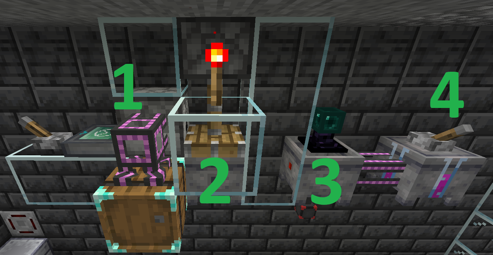
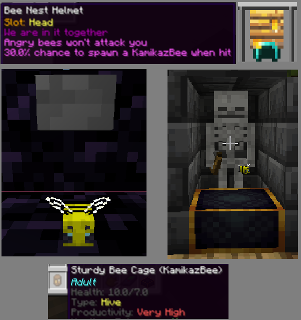
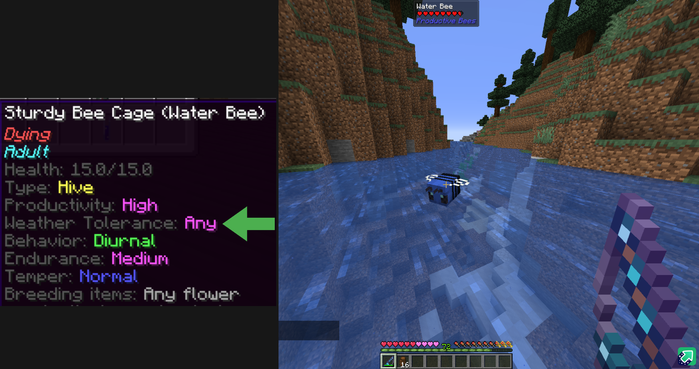

# Productive Bees

## Getting Started

Hi, I'm Jonh09 and I made this guide to help people who are getting into **Productive Bees** or want to know more advanced stuff.

If you're starting out and want to learn more, check out [Rockit14](https://www.youtube.com/watch?v=2CdILcAxPxE) for a complete guide and [Pilpoh](https://www.youtube.com/watch?v=7wg3UQ_AsAA) for an advanced guide! Also, read the **Productive Bees book**; it has all you need to know, including upgrades and how they work, different types of bees, different machines, etc. A glance at the book will help if you get stuck. Also, remember that **JEI** is your best friend.

This guide's main focus is genes. Genes are the stats that bees have that determine their productivity, what conditions they can work in, and other less important ones. I will show you the best genes and how to get them here.

If you find any errors or something that can be done differently, you can ping me. Same name in discord

Original guide: [Productive Bees GUIDE - Beginning Tutorials + Best Genes and how to get them](https://imgur.com/a/bh2fHtf)

---

## Gene Types

{align=right width='249px' height='132px'}

Apart from the 5 main genes, there is a 6th gene, the **bee-specific gene**. These are used to make spawn eggs of that bee. Most major mods use bee spawn eggs to connect themselves to Productive Bees. *(EX: Mystical Agriculture essence bees)*

---

| Gene | Description | Levels | Best Level |
| ---- | ----------- | ------ | ---------- |
| **Productivity** | Produces more combs per trip | Normal, Medium, High, Very High | Very High
| **Weather Tolerance** | Determines which weather conditions a bee can work in | None, Rain, Any | Any
| **Behavior** | What time of day the bee can work | [Diurnal]("Only work during daytime"), [Nocturnal]("Only works at night"), [Metaturnal]("Works 24/7") | Metaturnal
| **Endurance** | Affects the bee's max health | Weak, Normal, Medium, Strong | Strong
| **Temper** | Affects bee's hostility | Passive, Normal, Aggressive, Hostile | Passive

## How to Get Genes

Now that you know what the genes are, you need to know how to get the genes. When you **squash** a bee to get genes, you will get all of its 6 different genes. The bad news? You only get a small percentage of the gene. The percentage dictates the chance that another bee has to get that gene. To give genes to a different bee, combine a **Honey Treat** with your chosen gene(s) in a crafting grid and then ++rbutton++ on a bee to give them that trait.

{.center width='500px' height='500px'}

???+ abstract "Getting genes is a pretty simple process:"
	1. Get a bee you wish to get the genes of
	2. In a 3 block tall space, put a **Bottler** *(with bottles of course)* on the bottom, and a **Piston** facing down on top with button/lever next to it.
	3. Put the bee in the middle, and quickly press the lever/button, that will squish the bee into a bottler and give you **Squashed Bee Material**
	4. Put that into a **Centrifuge**, and it will give you the 6 genes of the bee. 

Easy right? But remember, it will only give up to around 20% of the gene per bee, so you need to repeat the process 4-5 times. I'll show you how to get genes automatically below.

---

## Gene Automation

This is a simple semi-automated setup. I reckon you already know how to set up breeding and incubation to get more bees if you are here.

### **1.** The Dispensing of Bees

For this you can just use a vanilla **Dispenser** + an **RFTools Timer** to send a pulse to it every **20 ticks**, releasing a bee from a cage into the piston area. The lever behind the Timer is just to disable it when you arent using it.

???+ tip
	Make sure you are squishing bees in disposable cages, as those dont cause any clutter and are more straightforward to use

### **2.** The Squishing

This is where the bees will be turned into the **Squashed Bee Material**, the same thing as in the previous explanation. Dont forget to send bottles to the **Bottler** or it will stop squishing bees.

???+ tip
	If you keep the piston extended, like in the image, the bees will get squashed automatically when you push/dispense them into it.

### **3.** Processing Bee Material

Using any Item Collector, pick up the **Squashed Bee Material** and send it to a **Centrifuge** that separates it into the 6 genes.

### **4.** Sorting & Improving Genes.

After getting the genes out of the centrifuge using whatever pipe you prefer, you can send them into a **Gene Indexer**. This machine will sort and combine the genes inside when given a redstone signal *(Lever or Redstone Block)*. It will combine all the genes into their 100% version. These are the ones we are looking for, the ones that allow you to change the genes of a bee 100% of the time.

### Optional Step 

Using an item pipe from **Pipez** that can pull 100% genes with NBT filtering.

Item: `productivebees:gene`

NBT: `{productivebees_gene_purity:100}`

---

## Getting the Best Genes

OK, OK, you already know what genes are, how to get them, and how to automate them. This is what you are here for, the *BEST* genes. In this section, I'll discuss the most and least important ones.

???+ note 
	My recommendation? Put all your good genes into one bee that you can breed. Then, you will get a baby with the same genes.
	
	From there, breed them -> Squish them -> Get genes -> Make Honey Treats with those genes, and use those to upgrade all your bees.

???+ tip
	You can put **multiple genes** into the same **Honey Treat**. I like to call this *Bee Steroids*, a honey treat with all the best genes.

### Least Important

The least important ones are **Temper** and **Endurance**. These two are worthless if you use a **Simulation Upgrade** or have them in a box.

### Most Important

#### Productivity: Very High

{align=right}

This one's the trickiest and most important; this trait can only be gotten from **Kamikaze Bees**.

**Kamikaze Bees** spawn in a particular way by being attacked. Their only objective is to protect you by... well... going kamikaze on the attacker.

While wearing a **Bee Nest Helmet** (a Diamond helmet with a Nest on top), if you get hit by a hostile mob, there is a **30% chance** of a Kamikaze Bee spawning. The difficult part? They're *TINY* and *FAST* so you need to have a setup inside an enclosed box, have a **Catcher** ready, or have good aim and cage them once they spawn.

Get **4-5** of them then squeeze them. This should get you a **100% Very High** Productivity gene.

!!! warning "Kamikaze Bees can't breed with each other."

Now, you need to put the gene in an easy-to-breed bee (via Honey Treat + Gene) and breed them, and once an offspring is born with the Very High gene use it to breed more bees of that type. With that, you basically have infinite, Very High Productivity genes.

#### Behavior: Metaturnal

{align=right width='350px' height='350px'}

To get this trait, a bee needs to be **left outside** for a few days. If it starts as **Diurnal**, it will change to **Nocturnal**, then **Metaturnal**. If you have Nocturnal bees, that's better since you are already halfway there. 

I recommend using a **Lead + a Fence** to secure them so they don't fly away.  

!!! warning "You must feed them **Honey Treats** once in a while because they take damage while they're stuck outside"

#### Weather Tolerance: Any

There are 2 ways to obtain this. The slow and the fast way. 

The slow: The strategy of leaving the bees outside so they get forced to adapt like the previous one... OR the fast fishing route. 

By fishing I mean fishing for bees, more specifically **Water Bees**. To get them, you will need to fish in a **River biome**.
 
!!! tip "If there aren't rivers nearby, use a **Nature's Compass** to point you to a river."

While using a normal **fishing rod**, there is a chance for a **Water Bee** to come out of the water, and it will be *MAD*, so have a **Cage** on hand to capture it. You will need 2 of those to breed them to make more and to get that sweet weather tolerance.

{.center width='500px' height='500px'}

## Genes When Breeding

When breeding, you must know how genes are assigned to a child bee.

The bee on the **Left** side will be the **Main** bee, which is the one with priority gene-wise. This means that the baby will have the genes of the main bee at a minimum. 

The bee on the **Right** only defines the range of gene levels.

In the image below the "maxed" gene levels of the **Main** bee (Weather tolerance, behavior, and endurance) gets transferred to the child bee.

{.center}

???+ example
	If the main bee has **Productivity: Medium**, and the 2nd bee has **Productivity: Very High**, the baby will have a chance to have either Medium (the minimum the main bee has), High, or Very High.

You will *never* get a child bee that has genes of a lower level than the main bee. That's why I recommend maxing out the 1st bee so it can be used as the main one for breeding.

> Productive Bees | [CurseForge](https://legacy.curseforge.com/minecraft/mc-mods/productivebees)
