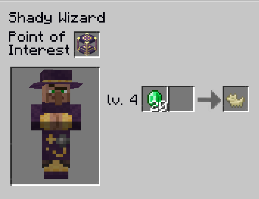
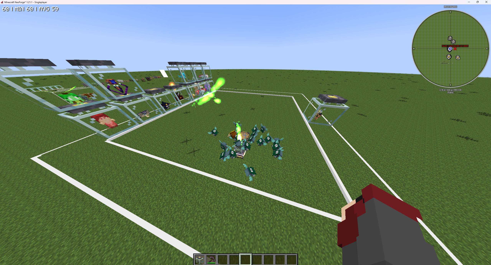

## Drygmys

Drygmys are passive, nature-oriented sprites often found near wild animals, seemingly tending to them. They are relatively rare but can spawn in most environments. Their primary function is to passively generate mob drops and experience orbs from nearby creatures *without* harming them.

---

## Obtaining Drygmys

There are two main ways to get started with Drygmys:

### 1. Finding Wild Drygmys

*   **Location:** Found sporadically in the wild, often near groups of passive animals.
*   **Befriending:** To acquire a token from a wild Drygmy, simply toss a `Wilden Horn` on the ground near it. The Drygmy will approach the horn and drop a `Drygmy Token`.
*   **Appearance:** Tamed Drygmys (summoned from a Charm) can be dyed Cyan, Orange, or Brown by ++rbutton++ them with the corresponding dye.

    

### 2. Trading

*   `Drygmy Tokens` can sometimes be obtained by trading with a Level 4 **Shady Wizard Villager** (requires an `Arcane Core` as their workstation).

---

## Summoning and Housing Your Drygmy

After obtaining the `Drygme Token` you can summon your own Drygmys using a `Drygmy Charm`.

### Drygmy Charm

This charm is essential for summoning your first Drygmy and establishing its Henge.

**Obtaining a `Drygmy Charm`:**

*   **Crafting:** Via the `Enchanting Apparatus`.
    *   **Reagent:** `Drygmy Token`
    *   **Pedestal Items:**
        *   Any Fish
        *   `Wheat`
        *   `Apple`
        *   `Carrot`
        *   Any Seeds
        *   `Source Gem` x3

### Summoning Process

1.  Place a block of `Mossy Cobblestone` in the desired location for your Drygmy farm.
2.  ++rbutton++ the `Mossy Cobblestone` with a `Drygmy Charm`.
3.  After a short animation, the block will transform into a `Drygmy Henge`, and your first Drygmy will be summoned nearby.
4.  **Adding More Drygmys:** To summon additional Drygmys associated with the same Henge, simply ++rbutton++ the *existing Henge block* with more `Drygmy Charms`. Each charm summons one Drygmy.
5.  **Retrieving Charms:** If a Drygmy is killed or despawned using the `Dispel` spell, its corresponding `Drygmy Charm` will be dropped.

---

## The Drygmy Henge: Production Hub

The `Drygmy Henge` serves as the central point and inventory output for your Drygmy farm.

### Functionality

*   **Home Area:** A Drygmy considers its "home" to be a **10x10x10 block area** centered on its Henge. It will only interact with valid entities within this range.
*   **Production Cycle:**
    1.  Drygmys associated with the Henge will periodically "channel" (perform a small dance animation) near valid entities within their home area.
    2.  Each successful channeling action contributes "progress" to the Henge.
    3.  Once the Henge reaches maximum progress, it triggers a production cycle.
    4.  The Henge generates items and experience gems based on the nearby entities and the total Drygmy happiness/drop count.
    5.  Generated items are automatically deposited into adjacent inventories (chests, barrels, etc.).
    6.  The Henge consumes `Source` from a nearby `Source Jar` to recharge after each production cycle (1000 `Source` per cycle).
*   **Basic Setup:** Place at least one Chest (or other inventory) and one `Source Jar` directly adjacent (touching) the `Drygmy Henge` block.

### Happiness and Efficiency (Drop Count)

A Drygmy Henge's efficiency, which directly impacts the *number* of random loot drops generated per cycle, depends on the number and variety of entities nearby. This is often referred to as "happiness".

*   **Base Drop Count:** 1 (Implicit minimum if at least one valid entity is present)
*   **First Entity Bonus:** The very first unique entity type (or `Containment Jar` with an entity) added near the Henge provides +1 drop count.
*   **Quantity Bonus:** Each of the first 5 entities (or `Containment Jars`) near the Henge provides +1 drop count (maximum of +5 from this bonus).
*   **Unique Bonus:** Each *unique* type of entity near the Henge provides +2 drop count.
*   **Containment Jars:** Mobs captured inside `Containment Jars` placed within the Henge's 10x10x10 range count towards these bonuses just like living entities. *(Note: Living entities might have a slightly smaller interaction range compared to jars.)*

**Example:** A single entity (like a cow in a jar) near a Henge provides:
Base (1) + First Entity (1) + Quantity (1 for being one of the first 5) + Unique (2 for being the first unique type) = **5 drops** per cycle.

Adding a *second*, different entity (e.g., a sheep in a jar) would add:
Quantity (+1, now 2/5) + Unique (+2, now 2 unique types) = +3 drop count, for a total of **8 drops** per cycle.

---

## Advanced Mechanics & Optimization

Understanding the underlying mechanics helps maximize farm efficiency.

### Loot Table Generation

1.  **Pooling:** The potential drops from *all* valid entities (mobs with defined loot tables, excluding blacklisted ones like Players, Drygmys, Twilight Forest Bosses, etc.) within the Henge's range are combined into one large loot pool for that specific Henge.
2.  **No Loot Chance:** If an entity has items in its loot table that don't drop 100% of the time (e.g., `Wither Skeleton Skulls`), there's a chance that a "no loot" result (represented internally as `Air`) is added to the pool for that entity. More low-chance items mean a higher chance of getting nothing from that mob's contribution to a specific drop slot.
3.  **Exclusions:** Special drops not part of standard loot tables (like `Nether Stars` from the Wither) are generally not generated. Boss mobs are often excluded.
4.  **Biasing:** Adding multiple instances of the *same* mob type *can* slightly increase the chance of getting drops from that specific mob relative to others, effectively weighting the pool if many *different* unique mob types are also present.
5.  **Dropless Entities:** Mobs *without* loot tables ([Dropless Mobs List](#dropless-mobs-list)) can still contribute to the *drop count* via the Happiness bonuses (Quantity/Unique) without adding items (or "no loot" chances) to the loot pool. Use these strategically to increase the number of items generated per cycle from your desired mobs that *do* have loot tables.

### Item Generation

*   For each point of "drop count" calculated via Happiness, the Henge randomly pulls one item (or potentially "no loot"/Air) from the generated Loot Pool for that cycle.

### Experience Generation

1.  **Sum XP:** The base vanilla XP values of *all* entities (including dropless ones) in the Henge range are summed up.
2.  **Multiplier:** This sum is multiplied by **0.25**.
3.  **Threshold:** If the resulting value is 3 or less, no XP is generated for that cycle.
4.  **Gem Calculation:**
    *   For every 12 points in the reduced sum (XP * 0.25), one `Greater Experience Gem` is generated.
    *   After subtracting XP accounted for by Greater Gems, for every 3 remaining points, one standard `Experience Gem` is generated.
    *   If there's any positive remainder (1 or 2) after calculating standard gems, one additional `Experience Gem` is generated.
5.  **Notes:** Duplicates don't penalize XP generation; unique types don't provide bonus XP. Special XP drops (like Ender Dragon boss fight XP) are ignored.

### Henge Progress & Drygmy Behavior

*   **Cycle Check:** The `Henge` checks if its progress bar is full every **100 ticks** (5 seconds). Progress accumulated beyond the cap within that 100-tick window before the check occurs is wasted. Therefore, there is no benefit to trying to tick accelerate the `Henge` itself.
*   **Drygmy Contribution:** A Drygmy contributes progress to the Henge *after* completing its **100-tick** (5 seconds) "channeling" (dancing) animation next to a valid entity or jar.
*   **Cooldown:** After successfully channeling, a Drygmy waits **100 ticks** (5 seconds) before attempting to find another entity and start its next channeling animation.
*   **Pathing Skip:** If a Drygmy cannot pathfind directly to its chosen entity/jar (e.g., it's enclosed in glass, too far, or blocked by solid blocks), it may skip the movement phase and start dancing immediately *if* it's already within the required interaction range.
*   **Optimization - Pathing:** To potentially speed up cycles by reducing travel time, ensure Drygmys *cannot* easily pathfind directly to the entities/jars they target (e.g., enclose jars in glass or keep them in a separate, inaccessible chamber within the Henge's 10x10x10 range). However, **do not** trap Drygmys in tiny 1x1 spaces, as this harms performance.
*   **Optimization - Number of Drygmys:** You theoretically need **20 Drygmys** around a single Henge to potentially max out its progress bar every 100-tick check cycle, assuming perfect conditions (instant pathing skips, always finding a target). Adding more than 20 provides redundancy but likely won't significantly increase production speed due to the fixed 100-tick Henge check cycle.
*   **TPS Warning:** Stacking many Drygmys in a single block space (e.g., a 1x1 hole) is **very detrimental to server performance (TPS)** due to excessive collision checks. Allow them space to move somewhat freely within the Henge area. Free-ranging Drygmys is significantly better for performance than tightly packing them.

---

### Dropless Mobs List

This is not exhaustive but includes common examples of mobs that contribute to happiness bonuses but not the loot pool:

#### Minecraft Vanilla
*   `minecraft:allay`
*   `minecraft:axolotl`
*   `minecraft:endermite`
*   `minecraft:frog`
*   `minecraft:ocelot`
*   `minecraft:silverfish`
*   `minecraft:tadpole`
*   `minecraft:vex`
*   `minecraft:wolf`
*   ~~`minecraft:wandering_trader`~~
*   ~~`minecraft:villager`~~
*   ~~`minecraft:bat`~~
*   ~~`minecraft:bee`~~
*   ~~`minecraft:wither`~~
*   ~~`minecraft:ender_dragon`~~*

#### Ars Nouveau
*   `ars_nouveau:wilden_chimera`
*   `ars_nouveau:starbuncle`
*   `ars_nouveau:whirlisprig`
*   `ars_nouveau:wixie`
*   `ars_nouveau:amethyst_golem`
*   `ars_nouveau:bookwyrm`
*   ~~`ars_nouveau:drygme`~~ *(Drygmys don't count)*
*   Summoned mobs from spells and animated blocks (e.g., `Summon Undead`, `Animate Block`) *(Might drop Apotheosis gems)*

#### Ars Elemental
*   `ars_elemental:firenando` (also known as `Flarecannon`)
*   `ars_elemental:siren`

#### Data and Essence
*   `datanessence:ancient_sentinel`

#### ForceCraft
*   `forcecraft:fairy`

#### Minecolonies
*   It's highly probable that colonists and guards do not drop items via Drygmys.

#### Corail Tombstone
*   `tombstone:grave_guardian`
*   `tombstone:spectral_wolf`

#### Ice and Fire Community Edition
*   `iceandfire:fire_dragon`
*   `iceandfire:lightning_dragon`
*   `iceandfire:ice_dragon`

#### Mahou Tsukai
*   `mahoutsukai:familiar_entity`

#### Hexerei
*   `hexerei:crow`
*   `hexerei:owl`

#### Occultism
*   `occultism:bat_familiar`
*   `occultism:beaver_familiar`
*   `occultism:beholder_familiar`
*   `occultism:blacksmith_familiar`
*   `occultism:chimera_familiar`
*   `occultism:cthulhu_familiar`
*   `occultism:deer_familiar`
*   `occultism:demonic_husband`
*   `occultism:demonic_wife`
*   `occultism:devil_familiar`
*   `occultism:dragon_familiar`
*   `occultism:fairy_familiar`
*   `occultism:goat_familiar`
*   `occultism:greedy_familiar`
*   `occultism:guardian_familiar`
*   `occultism:headless_familiar`
*   `occultism:mummy_familiar`
*   `occultism:shub_niggurath_familiar`
*   `Marid`, `Djinni`, `Foliot`, `Afrit` crushers
*   `Foliot Transporters`

*(Note: This list may vary with pack updates or mod configurations. Always test in-game if unsure. For additions or corrections, contact @Xannaeh on the ATM discord.)*

---

### Drygmy Mob Farm Example

In this image, you can see how 20 `Drygmys` farm `Pigliches`. To maximize efficiency, the `Drygmys` are made happier (increasing drops per cycle) using several mobs without loot tables (like those listed above) placed in `Containment Jars`. This specific setup yields 32 `Piglich Hearts` per iteration.

---

## Related Items & Concepts

### Drygmy Familiar

A Drygmy can also become a player's familiar, providing passive buffs when active.

*   **Effect:** Increases the damage of the player's `Earth` spells by 2. Grants the player a chance for increased loot drops when they personally kill mobs (similar effect to the Looting enchantment).
*   **Obtaining the Familiar:**
    1.  Perform the `Ritual of Binding` near a Drygmy (tamed or wild). This creates a `Bound Script - Drygmy`.
    2.  Use the Bound Script from your inventory (++rbutton++) to learn the familiar.
    3.  Summon/dismiss the Drygmy familiar via the Familiars tab in your Ars Nouveau Spellbook. Summoning incurs Familiar Sickness for a short duration.

### Drygmy Thread

*   **Item:** `Thread of the Drygmy`
*   **Use:** Apply this thread to Ars Nouveau armor using an `Alteration Table`.
*   **Effect:** Grants the wearer a chance for increased loot drops when they kill mobs (similar to the Looting enchantment). This stacks with the familiar effect and the Looting enchantment itself.

---

*Sources used for this guide include the [ars guide](https://ars.guide/docs/drygmy/guide/) and [ars wiki](https://www.arsnouveau.wiki/category/automation/entry/drygmy_charm/).*

> Ars Noveau | [CurseForge](https://www.curseforge.com/minecraft/mc-mods/ars-nouveau) | [Ars Guide](https://ars.guide/) | [Wiki](https://www.arsnouveau.wiki/)
