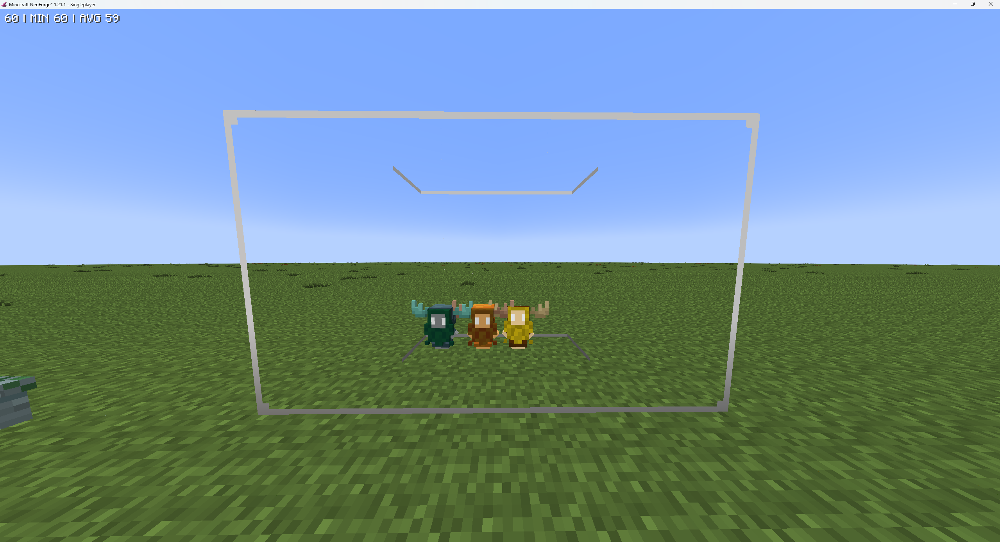

## Drygmys: An Overview

Drygmys are passive, nature-oriented sprites often found near wild animals, seemingly tending to them. They are relatively rare but can spawn in most environments. Their primary function is to passively generate mob drops and experience orbs from nearby creatures without harming them.
---
### How to obtaion Drygme tokens

1. Finding them
    *   **Location:** Found sporadically in the wild, often near groups of animals.
    *   **Befriending:** To tame a wild Drygmy, simply toss a `Wilden Horn` on the ground near it. The Drygmy will approach the horn and drop a `Drygmy Token`.
    *   **Appearance:** Tamed Drygmys can be dyed Cyan, Orange, or Brown by ++rbutton++ them with the corresponding dye.

2.  **Trading:** Can sometimes be obtained by trading with a Level 4 Shady Wizard Villager (requires an Arcane Core as their workstation).

---
## Summoning and Housing Your Drygmy

After obtaining the `Drygme Token` you can summon your own Drygmys using a `Drygmy Charm`.

### Drygmy Charm

This charm is essential for summoning your first Drygmy and establishing a Henge.

**Obtaining a `Drygmy Charm`:**

1.  **Crafting:** Via the `Enchanting Apparatus`.
    *   **Reagent:** `Drygmy Token`
    *   **Pedestal Items:**
        *   Any Fish
        *   `Wheat`
        *   `Apple`
        *   `Carrot`
        *   Any Seeds
        *   `Source Gem` x3

### Summoning Process

1.  Place a block of Mossy `Cobblestone`  in the desired location for your Drygmy farm.
2.  Right-click the Mossy Cobblestone with a **Drygmy Charm**.
3.  After a short animation, the block will transform into a `Drygmy Henge`, and your first Drygmy will be summoned.
4.  **Adding More Drygmys:** To summon additional Drygmys to the same Henge, simply ++rbutton++ the *existing Henge* with more `Drygmy Charms`.
5.  **Retrieving Charms:** If a Drygmy is killed or despawned using the `Dispel` spell, its corresponding `Drygmy Charm` will be dropped.

## The Drygmy Henge: Production Hub

The Drygmy Henge serves as the central point for your Drygmy farm.

### Functionality

*   **Home Area:** A Drygmy considers its "home" to be a **10x10x10 block area** centered on its Henge. It will interact with entities within this range.
*   **Production Cycle:**
    1.  Drygmys associated with the Henge will "channel" (perform a small dance) near valid entities within their home area.
    2.  Each channeling action contributes "progress" to the Henge.
    3.  Once the Henge reaches maximum progress, it triggers a production cycle.
    4.  The Henge generates items and experience gems based on nearby entities and Drygmy happiness.
    5.  Generated items are deposited into adjacent inventories.
    6.  The Henge consumes `Source` from an adjacent `Source Jar` to recharge (1000 `Source` per cycle).
*   **Basic Setup:** Place at least one Chest (or other inventory) and one `Source Jar` directly adjacent to the Henge block.

### Happiness and Efficiency

A Drygmy's efficiency, which directly impacts the *number* of drops produced per cycle, depends on its happiness.

*   **Base Drop:** 1 (Implicitly)
*   **First Entity Bonus:** The very first entity (or `Containment Jar`) added near the Henge provides +1 drop count.
*   **Quantity Bonus:** Each of the first 5 entities (or `Containment Jars`) near the Henge provides +1 drop count.
*   **Unique Bonus:** Each *unique* type of entity near the `Henge` provides +2 drop count.
*   **Containment Jars:** Mobs inside `Containment Jars` within the Henge's range count towards these bonuses.

**Example:** A single entity in a Henge's range provides a base + 1 (first entity) + 1 (first 5) + 2 (unique) = **4 drops** per cycle.

## Advanced Mechanics & Optimization

Understanding the underlying mechanics helps maximize efficiency.

### Loot Table Generation

1.  **Pooling:** The potential drops from *all* valid entities (mobs with loot tables, excluding blacklisted ones like Players/Drygmys) within the Henge's range are combined into one large loot pool for that Henge.
2.  **No Loot Chance:** If an entity has items in its loot table that don't drop 100% of the time (e.g., Wither Skeleton Skulls), there's a chance that a "no loot" result is added to the pool for that cycle.
3.  **Exclusions:** Special drops not part of standard loot tables (like Nether Stars) are not generated.
4.  **Biasing:** Adding multiple instances of the same mob *can* increase the chance of getting drops from that specific mob's loot table, effectively biasing the pool if many different unique mobs are present.
5.  **Dropless Entities:** Mobs *without* loot tables ([Dropless Mobs List](drygmes.md/#dropless-mobs-list)) can still contribute to the *drop count* via the Happiness bonuses (Quantity/Unique) without adding items (or "no loot" chances) to the pool. Use these to increase the number of items generated from your desired mobs.

### Item Generation

*   For each point of "drop count" calculated via Happiness, the Henge randomly pulls one item from the generated Loot Table for that cycle.

### Experience Generation

1.  **Sum XP:** The base vanilla XP values of *all* entities in the Henge range are summed up.
2.  **Multiplier:** This sum is multiplied by 0.25.
3.  **Threshold:** If the resulting value is 3 or less, no XP is generated for that cycle.
4.  **Gem Calculation:**
    *   For every 12 points in the reduced sum, one `Greater Experience Gem` is generated.
    *   After subtracting XP accounted for by Greater Gems, for every 3 remaining points, one standard `Experience Gem` is generated.
    *   If there's any positive remainder after calculating standard gems, one additional `Experience Gem` is generated.
5.  **Notes:** Duplicates don't penalize XP, uniques don't bonus XP. Special XP drops (like Ender Dragon) are ignored.

### Henge Progress & Drygmy Behavior

*   **Cycle Check:** The `Henge` checks if its progress maxed out every 100 ticks (5 seconds). Progress beyond the cap within that 100-tick window is wasted. So there is no use on tick accelerate the `Henge`.
*   **Drygmy Contribution:** A Drygmy contributes progress after completing its 100-tick (5 seconds) "channeling" (dancing) animation next to an entity.
*   **Cooldown:** After dancing, a Drygmy waits 100 ticks (5 seconds) before starting its next channeling attempt.
*   **Pathing Skip:** If a Drygmy cannot pathfind to its chosen entity/jar (e.g., it's blocked by solid blocks or too far), it may skip the movement phase and start dancing immediately *if* it's already within range.
*   **Optimization - Pathing:** To speed up cycles, ensure Drygmys *cannot* pathfind directly to the entities/jars they target (e.g., enclose jars in glass or keep them in a separate room within range). This minimizes travel time. **Do not** trap Drygmys in 1x1 spaces.
*   **Optimization - Number:** You need 20 Drygmys around a Henge to potentially max out progress every 100-tick check cycle, assuming perfect conditions. You can always add more but they will not add notorious efficiency.
*   **TPS Warning:** Stacking many Drygmys in a single block space (e.g., a 1x1 hole) is **very bad for server performance (TPS)**. Allow them space to move freely within the Henge area. Free-ranging is significantly better for performance.

### Dropless Mobs list
e.g., Axolotl, Wandering Trader, Villager, Bat, Allay, Bee, Wither, Ender Dragon, Wilden Chimera

### Drygme Mob Farm Example

*(WIP)*

---

## Related Items & Concepts

### Drygmy Familiar

A Drygmy can also become a player's familiar, providing passive buffs.

*   **Effect:** Increases the damage of `Earth` spells by 2. Grants a chance for increased loot drops when the player kills mobs (similar to the Looting enchantment).
*   **Obtaining the Familiar:**
    1.  Perform the `Ritual of Binding` near a Drygmy (tamed or wild). This creates a `Bound Script - Drygmy`.
    2.  Use the Bound Script from your inventory to learn the familiar.
    3.  Summon/dismiss the Drygmy familiar via the Familiars tab in your Ars Nouveau Spellbook. Summoning incurs Familiar Sickness for a short duration.

### Drygmy Thread

You can also place in your ars armor a `Thread of The Drygmy` in an `Alteration Table`. Grants a chance for increased loot drops when the player kills mobs (similar to the Looting enchantment).

# For more informationadn as a resource for this guide has been used https://ars.guide/docs/drygmy/guide/ and https://www.arsnouveau.wiki/category/automation/entry/drygmy_charm/
