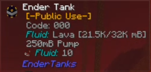
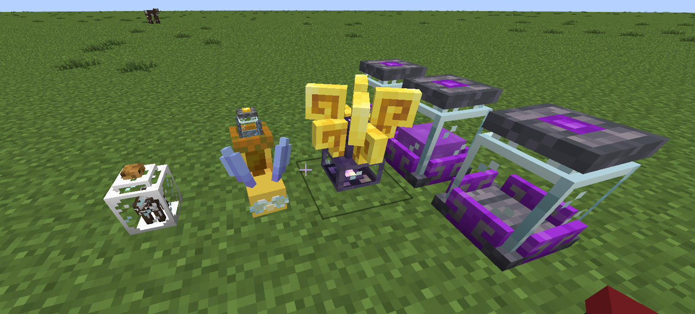

## Source

**Source** is the fundamental energy resource in Ars Nouveau. It acts as the magical "power" required to operate various devices, perform rituals and fuel automated systems.
Understanding how to generate, store, and utilize Source is crucial for progressing in the mod.

---

## Generating Source

Source must be actively generated using different types of **Sourcelinks**. Each Sourcelink converts specific actions or resources into Source, which is then typically transferred to nearby Source Jars.

### Common Sourcelink Properties

*   **Max Source Buffer:** Most Sourcelinks have an internal buffer of 20,000 Source.
*   **Transfer Rate:** They transfer Source to nearby jars every 5 seconds but can generate much more frequently (every 2s).
*   **Jar Range:** Sourcelinks typically output Source to jars within 5 blocks.
*   **Optimize:** Sometimes it is more efficient to connect `Source Splitters` directly to the sourcelinks to extract the source if the production rate is faster than the transmission rate of the sorucelinks to jars.

### Agronomic Sourcelink

Generates Source from the natural growth of crops and trees within a 15-block radius. Bonus Source is generated for magical plants (tagged `ars_nouveau:magic_plants` like Magebloom, Sourceberry Bush) and
magical saplings (tagged `ars_nouveau:magic_saplings` like Archwood). Note: Using Bone Meal does not generate Source. Generally low output, often used for sustainable power for things like Harvest rituals.

*   **Source per Event:**
    *   Non-Magical Crop Growth: 20 Source
    *   Magical Crop Growth: 45 Source
    *   Non-Magical Tree Growth: 50 Source
    *   Magical Tree Growth: 100 Source

### Alchemical Sourcelink

Generates Source by consuming potions from adjacent **Potion Jars**. The amount generated depends on the complexity, duration, and potency of the potion effects. Potions with multiple, high-level,
long-duration effects yield significantly more Source. Works well with automated potion brewing setups (e.g., using Wixies and Potion Melders). Consumes potions 100mB (one bottle's worth) at a time,
checking every second.

*   **Source Calculation:**
    1.  For *each effect*: `(duration_ticks / 50) + (amplifier * 250) + 150`
    2.  Base Potion Value: `75 + sum_of_all_effect_values`
    3.  Multi-Effect Multiplier: If multiple effects exist, `total_value * (2.1 ^ number_of_effects)`

### Mycelial Sourcelink

Generates Source by consuming edible items placed on adjacent pedestals or dropped nearby (checks every 2 seconds). More nourishing food (higher hunger/saturation) yields more Source.
Source Berry products and items tagged `ars_nouveau:magic_food` provide substantial bonuses. Passively converts Dirt/Grass into Mycelium in the 3x3 area below it and can grow mushrooms
on nearby Mycelium blocks if space and light levels permit.

*   **Source per Item:**
    *   Base: `(11 * nutrition) + (60 * saturation)` (Generates 1 Progress)
    *   Magic Items (`ars_nouveau:magic_food` or `ars_nouveau:magic_plants`): `(Base + 10) * 2.5` (Generates 5 Progress)
*   **Block Conversion (Uses Progress):**
    *   Dirt/Grass -> Mycelium (3x1x3 below): 25 Progress
    *   Air -> Brown/Red Mushroom (3x3x3 around, on Mycelium): 10 Progress

### Vitalic Sourcelink

Generates Source from creature deaths and animal breeding events within a 15-block radius. Also passively generates Source from nearby baby animals and significantly accelerates their
growth rate (aging them 25 seconds every 3 seconds they are within 6 blocks). Excludes summoned/dispellable mobs and blacklisted entities (`ars_nouveau:vitalic_death_blacklist`,
`ars_nouveau:vitalic_growth_blacklist`).

*   **Source per Event:**
    *   Entity Death (valid): 200 Source
    *   Baby Entity Spawned (breeding): 600 Source
    *   Passive (Baby Animal nearby): 10 Source per 60 ticks (3 seconds)

### Volcanic Sourcelink

Generates Source by consuming burnable items (fuel) supplied via adjacent pedestals or dropped nearby (checks every second). Generates bonus Source from Archwood logs (`c:logs/archwood`),
especially Blazing Archwood. Also generates "Heat" as it burns fuel. Heat allows it to slowly convert Stone to Magma Block, and Magma Block to Lava in the 3x3 area below it.

*   **Source per Item:**
    *   Fire Essence: 2000 Source (1 Progress)
    *   Blazing Archwood Log: 125 Source (6 Progress)
    *   Archwood Log: 75 Source (4 Progress)
    *   Other Fuel: `burn_time_ticks / 12` Source (1 Progress)
        * Right now on the pack some of the best fuels are:
        * **Primal Magick** `Block of Ignyx` semelts 640 items
        * **Mystical Aggraditions** `Insanium Coal Block` smelts 3465 items
        * `Blaze Rod Block x5` smelts 7,085,880.5 items
*   **Block Conversion (Uses Progress):**
    *   Stone (`c:stones`) -> Magma Block: 150 Progress
    *   Magma Block -> Lava: 200 Progress

### Fluid Sourcelink

Generates Source by consuming compatible fluids from tanks placed directly below it.

* **Minecraft** `Milk` generates 100 source for 1,000mB
* **Create** `Honey` generates 300 source for 1,000mB
* **Create** `Chocolate` generates 500 source for 1,000mB
* **Starbunclemania** `Liquefied source` generates 900 source for 1,000mB (so you end up with loses)
* **Minecraft** `Lava` generates 1600 source for 1,000mB

### Examples

=== "Agronomic Sourcelink"

    Work in Progress

=== "Alchemical Sourcelink"

    Work in Progress

=== "Mycelial Sourcelink"

    Work in Progress

=== "Vitalic Sourcelink"

    Work in Progress

=== "Volcanic Sourcelink"

    Work in Progress

=== "Fluid Sourcelink"

    In this example we are going to generate source with lava. For that, locate in the nether a lava lake with botomless supply.
    Put a **Create** `Hose` and a `Handcrank` and deploy the hose untill the botom of the lake.
    Place an `Endertank` (for correct placement place the tank clicking the block, not the hose) with the correspondent piston upgrades to be able to use the tank as a pump.

    

    Place a `Lever` to activate the pumping option of the tank.  The configuration should look something like this.

    

    Now you can go back to your base and use this lava in the `Fluid Sourcelink`. You can use any fluid transportation system.
    In this example we are using a `Starbuncle` equipped with a **Starbunclemania** `Starbucket` to allow them to transport fluids.
    The starbuncle configuration should be: take from the enderchest, deposit on the sorucelink.

    

    Not visiter the nether yet? No problem, just replace the ender tank with a **Cooking for Blockheads** `Cow in a Jar`.

    

---

## Storing Source

Generated Source needs to be stored for later use.

### Source Jar

The standard container for Source. Stores up to **10,000 Source**. Fills from adjacent Sourcelinks or from source relays and provides Source to adjacent machines or configured relays.
Can be picked up and moved with Source intact. Outputs a Redstone signal via a Comparator based on fill level.

### Fluid Containment Jar

A tank that can hold up to 16 buckets (16,000 mB) of fluid. If used to store a potion fluid, placing a Potion Jar above it converts the fluid for flask/melding use.

### Source Condenser

Condenses Source from standard **Source Jars** placed nearby into liquid Source fluid. Automatically outputs this fluid to compatible tanks placed directly below it.
Its necessary to fluidize the source to create a `Liquid Sourcelink`.

### Ender Source Jar

Allows Source storage in an "ender-connected" network. Any Source put into one Ender Source Jar is accessible from *any* other Ender Source Jar placed in the world, regardless of distance or dimension.
Acts like a shared, global Source pool.

### Other Storage (Mod Integrations)

*   `Unobtanium Source Jar`: A higher capacity Source Jar holding up to **100,000 Source**.
*   `ME Source Jar`: Allows interfacing Source with an **Applied Energistics 2** system, storing Source digitally on `Storage Cells`. Acts as both, input and output source point in the **AE2** system.

---

## Moving Source

Beyond manually moving jars, Source can be transported using Source Relays, controlled with the **Dominion Wand**.

*   **Linking:** ++rbutton++ the source block (Jar/Relay) with the Dominion Wand, then ++rbutton++ the target block (Jar/Relay). Max range for basic links is 30 blocks.
*   **Clearing Links:** ++shift+rbutton++ a Relay with the Dominion Wand.

### Source Relay

The basic point-to-point Source transporter. Requires manual linking between Jars and other Relays.
Splitters can extract  1000 source per operation.

### Source Relay: Collector

Acts like a Source Relay but automatically pulls Source from *any* unlinked Source Jars within a 5-block radius, in addition to its manually linked inputs.
Splitters can extract  1000 source per operation.

### Source Relay: Depositor

Acts like a Source Relay but automatically pushes Source to *any* unlinked Source Jars within a 5-block radius, in addition to its manually linked outputs.
Splitters can extract  1000 source per operation.

### Source Relay: Splitter

Acts like a Source Relay but can be linked to multiple inputs and outputs simultaneously. Has a higher throughput than the basic relay, splitting the transfer rate among all connections.
This one is the most recommended one to use in almost any situation.
Splitters can extract 2500 source per operation compared to other Relays which can only extract 1000 source per operation.

### Source Relay: Warper

Acts like a Source Relay: Splitter but enables transferring Source over unlimited distances *between other Warper Relays*. Transfers beyond 30 blocks have a chance to lose some Source during transit.
Warpers  can extract 2500 source per operation compared to other Relays which can only extract 1000 source per operation.

---

## Using Source

Source is consumed by various blocks and processes:

*   **Machines:** `Enchanting Apparatus`, `Imbuement Chamber` (can use Source to speed up crafting).
*   **Rituals:** Powering `Ritual Braziers` to perform rituals.
*   **Automation:** Powering devices like `Spell Turrets` or the `Source Motor` (converts Source to rotational force for Create mod).
*   **Power Conversion:** `Source Converter` converts Source into AE energy.
*   **Enchantments/Runes:** Sustaining effects from `Permanent Runes`.
*   **Crafting:** Some specific `Enchanting Apparatus` recipes may require `Source Jars` with Source nearby.

---

*Sources used for this guide include the [ars guide](https://ars.guide/docs/sourcelinks/) and [ars wiki](https://www.arsnouveau.wiki/category/source/).*

> Ars Noveau | [CurseForge](https://www.curseforge.com/minecraft/mc-mods/ars-nouveau) | [Ars Guide](https://ars.guide/) | [Wiki](https://www.arsnouveau.wiki/)
