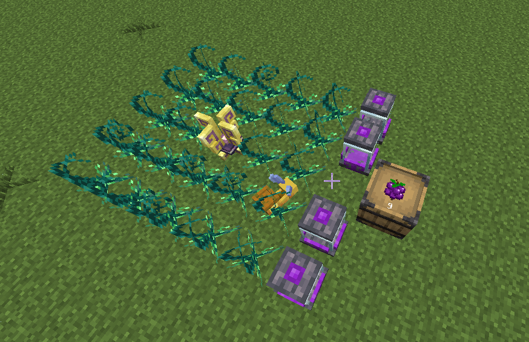
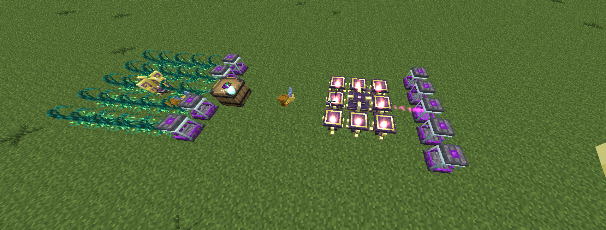
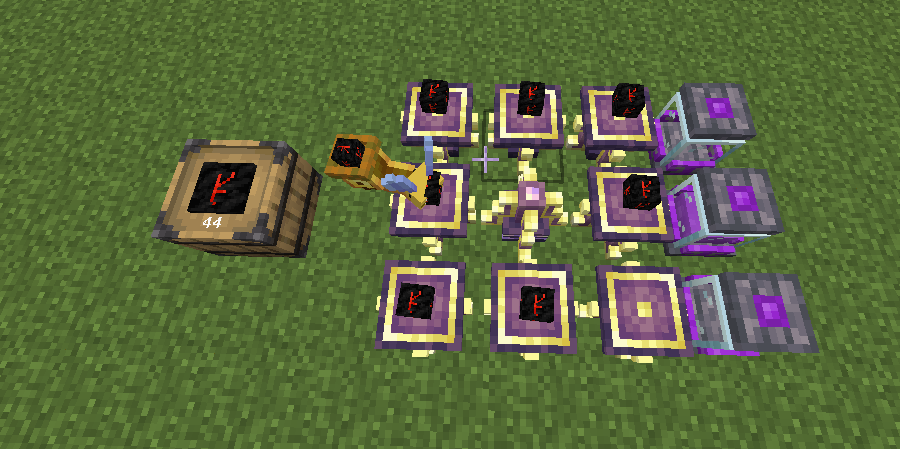
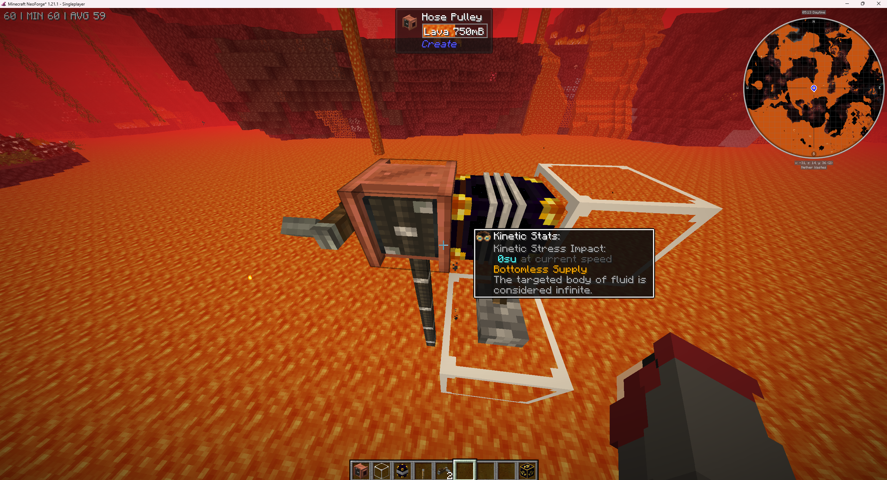
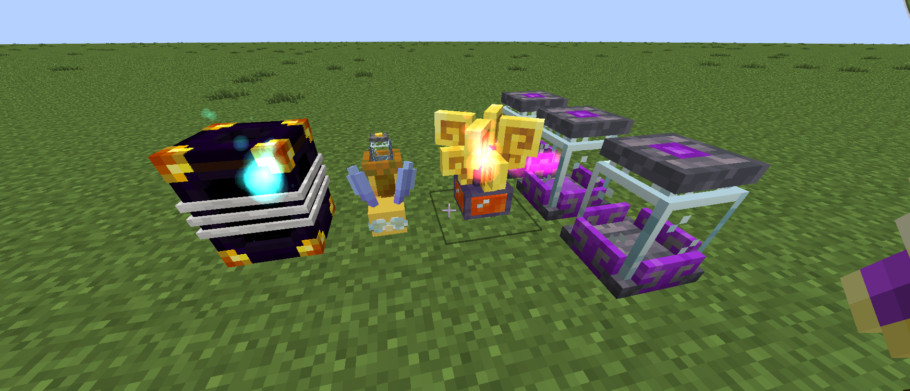
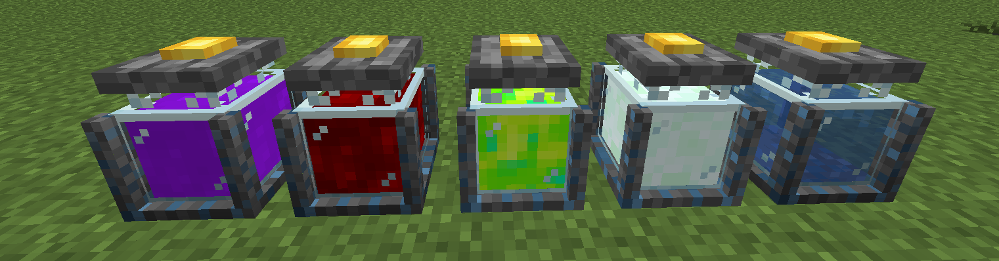

# Source

**Source** is the fundamental energy resource in Ars Nouveau. It acts as the magical "power" required to operate various devices, perform rituals, and fuel automated systems.
Understanding how to generate, store, and utilize Source is crucial for progressing in the mod.

---

## Generating Source

Source must be actively generated using different types of **Sourcelinks**. Each Sourcelink converts specific actions or resources into Source, which is then typically transferred to nearby `Source Jars`.

### Common Sourcelink Properties

*   **Max Source Buffer:** Most Sourcelinks have an internal buffer (20,000 Source).
*   **Transfer Rate:** They transfer Source to nearby jars periodically (every 5 seconds), but generation can be faster (every 2 seconds).
*   **Jar Range:** Sourcelinks typically output Source to jars within a 5-block radius.
*   **Optimization Tip:** Sometimes it's more efficient to connect a `Source Relay: Splitter` directly to Sourcelinks using the `Dominion Wand` to extract Source if the production rate exceeds the Sourcelink's direct transfer rate to jars.

### Agronomic Sourcelink

Generates Source from the natural growth of crops and trees within a 15-block radius. Bonus Source is generated for magical plants (tagged `ars_nouveau:magic_plants` like `Magebloom`, `Sourceberry Bush`) and
magical saplings (tagged `ars_nouveau:magic_saplings` like `Archwood Sapling`). Note: Using `Bone Meal` does **not** generate Source. Generally low output, often used for sustainable power for things like Harvest rituals.

*   **Source per Event:**
    *   Non-Magical Crop Growth: 20 Source
    *   Magical Crop Growth: 45 Source
    *   Non-Magical Tree Growth: 50 Source
    *   Magical Tree Growth: 100 Source

### Mycelial Sourcelink

Generates Source by consuming edible items placed on adjacent `Item Pedestals` or dropped nearby (checks every 2 seconds). More nourishing food (higher hunger/saturation values) yields more Source.
`Source Berry` products and items tagged `ars_nouveau:magic_food` provide substantial bonuses. Passively converts `Dirt`/`Grass` into `Mycelium` in the 3x1x3 area below it and can grow mushrooms
on nearby `Mycelium` blocks if space and light levels permit (requires internal Progress).

*   **Source per Item:**
    *   Base: `(11 * nutrition) + (60 * saturation)` (Generates 1 Progress)
    *   Magic Items (`ars_nouveau:magic_food` or `ars_nouveau:magic_plants` tag): `(Base + 10) * 2.5` (Generates 5 Progress)
*   **Block Conversion (Uses Progress):**
    *   `Dirt`/`Grass` -> `Mycelium` (3x1x3 below): 25 Progress
    *   `Air` -> Brown/Red Mushroom (3x3x3 around, on Mycelium): 10 Progress

### Alchemical Sourcelink

Generates Source by consuming potions from adjacent **Potion Jars**. The amount generated depends on the complexity, duration, and potency of the potion effects. Potions with multiple, high-level,
long-duration effects yield significantly more Source. Works well with automated potion brewing setups (e.g., using Wixies and `Potion Melders`). Consumes potions 100mB (one bottle's worth) at a time,
checking every second.

*   **Source Calculation:**
    1.  For *each effect*: `(duration_ticks / 50) + (amplifier * 250) + 150`
    2.  Base Potion Value: `75 + sum_of_all_effect_values`
    3.  Multi-Effect Multiplier: If multiple effects exist, `total_value * (2.1 ^ number_of_effects)`

### Vitalic Sourcelink

Generates Source from creature deaths and animal breeding events within a 15-block radius. Also passively generates Source from nearby baby animals and significantly accelerates their
growth rate (aging them 25 seconds every 3 seconds they are within 6 blocks). Excludes summoned/dispellable mobs and blacklisted entities (`ars_nouveau:vitalic_death_blacklist`,
`ars_nouveau:vitalic_growth_blacklist`).

*   **Source per Event:**
    *   Entity Death (valid): 200 Source
    *   Baby Entity Spawned (breeding): 600 Source
    *   Passive (Baby Animal nearby): 10 Source per 60 ticks (3 seconds)

### Volcanic Sourcelink

Generates Source by consuming burnable items (fuel) supplied via adjacent `Item Pedestals` or dropped nearby (checks every second). Generates bonus Source from Archwood logs (`c:logs/archwood`),
especially `Blazing Archwood`. Also generates "Heat" (Progress) as it burns fuel. Heat allows it to slowly convert `Stone` to `Magma Block`, and `Magma Block` to `Lava` in the 3x3 area below it.

*   **Source per Item:**
    *   `Fire Essence`: 2000 Source (1 Progress)
    *   `Blazing Archwood Log`: 125 Source (6 Progress)
    *   `Archwood Log`: 75 Source (4 Progress)
    *   Other Fuel: `burn_time_ticks / 12` Source (1 Progress)
        *   Current good fuel options in the pack:
            *   **Primal Magick** `Block of Ignyx`: ~10667 Source, 1 Progress
            * *(Note: due to the sourcelink buffer capped to 20000 anything further than this is not a good consumable because it will go to waste)
            *   ~~**Mystical Agradditions** `Insanium Coal Block`: 57750 Source, 1 Progress~~
            *   ~~`Block of Blaze Rods x5` ~118098008 Source, 1 Progress~~
            * *(Note:More can be found using JEI/EMI, there the burn items are shown, for doing the calculations multiply it by 200 and divide it by 12)*
*   **Block Conversion (Uses Progress):**
    *   `Stone` (`c:stones`) -> `Magma Block`: 150 Progress
    *   `Magma Block` -> `Lava`: 200 Progress

### Fluid Sourcelink

Generates Source by consuming compatible fluids from tanks placed directly below it.

| Fluid                               | Source per 1000mB | Notes                                         |
|:------------------------------------|:------------------|:----------------------------------------------|
| **Minecraft** `Milk`                | 100 Source        | Easy early game with Cow in a Jar             |
| **Create** `Honey`                  | 300 Source        | Requires bee farms                            |
| **Create** `Chocolate`              | 500 Source        | Requires cocoa beans, milk, sugar             |
| **Starbunclemania** `Liquid Source` | 900 Source        | Inefficient, generates less than input        |
| **Minecraft** `Lava`                | 1600 Source       | Excellent with bottomless Nether lava sources |

### Examples

=== "Agronomic Sourcelink"

    A classic early-game Source farm uses `Sourceberry Bushes` and `Starbuncles`. The Starbuncles can be configured to automatically harvest mature `Sourceberries` and store them in a linked inventory (like a chest). The `Agronomic Sourcelink` placed nearby will then generate Source as the berries regrow.

    

=== "Mycelial Sourcelink"

    You can attach a `Mycelial Sourcelink` to the output of the `Sourceberry` farm mentioned before. Configure a `Starbuncle` (or other transport method) to move the harvested `Sourceberries` from the storage chest onto `Item Pedestals` adjacent to the `Mycelial Sourcelink`. The Sourcelink will consume the berries from the pedestals to generate Source.

    

=== "Alchemical Sourcelink"

    *(Work In Progress)*

=== "Vitalic Sourcelink"

    *(Work In Progress)*

=== "Volcanic Sourcelink"

    You can simply have a `Starbuncle` configured to take burnable items (like coal, logs, or blaze rods) from an inventory (e.g., a chest) and place them onto `Item Pedestals` adjacent to the `Volcanic Sourcelink`. The Sourcelink will consume the fuel from the pedestals.

    

=== "Fluid Sourcelink"

    In this example, we are going to generate Source with Lava. For that, locate a lava lake in the Nether (one that is bottomless).
    Place a **Create** `Hose Pulley` and deploy the hose using a `Hand Crank` until it reaches the bottom of the lake.
    Place an `Ender Tank` directly on the `Hose Pulley` block (click the glass block block, not the hose) and configure it with piston upgrades to enable pumping/extraction.

    

    Provide a redstone signal (e.g., place a `Lever` on the tank and turn it on) to activate its pumping capability. The tank configuration should look something like this (showing fluid inside):

    

    Now you can go back to your base and use this lava in the `Fluid Sourcelink`. Place another `Ender Tank` (with the same color code) near the `Fluid Sourcelink`.
    You can use any fluid transport system, but Ender Tanks are simple for cross-dimensional transfer.
    In this example, we are using a `Starbuncle` equipped with a **Starbunclemania** `Starbucket` which allows them to move fluids between tanks/machines.
    Configure the Starbuncle to take Lava from the Ender Tank and deposit it into the `Fluid Sourcelink`.

    

    **No Nether Access Yet?** No problem! Replace the `Ender Tank` setup with a **Cooking for Blockheads** `Cow in a Jar`. This provides a steady, albeit slower, source of Milk for early-game Source generation.

    

---

## Storing Source

Generated Source needs to be stored for later use.

### Source Jar

The standard container for Source. Stores up to **10,000 Source**. Fills from adjacent Sourcelinks or linked Source Relays (configured) and provides Source to adjacent "machines" or configured relays.
Can be picked up (breaking it) and moved with Source intact. Outputs a Redstone signal via a `Comparator` based on fill level.

### Fluid Containment Jar

A tank that can hold up to 16 buckets (16,000 mB) of *any* fluid, including liquid Source. If used to store a potion fluid, placing a `Potion Jar` above it allows interaction for flasks/melding.

### Source Condenser

Condenses Source from standard `Source Jars` placed nearby into liquid `Source` fluid. Automatically outputs this fluid to compatible tanks placed directly below it.
Necessary if you want to create the `Fluid Sourcelink`.

### Ender Source Jar

Allows Source storage in an "ender-connected" network. Any Source put into one `Ender Source Jar` is accessible from *any* other `Ender Source Jar` placed in the world (sharing the same owner/network), regardless of distance or dimension.
Acts like a shared, global Source pool for that network.

### Other Storage (Mod Integrations)

*   `Unobtainium Source Jar`: A higher capacity Source Jar holding up to **100,000 Source**.
*   `ME Source Jar`: Allows interfacing Source with an **Applied Energistics 2** system, storing Source digitally on `Storage Cells`. Acts as both an input and output point for Source in the AE2 network.

---

## Moving Source

Beyond manually moving jars, Source can be transported using **Source Relays**, controlled with the **Dominion Wand**.

*   **Linking:** ++rbutton++ the source block (Jar/Relay) with the `Dominion Wand`, then ++rbutton++ the target block (Jar/Relay). The maximum range for basic links is 30 blocks.
*   **Clearing Links:** ++shift+rbutton++ a Relay with the `Dominion Wand` to clear its links.

### Source Relay

The basic point-to-point Source transporter. Requires manual linking between Jars and other Relays.
Can extract 1000 Source per operation from a linked Jar/Sourcelink.

### Source Relay: Collector

Acts like a `Source Relay` but automatically pulls Source from *any* unlinked `Source Jars` within a 5-block radius, in addition to its manually linked inputs.
Can extract 1000 Source per operation.

### Source Relay: Depositor

Acts like a `Source Relay` but automatically pushes Source to *any* unlinked `Source Jars` within a 5-block radius, in addition to its manually linked outputs.
Can extract 1000 Source per operation.

### Source Relay: Splitter

Acts like a `Source Relay` but can be linked to *multiple* inputs and outputs simultaneously. Has a higher throughput than the basic relay, splitting the transfer rate among all connections.
This is the **most recommended** relay for general use due to its flexibility and higher transfer potential.
Can extract **2500** Source per operation from a linked Jar/Sourcelink.

### Source Relay: Warper

Acts like a `Source Relay` but enables transferring Source over **unlimited distances** between other `Warper Relays`. Transfers beyond 30 blocks have a chance to lose some Source during transit.
Can extract **2500** Source per operation from a linked Jar/Sourcelink.

---

## Using Source

Source is consumed by various blocks and processes:

*   **Machines:** `Enchanting Apparatus`, `Imbuement Chamber` (can use Source to speed up crafting).
*   **Rituals:** Powering `Ritual Braziers` to perform rituals.
*   **Automation:** Powering devices like `Spell Turrets` or the `Source Motor` (converts Source to rotational force for Create mod).
*   **Power Conversion:** `Source Converter` converts Source into AE energy.
*   **Enchantments/Runes:** Sustaining effects from permanent `Runes` placed in the world.
*   **Crafting:** Some specific `Enchanting Apparatus` recipes may require `Source Jars` with Source nearby as catalysts.

---

*Sources used for this guide include the [Ars Nouveau Guide](https://ars.guide/docs/sourcelinks/) and [Ars Nouveau Wiki](https://www.arsnouveau.wiki/category/source/).*

> Ars Nouveau | [CurseForge](https://www.curseforge.com/minecraft/mc-mods/ars-nouveau) | [Ars Guide](https://ars.guide/) | [Wiki](https://www.arsnouveau.wiki/)
