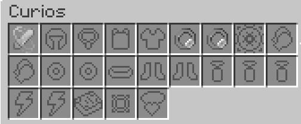
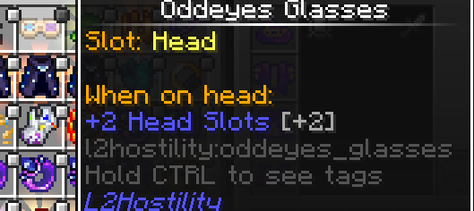
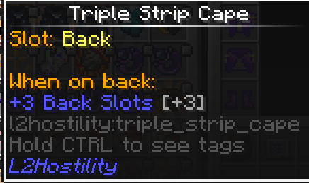
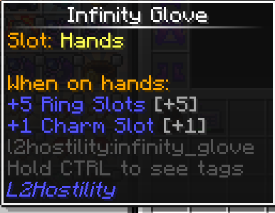
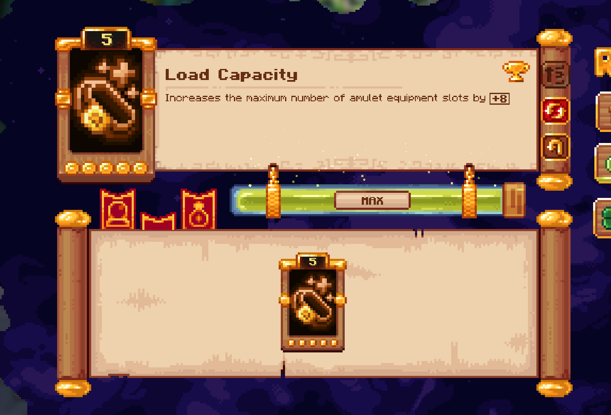
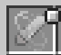
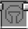
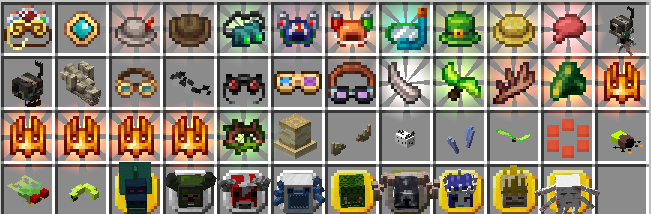
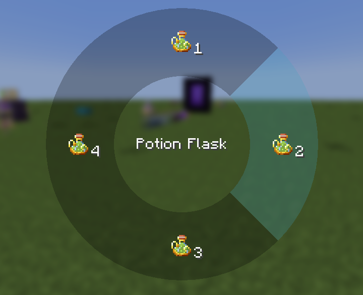

# Guide: Curios Slots & Items

This guide covers the Curios API, how to gain additional slots, and provides details on specific Curios items available in ATMA, with examples from various mods.

## Understanding Curios: The Accessory API

### Overview

**Curios** is a foundational Minecraft mod acting as an **API** (Application Programming Interface) and library. It primarily provides a standardized system for other mods to add **new equipment slots** beyond vanilla armor, off-hand, and hotbar slots. Think of it as a framework enabling accessories and extra gear.

### Key Features for Players:

*   **More Equipment Slots:** Allows mods to add slots for items like rings, necklaces, belts, charms, back items, headgear, hand items, and more.
*   **Centralized Management:** All extra accessory slots are managed through a single GUI, typically opened by pressing the **'G' key** (configurable in Controls). This keeps your main inventory screen cleaner.
*   **Flexibility:** Items can often be equipped into multiple compatible slot types (e.g., some head items might fit in the helmet slot or a Curios head slot).
*   **Compatibility:** Standard mechanics like Mending, Unbreaking, and Curses generally work with items in Curios slots.

---

## Getting More Curios Slots

Some specific Curios items grant additional slots of certain types when equipped.

*   **Head:** `Oddeyes Glasses` - When equipped in a Head slot, grants **+2 Head slots**.
    

*   **Back:** `Triple Strip Cape` - When equipped in a Back slot, grants **+3 Back slots**.
    

*   **Hands:** `Infinity Glove` - When equipped in a Hands slot, grants **+5 Ring slots** and **+1 Charm slot**.
    

*   **Belt:** `Leather Belt` - When equipped in the Belt slot, grants up to **+8 Charm slots**.
    

---

## Curios by Slot Type

Here are examples of items that fit into specific Curios slots available in ATMA:

### Spell Focus Slot

*   **Description:** A dedicated slot primarily used by **Ars Nouveau** for its `Spell Foci`.
*   **Functionality:** Equipping a Focus provides passive benefits and enhances certain spells or schools of magic.
*   **Compatibility:** Items tagged `#curios:an_focus` fit here.
*   **Examples:** `Focus of Earth`, `Focus of Water`, `Focus of Fire`, `Focus of Air`, `Focus of Necromancy`, `Focus of Summoning`, `Focus of Block Shaping`, `Focus of Transmutation` (Ars Technica).
*   **Details:** [Click here for an in-depth explanation of Spell Focus](arsnouveau/README.md/#spell-focus)

### Head Slot

*   **Description:** A slot for items worn on the head, often providing utility or visual effects. Items here can typically also be worn in the vanilla helmet armor slot.
*   **Fucntionality**:
*   **Compatibility** :Items tagged `#curios:head` fit here.
*   **Examples:**

1.   **Occultism:**
   *   `Otherworld Goggles`: Grants the permanent **Third Eye** effect, allowing the wearer to see hidden Otherworld blocks and entities related to **Occultism**.
This ability, referred to as "seeing beyond the veil," is normally temporary and achieved by consuming `Demon's Dream` herbs.

2.   **The Bumblezone:**
   *   `Flower Headwear`: Prevents bees from becoming angry and attracts them when worn in the *armor* slot. **Functionality may not work correctly when equipped in the Curios slot**,
and it provides no visual change in the Curios slot either.

3. **Ars Nouveau** and addons
   * **Ars Technica** `Spy Monocle`: Allows zooming in pressing ++g++.
   * `Alchemist's Crown`: Allows opening a potion radial menu pressing ++g++ when `Potion Flaks` on the inventory

5. **L2Hostility**
    * `Oddeyes Glasses`:  When equipped in a Head slot, grants **+2 Head slots**.
    * `Detector Glasses`: Allow you to see invisible mobs, and see mobs when you have blindness or darkness effects. Additionally while holding a `Hostility Detector` on the
offhand you can clear the difficulty on area.[Click here for more information](l2hostility.md/#ways-to-decrease-player-difficulty).

5. **Create**
    * `Engineer's Goggles`:  add description

5. **Hexerei**
    * `Reading Glasses`:  Allows zooming in pressing ++z++

4. **Aesthetic ONLY Items:** *(These provide no functional benefit when equipped)*
   *   Trophies from **Twilight Forest**: `Twilight Lich Trophy`, `Snow Queen Trophy`, `Questing Ram Trophy`, `Naga Trophy`, `Alpha Yeti Trophy`, `Minoshroom Trophy`, `Knight Phantom Trophy`, `Hydra Trophy`, `Ur-Ghast Trophy`
   *   Other **Twilight Forest**: `Moonworm`, `Cicada`, `Firefly`
   *   **Cataclysm**: `Aptrgangr Head`, `Draugur Head`, `Kobolediator Head`
   *   **Starbunclemania**: `Whirly Propeller`, `Alakakrinas Hat`, `Drygme Horns`, `Sea Bunny`, `Starby Ears`

*(List other slot types like Back, Body, Charm, Necklace, Belt, Ring, Hands, Feet as needed, with examples)*

---

## How to Equip Curios Items

1.  Open your inventory (Default key: 'E').
2.  Press the **Curios key** (Default key: 'G') to open the Curios slots GUI.
3.  Identify the appropriate slot type for the item you want to equip (e.g., Head, Back, Hands, Belt, Charm, Ring, Focus).
4.  Drag the desired Curios item from your main inventory into a compatible empty slot in the Curios GUI.
5.  The item is now equipped, and its effects (if any) should be active!

---

> **Curios API** | [CurseForge Link](https://www.curseforge.com/minecraft/mc-mods/curios)
