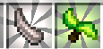

# Guide: Curios Slots & Items

This guide covers the Curios API, how to gain additional slots, and provides details on specific Curios items available in ATMA, with examples from various mods.

## Understanding Curios: The Accessory API

### Overview

**Curios** is a foundational Minecraft mod acting as an **API** (Application Programming Interface) and library. It primarily provides a standardized system for other mods to add **new equipment slots** beyond vanilla armor, off-hand, and hotbar slots. Think of it as a framework enabling accessories and extra gear.

### Key Features for Players:

*   **More Equipment Slots:** Allows mods to add slots for items like rings, necklaces, belts, charms, back items, headgear, hand items, and more.
*   **Centralized Management:** All extra accessory slots are managed through a single GUI, typically opened by pressing the **'G' key** (configurable in Controls). This keeps your main inventory screen cleaner.
*   **Flexibility:** Items can often be equipped into multiple compatible slot types (e.g., some head items might fit in the helmet slot or a Curios head slot).
*   **Compatibility:** Standard mechanics like Mending, Unbreaking, and Curses generally work with items in Curios slots.

---

## Getting More Curios Slots

Some specific Curios items grant additional slots of certain types when equipped.

*   **Head:** `Oddeyes Glasses` - When equipped in a Head slot, grants **+2 Head slots**.
    

*   **Back:** `Triple Strip Cape` - When equipped in a Back slot, grants **+3 Back slots**.
    

*   **Hands:** `Infinity Glove` - When equipped in a Hands slot, grants **+5 Ring slots** and **+1 Charm slot**.
    

*   **Belt:** `Leather Belt` - When equipped in the Belt slot, grants up to **+8 Charm slots**.
    

---

## Curios by Slot Type

Here are examples of items that fit into specific Curios slots available in ATMA:

### Spell Focus Slot

*   **Description:** A dedicated slot primarily used by **Ars Nouveau** for its `Spell Foci`.
*   **Functionality:** Equipping a Focus provides passive benefits and enhances certain spells or schools of magic.
*   **Compatibility:** Items tagged `#curios:an_focus` fit here.
*   **Examples:** `Focus of Earth`, `Focus of Water`, `Focus of Fire`, `Focus of Air`, `Focus of Necromancy`, `Focus of Summoning`, `Focus of Block Shaping`, `Focus of Transmutation` (Ars Technica).
*   **Details:** [Click here for an in-depth explanation of Spell Focus](arsnouveau/README.md/#spell-focus)

### Head Slot

*   **Description:** A slot for items worn on the head, often providing utility or visual effects. Items here can typically also be worn in the vanilla helmet armor slot.
*   **Fucntionality**:
*   **Compatibility** :Items tagged `#curios:head` fit here.
*   **Examples:**

1.   **Occultism:**
*   `Otherworld Goggles`: Grants the permanent **Third Eye** effect, allowing the wearer to see hidden Otherworld blocks and entities related to **Occultism**.
This ability, referred to as "seeing beyond the veil," is normally temporary and achieved by consuming `Demon's Dream` herbs.

2.   **The Bumblezone:**
*   `Flower Headwear`: Prevents bees from becoming angry and attracts them when worn in the *armor* slot. **Functionality may not work correctly when equipped in the Curios slot**,
and it provides no visual change in the Curios slot either.

3. **Ars Nouveau** and addons
* **Ars Technica** `Spy Monocle`: Allows zooming in pressing ++g++.
* `Alchemist's Crown`: Allows opening a potion radial menu pressing ++g++ when `Potion Flaks` on the inventory

5. **L2Hostility**
* `Oddeyes Glasses`:  When equipped in a Head slot, grants **+2 Head slots**.
* `Detector Glasses`: Allow you to see invisible mobs, and see mobs when you have blindness or darkness effects. Additionally while holding a `Hostility Detector` on the
offhand you can clear the difficulty on area.[Click here for more information](l2hostility.md/#ways-to-decrease-player-difficulty).

5. **Create**
* `Engineer's Goggles`:  add description

5. **Hexerei**
* `Reading Glasses`:  Allows zooming in pressing ++z++

6. **Artifacts**
The relics/artifacts share the experience earned and they gain experience while using the relics skills.

*   `Whoopee Cushion`: Chance to knock back nearby entities and apply nausea when taking damage or crouching frequently.
*   `Angler's Hat`: Chance to increase the amount of catch received while fishing, potentially repeating multiple times.
*   `Cowboy Hat`: Increases movement speed, jump height, and safe fall height of mounts. When used (activated ability), allows riding and controlling *any* mob for a short duration (up to 12.5s at max level), followed by a cooldown (1 minute).
*   `Night Vision Goggles`: Enhances brightness in poorly lit areas and reduces the effectiveness of Blindness and Darkness effects.
*   `Novelty Drinking Hat` and `Plastic Drinking Hat`: Increases drinking speed for potions and other items with a drinking animation. Replenishes hunger points when consuming liquids (potions, water bottles, etc.).
*   `Snorkel`: Removes the fog effect when submerged in liquids. Applies a Water Breathing effect for a duration upon full submersion.
*   `Supersticious Hat`: Chance to apply an additional level of Looting to defeated mobs, potentially repeating multiple times.
*   `Villager Hat`: Prevents naturally spawned Iron Golems from attacking the player. Increases the discount when trading with villagers.

7. **Reliquified Twilight Forest**
The relics share the experience earned and they gain experience while using the relics skills.

*   `Lich Crown` All skeletons become friendly towards the player.
*   `Soulbound Gems:` Allows the `Lich Crown` to be inlaid with up to 18 special gems. Each unique gem unlocks a new ability, while additional gems of the same type increase the level of the corresponding ability.
    *   **To insert:** Right-click the Crown while holding the gem in your inventory.
    *   **To remove:** Ensure your cursor is empty and right-click the Crown.
    *  *(Note: you can place the gems in any desired combination. adding more of the same gem will increase the power of the specific skill)*
        *   `Absortion Gem:` When the player's health falls below 20%, for 5 seconds, drains 31.2% (at max level) of their max health from all targets within 14 blocks (at max level). Afterward, it enters a cooldown of 2 seconds. *(Likely a passive Curio, perhaps Necklace or Charm)*
        *   `Necromancy Gem:` Every 4 seconds (at max level), spawns a mini-zombie that fights for the player, dealing 12 damage (at max level) to targets. The total number of active mini-zombies cannot exceed 20 (at max level). *(Likely a passive Curio)*
        *   `Shielding Gem:` Every 0.7 seconds (at max level), creates a shield around the player that completely blocks most directed attacks. The number of active shields cannot exceed 23 (at max level) at a time. *(Likely a passive Curio)*
        *   `Twilight Gem:` Applies a stacking frostbite effect for 14 seconds (at max level) on attack. Once the effect exceeds 7 seconds, the target takes 1 damage through armor every 2 seconds until the effect ends. *(Likely a Hands/Glove or Weapon-related Curio)*
        *   `Frost Gem:` When looking at a target and pressing LMB (Left Mouse Button), launches a twilight projectile moving at approximately 3 blocks per second, dealing 13 damage (at max level). Does not work if the target is within melee range. *(Likely an activated ability Curio, perhaps Ring or Hands)*
*   `Thorn Crown:` When activated, worsens vision but enhances smell, allowing the detection of valuable ores within a 16 block radius (at max level). Also allows storing up to 5 ore blocks inside the "nose",
preventing the sense from detecting those specific blocks again. To store ore, right-click the nose in the inventory with it. To extract ore, the cursor must be empty.
Grants the player full resistance to any 'thorn' damage (like from armor enchantments or mob abilities).
*   `Deer Antler:` Upon touching a target (likely unarmed attack), deals 7 damage (at max level) and has a 30% chance (at max level) to paralyze them for 6 seconds (at max level).
When used on a creature whose hitbox volume does not exceed 2048 blocks (at max level), places it on the player's antlers and prevents it from dealing damage to the player.

8. **Reliquified Ars Nouveau**
The relics share the experience earned and they gain experience while using the relics skills.

*   `Horn of the Wild Hunter:` Summons 2 invulnerable wolves that fight alongside the player. Each wolf deals an additional 15 damage (at max level).
*   `Whirlisprig Petals:` Holding the jump key gently lifts the player upwards for up to 0.5 seconds (at max level). When falling from a dangerous height, automatically grants the Slow Falling effect.

9. **Aesthetic ONLY Items:** *(These provide no functional benefit when equipped)*

*   Trophies from **Twilight Forest**: `Twilight Lich Trophy`, `Snow Queen Trophy`, `Questing Ram Trophy`, `Naga Trophy`, `Alpha Yeti Trophy`, `Minoshroom Trophy`, `Knight Phantom Trophy`, `Hydra Trophy`, `Ur-Ghast Trophy`
*   Other **Twilight Forest**: `Moonworm`, `Cicada`, `Firefly`
*   **Cataclysm**: `Aptrgangr Head`, `Draugur Head`, `Kobolediator Head`
*   **Starbunclemania**: `Whirly Propeller`, `Alakakrinas Hat`, `Drygme Horns`, `Sea Bunny`, `Starby Ears`

*(List other slot types like Back, Body, Charm, Necklace, Belt, Ring, Hands, Feet as needed, with examples)*

---

## How to Equip Curios Items

1.  Press the **Curios key** (Default key: 'G') to open the Curios slots GUI.
2.  Identify the appropriate slot type for the item you want to equip (e.g., Head, Back, Hands, Belt, Charm, Ring, Focus).
3.  Drag the desired Curios item from your main inventory into a compatible empty slot in the Curios GUI.
4.  The item is now equipped, and its effects (if any) should be active!

---

> **Curios API** | [CurseForge Link](https://www.curseforge.com/minecraft/mc-mods/curios)
