# Guide: Curios Slots & Items

This guide covers the Curios API, how to gain additional slots, and provides details on specific Curios items available in ATMA, with examples from various mods including Artifacts and Relics.

## Understanding Curios: The Accessory API

### Overview

**Curios** is a foundational Minecraft mod acting as an **API** (Application Programming Interface) and library. It primarily provides a standardized system for other mods to add **new equipment slots** beyond vanilla armor, off-hand, and hotbar slots. Think of it as a framework enabling accessories and extra gear.

### Key Features for Players:

*   **More Equipment Slots:** Allows mods to add slots for items like rings, necklaces, belts, charms, back items, headgear, hand items, and more.
*   **Centralized Management:** All extra accessory slots are managed through a single GUI, typically opened by pressing the **'G' key** (configurable in Controls). This keeps your main inventory screen cleaner.
*   **Flexibility:** Items can often be equipped into multiple compatible slot types (e.g., some head items might fit in the helmet slot or a Curios head slot).
*   **Compatibility:** Standard Minecraft mechanics like Mending, Unbreaking, and Curses generally work with items in Curios slots.

---

## How to Equip Curios Items

1.  Press the **Curios key** (Default key: 'G') to open the Curios slots GUI.
2.  Identify the appropriate slot type for the item you want to equip (e.g., Head, Back, Necklace, Hands, Belt, Charm, Ring, Focus).
3.  Drag the desired Curios item from your main inventory into a compatible empty slot in the Curios GUI.
4.  The item is now equipped, and its effects (if any) should be active!

---

## Example Loadouts & Combinations

Here are some example combinations of Curios items tailored for specific goals. Mix and match based on your needs and item availability! Remember that items granting more slots (`Oddeyes Glasses`, `Triple Strip Cape`, `Infinity Glove`, `Leather Belt`) are key to enabling more powerful combinations.

### 1. Mining Focus

*This combination prioritizes mining speed, ore detection, auto-smelting, and related bonuses.*

*   **Hands:** `Digging Claws` (Artifacts) - Reduces tool level requirement, increases mining speed.
*   **Hands:** `Pickaxe Heater` (Artifacts) - Autosmelts mined blocks using a charge buffer.
*   **Bracelet:** `Onion Ring` (Artifacts) - Mining speed based on saturation, chance to restore hunger/saturation when mining.
*   **Necklace:** `Lucky Scarf` (Artifacts) - Chance for bonus Luck levels when mining (potentially more drops).
*   **Head:** `Thorn Crown` (Reliquified TF) - Detect valuable ores nearby (activate ability).
*   **Focus:** `Focus of Transmutation` (Ars Technica) - Improves processing glyphs like `Obliterate` or `Whirl` if using Ars Nouveau for ore processing.

> ***How it works:*** *You mine faster, potentially breaking blocks you normally couldn't, autosmelt ores, detect hidden ores, get bonus luck, and sustain yourself while doing it. If using Ars magic, the Focus enhances ore doubling.*

### 2. Mob Looting Focus

*This focuses on increasing drops from mobs, specifically general loot and Hostility mod drops.*

*   **Head:** `Superstitious Hat` (Artifacts) - Chance to add temporary Looting levels on kill.
*   **Charm/Curse:** `Curse of Greed` (L2Hostility) - Doubles Hostility loot drop chance (+50 difficulty).
*   **Charm/Curse:** `Curse of Envy` (L2Hostility) - Enables trait symbol drops when killing mobs with traits (+50 difficulty).
*   **Charm/Curse:** `Curse of Lust` (L2Hostility) - Mobs drop their equipped items (+50 difficulty).
*   **Charm/Curse:** `Looting Charms` (L2Hostility - various tiers) - Enable specific hostility trait drops.
*   **(Air Spell Focus):** `Focus of Air` (Ars Nouveau) + `Cut` Glyph - Chance to drop mob heads/skulls on kill with the spell.

> ***How it works:*** *Increases general loot via temporary Looting, significantly boosts specific loot from the L2Hostility mod (at the cost of increased difficulty), and potentially allows head collection via Ars Nouveau. Note: Hostility curses significantly increase mob difficulty.*

### 3. Mob Experience Focus

*Maximize the experience points gained from killing mobs.*

*   **Hands:** `Golden Hook` (Artifacts) - Increases XP gained from mob kills.
*   **Ring:** `Emerald Stoneplate Ring` (Iron's Spells 'n Spellbooks) - Slain creatures drop +25% experience.

> ***How it works:*** *These two items directly add bonuses to your XP gain from killing mobs, speeding up leveling and enchanting.*

### 4. Fire Resistance Focus

*Protect yourself from fire, lava, and heat.*

*   **Charm:** `Charm of Emberward` (Ars Additions) - Nullifies Fire Damage (charges).
*   **Ring:** `Fireward Ring` (Iron's Spells 'n Spellbooks) - Grants complete fire immunity.
*   **Feet:** `Strider Shoes` (Artifacts) - Walk on lava (sneaking), hot floor immunity.
*   **Feet:** `Magma Walker` (Relics) - Hot block immunity, temporary lava walking.
*   **Charm:** `Obsidian Skull` (Artifacts) - Absorbs fire damage temporarily (buffer).
*   **Back:** `Chromatic Cloak` (Reliquified TF) + **Orange Wool** - Grants Fire Resistance buff.
*   **Bracelet:** `Flaming Bracer` (Reliquified Ars Nouveau) - Grants *Magic* fire immunity.

> ***How it works:*** *Multiple options provide full immunity or specific utility like lava walking or temporary absorption. Choose based on availability and slot usage.*

### 5. More Damage Focus

*Increase your damage output, both melee and magical.*

**General/Melee Damage:**

*   **Hands:** `Power Glove` (Artifacts) - Huge damage boost, adds attack cooldown.
*   **Hands:** `Feral Claws` (Artifacts) - Attack speed increase per consecutive hit.
*   **Hands:** `Rage Glove` (Relics) - Damage increases per hit (also increases damage taken).
*   **Hands:** `Giant's Glove` (Reliquified TF) - Increases size/stats of held item.
*   **Bracelet:** `Bangle of [Element]` (Ars Nouveau) - Adds elemental effects/damage on hit.
*   **Charm/Curse:** `Curse of Wrath` (L2Hostility) - Damage bonus vs higher level mobs.

**Spell Damage:**

*   **Spell Book Slot:** Highest tier Spell Book with relevant % Spell Power bonuses.
*   **Hands:** `Glove of Sorcerer` (Glimmering Tales) - +25% Magic Damage.
*   **Charm:** `Charm of Strength` (Glimmering Tales) - +50% Magic Damage.
*   **Charm:** `Charm of [Element]` (Glimmering Tales) - Huge boosts (+100%) to specific elemental damage types.
*   **Focus:** `Focus of [Element]` (Ars Nouveau) - Boosts spells of the attuned school.
*   **Bracelet:** `Bangle of [Element/Theme]` (Ars Nouveau) - Boosts damage of corresponding spell school.
*   **Ring:** `Affinity Rings` (Iron's Spells 'n Spellbooks) - +1 level to spells of that element.
*   **Hands:** `Archmage Glove` (Reliquified Ars Nouveau) - Chance for spells to repeat without mana cost.
*   **Charm:** `Emblem of Assault` (Reliquified Ars Nouveau) - Auto-casts linked spell on attack.

> ***How it works:*** *Choose items based on your combat style. Spellcasters prioritize Spell Books, Magic Damage boosts, and element-specific items. Melee users focus on attack speed, raw damage, or life steal.*

### 6. Easy Travel Focus

*Improve movement speed, offer flight, teleportation, or special terrain traversal.*

**Ground Speed & Jumping:**

*   **Feet:** `Running Shoes` (Artifacts) - Increases run speed.
*   **Feet:** `Bunny Hoppers` (Artifacts) - High jump.
*   **Ring:** `Ring of Jumping` (Ars Nouveau) - Mid-air jumps (mana cost).
*   **Charm:** `Cloud in a Bottle` (Artifacts) - Extra air jumps.

**Flight & Levitation:**

*   **Back:** `Whirlisprig Broom` (Reliquified Ars Nouveau) - Summon flying broom.
*   **Belt:** `Belt of Levitation` (Ars Nouveau) - Allows levitation.
*   **Head:** `Whirlisprig Petals` (Reliquified Ars Nouveau) - Hold jump to lift, auto Slow Falling.

**Special Terrain & Water:**

*   **Feet:** `Strider Shoes` (Artifacts) / `Magma Walker` (Relics) - Lava walking.
*   **Feet:** `Aqua-Dashers` (Artifacts) / `Aqua Walker` (Relics) - Water walking.
*   **Feet:** `Flippers` (Artifacts) / `Amphibian Boot` (Relics) - Swim speed.
*   **Feet:** `Steadfast Spikes` (Artifacts) / `Scaled Cloak` (Reliquified TF) - Wall climbing/sliding.

**Teleportation & Utility:**

*   **Charm:** `Warp Drive` (Artifacts) - Line-of-sight teleport.
*   **Hands:** `Ender Hand` (Relics) - Swap position with target.
*   **Feet:** `Phantom Boot` (Relics) - Creates temporary blocks underfoot.
*   **Necklace:** `Coin of Fortune` (Reliquary) - Item/XP vacuum.

> ***How it works:*** *Combine flight, speed boosts, terrain walkers, and teleports as needed. Phantom Boots are great for bridging gaps.*

### 7. Maximum Slot Combination

*Focus on equipping items that grant *more* Curios slots.*

*   **Head:** `Oddeyes Glasses` (L2Hostility) - **+2 Head slots**.
*   **Back:** `Triple Strip Cape` (L2Hostility) - **+3 Back slots**.
*   **Hands:** `Infinity Glove` (L2Hostility) - **+5 Ring slots**, **+1 Charm slot**.
*   **Belt:** `Leather Belt` (Relics) - Up to **+8 Charm slots**.

> ***How it works:*** *Dramatically increases the number of Head, Back, Ring, and Charm items you can wear, enabling powerful stacking builds.*

### 8. Ars Nouveau Spell Master Combination (Example: Fire)

*Maximize the power of a specific Ars Nouveau spell school.*

*   **Focus:** `Focus of Fire` (Ars Nouveau)
*   **Bracelet:** `Bangle of Fire` (Ars Nouveau)
*   **Ring:** `Ring of Greater Discount` (Ars Nouveau)
*   **Hands:** `Archmage Glove` (Reliquified Ars Nouveau)
*   **Necklace:** `Amulet of Mana Regen` / `Amulet of Mana Boost` (Ars Nouveau)
*   **Charm:** `Charm of Flame` (Glimmering Tales) - *If available/stacking mods*
*   **Spell Book:** `Ignis Spellbook` / `Blaze Instruction Manual`

> ***How it works:*** *Deeply specialize in one element for massive damage, cost reduction, and potential spell duplication. Substitute items for other elements as needed.*

### 9. "Untouchable" Tank Combination

*Focus on survival, damage mitigation, and death prevention.*

*   **Heart Amulet:** `Heart Amulet` / `Soul Amulet` (Baubley Heart Canisters) + Canisters
*   **Charm:** `Crystal Heart` (Artifacts) - Max Health boost.
*   **Charm:** `Charm of Second Wind` (Ars Additions) - Single death prevention (charges).
*   **Charm:** `Totem of Dream` / `Eternal Totem of Dream` (L2Complements) - Return to spawn on death.
*   **Feet:** `Kitty Slippers` (Artifacts) - Chance to survive fatal damage.
*   **Necklace:** `Holy Locket` (Reliquified) - Temporary immortality on kill.
*   **Ring:** `Ring of Divinity` (L2Hostility) - Magic damage immunity.
*   **Back:** `Cloak of Concealment` (Reliquified Ars Nouveau) - Mana Barrier.

> ***How it works:*** *Stack maximum health, multiple death cheats, damage absorption/immunity. Resource management (mana, charges) is key.*

### 10. Hostility Farmer Combination

*Designed for tackling high difficulty while maximizing L2Hostility loot.*

*   **Looting Items:** `Superstitious Hat` (Artifacts), `Curse of Greed`, `Curse of Envy`, `Curse of Lust`, `Looting Charm` (L2Hostility).
*   **Combat Scaling:** `Curse of Wrath` (L2Hostility) - Damage bonus vs higher level mobs, effect immunities.
*   **Defense:** `Ring of Reflection` (L2Hostility), Survival items from "Tank" build.
*   **Offense:** High Damage items from "More Damage" build.

> ***How it works:*** *Embrace high difficulty for maximum Hostility loot. `Curse of Wrath` and `Ring of Reflection` are crucial. Requires strong offense and defense.*

---

## Getting More Curios Slots

Some specific Curios items grant additional slots of certain types when equipped.

*   **Head:** `Oddeyes Glasses` - When equipped in a Head slot, grants **+2 Head slots**.
    

*   **Back:** `Triple Strip Cape` - When equipped in a Back slot, grants **+3 Back slots**.
    

*   **Hands:** `Infinity Glove` - When equipped in a Hands slot, grants **+5 Ring slots** and **+1 Charm slot**.
    

*   **Belt:** `Leather Belt` - When equipped in the Belt slot, grants up to **+8 Charm slots**.
    

---

## Curios by Slot Type

Here are examples of items that fit into specific Curios slots available in ATMA:

### Spell Focus Slot

*   **Description:** A dedicated slot primarily used by **Ars Nouveau** for its `Spell Foci`.
*   **Functionality:** Equipping a Focus provides passive benefits and enhances certain spells or schools of magic.
*   **Compatibility:** Items tagged `#curios:an_focus` fit here.
*   **Examples:**

    

    #### Common Mechanics for Elemental Focus (Earth, Water, Fire, Air)
    *   **Attunement:** Each elemental focus is attuned to a specific school of magic (e.g., Focus of Earth -> Earth School).
    *   **Amplification & Discount:** While equipped, spells (glyphs) belonging to the attuned school are generally stronger and/or cost less mana.
    *   **Lesser Focus Drawback:** The basic ("Lesser") version of these elemental Foci often weakens spells from the *other* three elemental schools (Fire, Water, Earth, Air).
    *   **Major Focus Bonus:** An upgraded version typically provides an additional, more powerful bonus under specific conditions, likely alongside the amplification/discount.

    #### 1. Ars Nouveau - Elemental Foci
    *   **`Focus of Earth`**:
        *   **Attunement:** Earth
        *   **Lesser Drawback:** Weakens Fire, Water, Air glyphs.
        *   **Major Bonus:** Grants Mana Regen I while the wearer is below Y=0 (deep underground).
        *   **Empowered Effects:**
            *   `Poison Spores` / `Grow`: Deals damage to Undead mobs, chance to spawn a `Spore Blossom`.
            *   `Gravity` (Augmented with `Sensitive`): Creates a gravity well pulling entities towards the center (filter-compatible).
            *   Passively grants Knockback Resistance.
            *   Boosts natural and instant Healing effects received by 1.5x.
    *   **`Focus of Water`**:
        *   **Attunement:** Water
        *   **Lesser Drawback:** Weakens Fire, Earth, Air glyphs.
        *   **Major Bonus:** Grants Mana Regen I while wet; OR Mana Regen II + Dolphin's Grace effect while swimming.
        *   **Empowered Effects:**
            *   `Freeze`: Applies stacking "Freezing" buildup, eventually inflicting "Frozen" status (short duration, stops healing).
            *   `Freeze` (Used after `Conjure Water`): Turns the conjured water into Ice blocks.
            *   `Summon Steed`: Summons a rideable Dolphin instead (build speed by timing jumps out of water).
            *   Converts Drowning damage dealt *to* water creatures into Magic damage.
    *   **`Focus of Fire`**:
        *   **Attunement:** Fire
        *   **Lesser Drawback:** Weakens Water, Earth, Air glyphs.
        *   **Major Bonus:** Grants Spell Damage II while the wearer is on fire or in lava.
        *   **Empowered Effects:**
            *   `Ignite`: Inflicts "Magic Burn".
            *   Allows `Flare` spell to damage/spread even on fire-resistant mobs.
            *   Allows magic damage to partially pierce armor.
            *   Makes Earth damage less effective against the target (negative synergy).
            *   `Summon Steed`: Summons a rideable Strider instead.
            *   `Ignite` + `Evaporate` Combo: Sublimates (destroys) Ice blocks.
    *   **`Focus of Air`**:
        *   **Attunement:** Air
        *   **Lesser Drawback:** Weakens Fire, Water, Earth glyphs.
        *   **Major Bonus:** Grants Mana Regen I while the wearer is above Y=200 OR while under the "Shocked" effect.
        *   **Empowered Effects:**
            *   `Launch` (Augmented with `Extend Time`): Applies the `Levitate` effect instead of just launching.
            *   `Cut`: Gives a chance to drop a mob's head or skull if `Cut` deals the killing blow.

    #### 2. Ars Nouveau - Other Foci
    *   **`Focus of Necromancy`**:
        *   **Mechanics:** Does not follow standard elemental attunement/drawback rules.
        *   **Effects:**
            *   Summoned Wolves, Undead, and Vexes will revive once upon death if the summoner is wearing the focus, returning with "blood lust".
            *   Summoned undead specifically will cast Homing spells when you do.
            *   Summoned undead specifically will heal you each time they kill an enemy.
    *   **`Focus of Summoning`**:
        *   **Mechanics:** Does not follow standard elemental attunement/drawback rules. Special focus for enhancing summons.
        *   **Effects:**
            *   Grants summons (from spells) additional duration, strength, and speed.
            *   Deals damage to enemies that kill your summons (similar to Thorns for summons).
            *   Casting spells that target you (like `Self` or `Orbit` casting methods) will also cast a copy on your nearby summons.
    *   **`Focus of Block Shaping`**:
        *   **Mechanics:** Does not follow standard elemental attunement/drawback rules. Special focus for block manipulation spells.
        *   **Effects:**
            *   **Impact Damage:** Blocks moved by spells (`Launch`, `Gravity`, `Pull`, `Knockback`, etc.) now deal damage to entities they collide with. Damage scales with your Spell Damage stat, the block's hardness, and the block's speed.
            *   **Spell Continuation:** Modifying, creating, or moving a block causes the remainder of the spell sequence to target the new or moving block, rather than the original target point.
                *   *Example (Creation):* `Freeze` -> `Break` will now correctly target the newly formed ice block with `Break`.
                *   *Example (Movement):* `Conjure Mageblock` -> `Launch` -> `Ignite` will launch the block, and the `Ignite` effect will apply to the moving block.
            *   Affects glyphs like `Conjure Mageblock`, `Freeze`, `Break`, `Exchange`, `Place Block`, `Launch`, `Pull`, etc.
            *   Synergizes heavily with `Area of Effect` (AoE) augmentation to manipulate or weaponize many blocks simultaneously.

    #### 3. Ars Technica
    *   **`Focus of Transmutation`**:
        *   **Mechanics:** Does not follow standard elemental attunement/drawback rules. Focus for item processing and enhancement glyphs.
        *   **Core Function:** Augments spells with the `Luck` effect and improves specific processing glyphs.
        *   **Provides the following bonuses:**
            *   2x Speed: For `Press`, `Polish`, and `Whirl` glyphs.
            *   2x Items Processed: For `Press` and `Polish` glyphs (processes two items per operation).
            *   2x Chance-Based Outputs: For `Obliterate` and `Whirl` glyphs (e.g., doubling ore dust chance).
            *   2x Damage: For the `Obliterate` glyph.
### Head Slot

*   **Description:** Slot for headwear, providing utility or visuals. Can often fit in the helmet slot too.
*   **Compatibility:** Items tagged `#curios:head`.
*   **Examples:**

    

    #### 1. Occultism
    *   `Otherworld Goggles`: Permanent **Third Eye** effect (see Occultism elements).

    #### 2. The Bumblezone
    *   `Flower Headwear`: Prevents bees from becoming angry and attracts them when worn in the *armor* slot. **Functionality may not work correctly when equipped in the Curios slot**, and it provides no visual change in the Curios slot either.

    #### 3. Ars Nouveau & Addons
    *   **(Ars Technica)** `Spy Monocle`: Allows zooming in by pressing ++g++ (configurable).
    *   `Alchemist's Crown`: Allows opening a potion radial menu by pressing ++g++ (configurable) when `Potion Flasks` are in the inventory.

        

    #### 4. L2Hostility
    *   `Oddeyes Glasses`: When equipped in a Head slot, grants **+2 Head slots**.
    *   `Detector Glasses`: Allows you to see invisible mobs and see mobs even when affected by Blindness or Darkness. Additionally, while holding a `Hostility Detector` in the off-hand, you can use it to clear the difficulty in an area. [Click here for more information](l2hostility.md/#ways-to-decrease-player-difficulty).

    #### 5. Create
    *   `Engineer's Goggles`: Augments your HUD with information about placed Create components (Stress, Capacity, item/fluid content).

    #### 6. Hexerei
    *   `Reading Glasses`: Allows zooming in by pressing ++z++ (configurable).

    #### 7. Artifacts
    *Note: Artifacts share experience earned and level up through use.*

    

    *   `Whoopee Cushion`: Grants`Flatulence`. Chance to knock back nearby entities and apply nausea when taking damage or crouching frequently.
    *   `Angler's Hat`: Grants `Generous Catch`. Chance to increase the amount of catch received while fishing, potentially repeating multiple times.
    *   `Cowboy Hat`: Grants `Gallop`: Increases mount speed, jump height, safe fall height and `Lasso`: Activated: Ride/control any mob temporarily, 1m cooldown.
    *   `Night Vision Goggles`: Grants `Gamma Vision`. Enhances brightness and reduces Blindness/Darkness effectiveness.
    *   `Novelty Drinking Hat` / `Plastic Drinking Hat`: Grants `Quick Drink`: Increases drinking speed and `Life-Giving Sip`: Replenishes hunger when drinking.
    *   `Snorkel`: Grants `Clear Vision`: Removes water fog and `Breath Control`: Grants Water Breathing upon submersion).
    *   `Superstitious Hat`: Grants `Big Loot`. Chance to add temporary Looting levels on kill, potentially repeating.
    *   `Villager Hat`: Grants `Innocent Appearance`: Prevents Iron Golem aggression and increases trading discounts.

    #### 8. Reliquified Twilight Forest
    *Note: Relics share experience earned and level up through use.*

    

    *   **`Lich Crown`**:
        *   Grants `Bone Pact`: All skeletons become friendly.
        *   Allows socketing `Soulbound Gems` (up to 18 total). Unique gems add abilities, duplicates level them up. Insert/remove via ++rbutton++.
        *   **Available Gems:**
            *   `Absorption Gem` (`Will to Live`): When health is below 20%, drains a percentage of max health from nearby targets for 5s (31.2% drain, 14 block range at max level). 2s cooldown.
            *   `Necromancy Gem` (`Risen Servants`): Every 4s (at max level), spawns a mini-zombie (up to 20 total) dealing 12 damage (at max level).
            *   `Shielding Gem` (`Fortification`): Every 0.7s (at max level), creates a shield blocking one directed attack (up to 23 shields active).
            *   `Frost Gem` (`Frostbite`): Attacks apply stacking frostbite for 14s (at max level). After 7s, target takes 1 armor-piercing damage every 2s.
            *   `Twilight Gem` (`Twilight Touch`): Pressing LMB while looking at a target launches a projectile (3 blocks/sec) dealing 13 damage (at max level). Doesn't work in melee range.
    *   **`Thorn Crown`**:
    *   Grants `Goblin Sense` (Activated): Worsens vision but detects valuable ores within 16 blocks (at max level). Can store up to 5 ore blocks internally (++rbutton++ with ore in inventory) to ignore those specific blocks. Extract stored ore with an empty cursor.
        *   Grants `Oak Skin`: Grants full resistance to 'thorn' damage.
    *   **`Deer Antler`**:
        *   Grants `Acupuncture`: Chance to paralyze on touch/unarmed hit.
        *   Grants `On the Horns!` (Activated): Impale small creatures on antlers, preventing them from attacking.

    #### 9. Reliquified Ars Nouveau
    *Note: Relics share experience earned and level up through use.*

    

    *   `Horn of the Wild Hunter` (`Wild Hounds`): Summons 2 invulnerable wolves that fight alongside the player, dealing bonus damage.
    *   `Whirlisprig Petals` (`Ascension`): Holding jump lifts player; automatically grants Slow Falling when falling.

    #### 10. Aesthetic ONLY Items
    *(These provide no functional benefit when equipped)*

    
    *   **Twilight Forest Trophies**: `Twilight Lich Trophy`, `Snow Queen Trophy`, `Questing Ram Trophy`, `Naga Trophy`, `Alpha Yeti Trophy`, `Minoshroom Trophy`, `Knight Phantom Trophy`, `Hydra Trophy`, `Ur-Ghast Trophy`.
    *   **Twilight Forest Critters**: `Moonworm`, `Cicada`, `Firefly`.
    *   **Cataclysm Heads**: `Aptrgangr`, `Draugur`, `Kobolediator`.
    *   **Starbunclemania**: `Whirly Propeller`, `Alakakrinas Hat`, `Drygme Horns`, `Sea Bunny`, `Starby Ears`.

### Necklace Slot

*   **Description:** Slot for necklaces, amulets providing passive buffs/utility.
*   **Compatibility:** Items tagged `#curios:necklace`.
*   **Examples:**

    

    #### 1. Ars Nouveau
    *   `Amulet of Mana Boost`: +50 Max Mana.
    *   `Amulet of Mana Regen`: +3 Mana Regen.

    #### 2. Reliquary
    *   `Coin of Fortune`: Automatically draws in nearby items and experience orbs. Can be activated (++shift+rbutton++) and held (++rbutton++) for a larger vacuum effect.

    #### 3. Nature's Aura
    *   `Amulet of Wrath`: *(Likely combat buff)*.

    #### 4. Iron's Spells 'n Spellbooks & Addons

    

    *   `Amulet of Concentration`: Uninterruptible casting.
    *   `Conjurer's Talisman`: +10% Summon Damage.
    *   `Heavy Chain`: +15% Spell Resistance.
    *   `Amethyst Resonant Charm`: +15% Mana Regen.
    *   `Amulet of Teleportation`: *(Likely teleport related)*.
    *   **(Traveloptics)** `Energy Unbound Necklace`: Free look/slow move during Death Laser (dmg penalty).
    *   **(Traveloptics)** `Sigil of the Spider Sorcerer`: Wall climb with Aspect of Spider, chance to poison on hit.
    *   **(Traveloptics)** `Amulet of Spectral Shift`: Spectral Blink teleports *target* to you (crouching).
    *   **Jewelry Crafting:** Various craftable amulets/chains. (`Simple Amulets`, `Simple Chains`, `Amulet of Protection`) *(WIP Guide)*.

    #### 5. Silent Gear
    *   `Necklace Blueprint`: Used for crafting Silent Gear necklaces. *(WIP Guide)*.

    #### 6. Artifacts
    *Note: Artifacts share experience earned and level up through use.*

    

    *   `Flame Pendant` (`Fiery Defense`): Chance to ignite attackers.
    *   `Shock Pendant` (`Electric Resistance`+`Lightning Defense`): Lightning immunity, chance to strike attackers.
    *   `Thorn Pendant` (`Poisonous Defense`): Chance to reflect damage & poison attackers.
    *   `Panic Necklace` (`Panic`): Speed boost based on nearby hostiles targeting you.
    *   `Cross Necklace` (`Invincibility`): Increases invulnerability frames.
    *   `Scarf of Invisibility` (`Silent Step`): Grants invisibility (breaks temporarily).
    *   `Charm of Shrinking` (`Compression`): Reduces player size.
    *   `Charm of Sinking` (`Anchor`+`Diver`): Faster sinking, restores air on seabed.
    *   `Lucky Scarf` (`Treasure Hunter`): Chance for bonus Luck levels when mining, repeats.

    #### 7. Reliquified Amulets
    *Note: Relics share experience earned and level up through use.*

    
    *   `Reflecting Necklace`: Stores damage, explodes dealing damage/stun.
    *   `Jellyfish Necklace` (Combined): No sinking, damage on collision, paralyzes on collision.
    *   `Holy Locket`
        *   `Faith` (Toggleable): **Holiness (Red):** Steals healing from nearby entities. **Unholiness (Blue):** Deals damage to nearby entities based on healing received.
        *   `Penitence`: Ignites undead and increases damage dealt to them.
        *   `Ascension`: Killing targets grants temporary stacking immortality.

### Back Slot

*   **Description:** Slot for back items like capes, backpacks, wings. Provides utility, storage, movement.
*   **Compatibility:** Items tagged `#curios:back`.
*   **Examples:**

    

    #### 1. L2Backpacks
    *   `Backpack`: Provides extra inventory storage accessible via a hotkey.
    *   `Quiver`: Automatically supplies arrows to bows, stores different arrow types.
    *   `Tool Swap`: Allows quick swapping between tools via a menu.
    *   `Armor Swap`: Allows quick swapping between armor pieces via a menu.
    *   `Suit Swap`: Allows quick swapping between full gear sets via a menu.
    *   *(Note: A dedicated guide for L2Backpacks with detailed functionality is planned).*

    #### 2. L2Hostility
    *   `Triple Strip Cape`: **+3 Back slots**.

    #### 3. Sophisticated Backpacks
    *   `Backpack`: Provides highly configurable and upgradeable extra inventory storage accessible via hotkey or placing the backpack. Can be equipped in the Back slot.
    *   *(Note: A dedicated guide for Sophisticated Storage/Backpacks with detailed functionality is planned).*

    #### 4. Silent Gear
    *   `Elytra Blueprint`: Used for crafting Silent Gear Elytra. *(WIP Guide)*.

    #### 5. Relics
    *Note: Relics share experience earned and level up through use.*

    

    *   `Midnight Robe` (`Vanish`+`Betrayal`): Invisibility/speed in low light, bonus damage on attack from invis (breaks invis temporarily).
    *   `Elytra Booster` (`Acceleration`): Uses fuel for elytra speed boost (activated).

    #### 6. Reliquified Ars Nouveau
    *Note: Relics share experience earned and level up through use.*

    

    *   `Whirlisprig Broom` (`Witch's Call`): Summon controllable flying broom.
    *   `Spiked Cloak` (`Boiling Point`): Fires damaging spikes on taking significant damage, bonus damage on rapid triggers.
    *   `Cloak of Concealment` (`Mana Barrier`): Absorbs damage using mana, cooldown on mana depletion.

    #### 7. Reliquified Twilight Forest
    *Note: Relics share experience earned and level up through use.*

    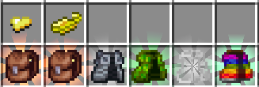

    *   `Charm Backpack` (`Charm Storage`): Stores TF Charms, prevents destruction on use (puts backpack on cooldown).
    *   `Steel Cape` (`Invulnerability`): Flat damage reduction, chance to fire stunning projectile on hit.
    *   `Scaled Cloak` (`Grip`+`Elusive Stare`): Wall climbing, chance to make attacker miss if looking at them.
    *   `Invisibility Cloak` (`Imperial Attire`+`Camouflage`): Hides armor cosmetically, grants invisibility when still/sneaking.
    *   `Chromatic Cloak` (`Spectrum Magic`+`Color Focus`): Stores colored wool, grants buffs based on active wool colors (consumes wool). Effect level scales with number of same-colored wools.
        *   **Wool Effects:**
            *   White: Levitation Resistance
            *   Light Gray: Reflection (Reflect projectiles?)
            *   Gray: Weather Resistance
            *   Black: Spider Climb
            *   Brown: Haste
            *   Red: Strength
            *   Orange: Fire Resistance
            *   Yellow: Reach
            *   Lime: Luck
            *   Green: Poison Resistance
            *   Cyan: Water Breathing
            *   Light Blue: Speed
            *   Blue: Night Vision
            *   Purple: Saturation
            *   Magenta: Regeneration
            *   Pink: Health Boost

### Body Slot

*   **Description:** General slot for body-worn items.
*   **Compatibility:** Items tagged `#curios:body`.
*   **Examples:**

    

    #### 1. Reliquary
    *   `Twilight Cloak`: Invisibility in darkness.

### Bracelet Slot

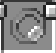

*   **Description:** Slot for wrist-worn items. Default: 2 slots.
*   **Compatibility:** Items tagged `#curios:bracelet`.
*   **Examples:**

    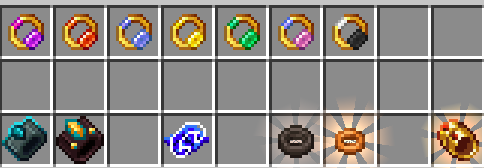

    #### 1. Ars Nouveau
    

    *   **`Enchanter's Bangle`**: Base item used to craft elemental/themed bangles. Provides a slight boost to overall spellcasting.
    *   **`Bangle of Fire`**:
        *   Boosts the damage of Fire spells more significantly than the base bangle.
        *   Arms are engulfed in fire, setting enemies on fire when hit.
        *   Grants a passive speed boost while in hot biomes.
    *   **`Bangle of Water`**:
        *   Boosts the damage of Water spells more significantly than the base bangle.
        *   Arms chill the air, freezing enemies on hit.
        *   Grants a passive speed boost (+50% swim speed) in water and rain.
    *   **`Bangle of Air`**:
        *   Boosts the damage of Air spells more significantly than the base bangle.
        *   Arms spark with the element, giving a passive boost to speed (+60%) and attack knockback (+1.2).
    *   **`Bangle of Earth`**:
        *   Boosts the damage of Earth spells more significantly than the base bangle.
        *   Plants blossom on arms, inflicting snare on enemies hit.
        *   Grants immunity to cactus and berry bush damage.
        *   Grants knockback resistance (+30%).
    *   **`Bangle of Summoning`**:
        *   Boosts the damage of Summoning spells (+2 Summoning Power).
        *   Summons follow arm movements, targeting whatever the player hits with increased damage.
    *   **`Bangle of Anima`**:
        *   Boosts the damage of Anima spells.
        *   Represents a cycle of life and death: randomly heals or withers enemies hit.
        *   Grants a small health boost (+4 Max Health).

    #### 2. Iron's Spells 'n Spellbooks (Addon: Traveloptics)
    *   `Nightstalker's Band`: Allows weaponless `Reversal`, grants `Assassin` buff on reflection.
    *   `Azure Ignition Bracelet`: Ignites Ignis spells with soul fire (bonus damage).

    #### 3. Silent Gear
    *   `Bracelet Blueprint`: Used for crafting Silent Gear bracelets. *(WIP Guide)*.

    #### 4. Artifacts
    *Note: Artifacts share experience earned and level up through use.*

    *   `Withered Bracelet` (`Wither Resistance`+`Withering Touch`): Wither immunity, chance to apply Wither on hit.
    *   `Onion Ring` (`Miner's Hunger`+`Raw Appetite`): Mining speed based on saturation, chance to restore hunger/saturation when mining.

    #### 5. Reliquified Ars Nouveau
    *Note: Relics share experience earned and level up through use.*

    *   `Flaming Bracer` (`Pyrophagy`+`Pyrokinesis`): Magic fire immunity, chance for extra fire bursts on melee hit vs burning target, repeats.

### Hostility Curse Slot

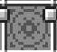

*   **Description:** Slot added by **L2Hostility** for "Curse" items, interacting with difficulty/loot mechanics. Many also fit the `Charm` slot.
*   **Compatibility:** Items tagged `#curios:hostility_curse`. (`Abyssal Thorn`, `Abrahadabra`, `Greed of Nidhoggur` are Curse slot ONLY).
*   **Examples:**

    

    #### 1. L2Hostility
    *   Looting Charms (`Unpolished`, `Magical`, `Chaotic`, `Miraculous`): Enable trait drops. (Also fits **Charm**)
    *   `Curse of Envy`: Enables trait symbol drops, +50 difficulty. (Also fits **Charm**)
    *   `Curse of Greed`: x2 Hostility loot chance, +50 difficulty. (Also fits **Charm**)
    *   `Curse of Lust`: Mobs drop equipped items, +50 difficulty. (Also fits **Charm**)
    *   `Curse of Wrath`: Damage bonus vs higher level mobs, grants effect immunities, +50 difficulty. (Also fits **Charm**)
    *   `Curse of Sloth`: Prevents difficulty gain from kills, mobs drop no hostility loot. (Also fits **Charm**)
    *   `Curse of Gluttony`: Chance for `Bottle of Curse` on kill. (Also fits **Charm**)
    *   `Abyssal Thorn`: Mobs get all possible traits, guarantees symbol drops with Envy. (**Curse Only**)
    *   *(Currently Unobtainable):* `Abrahadabra` (Reflects negative trait effects, +100 difficulty, **Curse Only**), `Curse of Pride` (HP/Dmg per difficulty, +100% trait frequency, Also **Charm**), `Greed of Nidhoggur` (x2 Hostility loot, +Loot per mob level, +100 difficulty, **Curse Only**), `Divinity Cross` (Prevents Cleanse on Lv1 buffs, Also **Charm**), `Divinity Light` (Keeps adaptive level at 0, Also **Charm**).

### Hands Slot

*   **Description:** Slot for gloves/hand accessories. Default: 2 slots.
*   **Compatibility:** Items tagged `#curios:hands`.
*   **Examples:**

    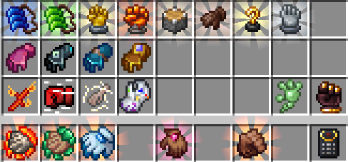

    #### 1. Occultism
    *   `Storage Accessor` (Storage Remote): Allows remote access to an Occultism storage network (Dimensional Storage Actuator). Requires binding to an actuator first.

    #### 2. Cataclysm Items
    *   `Blazing Grips`: Chance to apply `Blazing Brand` on hit.
    *   `Sticky Gloves`: Blocks Koboleton looting mechanic.

    #### 3. L2Hostility
    *   `Infinity Glove`: **+5 Ring slots**, **+1 Charm slot**.
    *   `Imagine Breaker`: Melee bypasses magic protection (disables hostility loot).
    *   `Flaming Thorn`: Inflict Soul Flame on damage based on target effects.
    *   *(Currently Unobtainable):* `Platinum Star` (Melee bypasses damage cooldown, also fits **Charm**).

    #### 4. Glimmering Tales
    *   `Glove of Thunder`: [Thunder] spell damage bypasses damage cooldown. Reduces Mana Regen by 25% (x0.75 multiplier).
    *   `Glove of Ocean`: [Ocean] spell damage bypasses damage cooldown. Reduces Mana Regen by 25% (x0.75 multiplier).
    *   `Glove of Abyss`: Infuses all spell damage with Abyss damage. Reduces Mana Regen by 50% (x0.5 multiplier).
    *   `Glove of Sorcerer`: Converts all spell damage to magic damage. Increases Magic Damage by +25%.

    #### 5. Relics
    *Note: Relics share experience earned and level up through use.*

    *   `Rage Glove` (`Berserker Rage`+`Phlebotomy`+`Spurt`-Activated): Damage/damage taken increase per hit, passive speed/regen, dash attack consumes charges.
    *   `Ender Hand` (`Neutrality`+`End Transposition`-Activated): Endermen neutral, swaps position with target.
    *   `Wool Mitten` (`Mold`): Collect snow to throw hardened snowballs (damage/stun/freeze).

    #### 6. Reliquified Ars Nouveau
    *Note: Relics share experience earned and level up through use.*

    *   `Archmage Glove` (`Dexterous Fingers`): Chance for spells to repeat multiple times without mana cost.

    #### 7. Reliquified Twilight Forest
    *Note: Relics share experience earned and level up through use.*

    *   `Giant's Glove` (`Giant's Grip`): Increases size/stats of held item.

    #### 8. Artifacts
    *Note: Relics share experience earned and level up through use.*

    *   `Digging Claws` (`Pickaxe Hands`+`Fast Mining`): Reduces tool level req, increases mining speed.
    *   `Feral Claws` (`Beast's Fury`): Attack speed increase per consecutive hit.
    *   `Power Glove` (`Power Strike`): Huge damage boost, but adds cooldown after each attack.
    *   `Fire Gauntlet` (`Fire Wave`): Releases homing fire sparks on attack.
    *   `Pocket Piston` (`Concentrated Strike`+`Long Reach`): Increases melee knockback and interaction range.
    *   `Vampiric Glove` (`Life Steal`): Heals based on damage dealt.
    *   `Golden Hook` (`Thirst for Knowledge`): Increases XP gained from mob kills.
    *   `Pickaxe Heater` (`Heat Concentration`): Autosmelts mined blocks using regenerating charge buffer.

### Ring Slot

*   **Description:** Slot for rings. Default: 2 slots (+5 from Infinity Glove).
*   **Compatibility:** Items tagged `#curios:ring`.
*   **Examples:**

    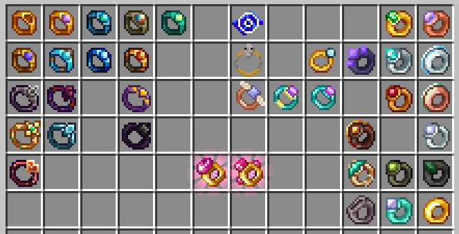

    #### 1. Glimmering Tales
    *   `Golden Ring`: +10% Max Mana.
    *   `Ring of Regeneration`: +10% Max Mana, +30% Mana Regen.
    *   `Ring of Nature`: +10% Max Mana, +10% Earth Affinity, +10% Life Affinity, +10% Flame Affinity, +10% Snow Affinity.
    *   `Ring of Earth`: +20% Max Mana, +50% Earth Affinity.
    *   `Ring of Life`: +20% Max Mana, +50% Life Affinity.
    *   `Ring of Thunder`: +30% Max Mana, +50% Thunder Affinity.
    *   `Ring of Ocean`: +20% Max Mana, +50% Ocean Affinity.
    *   `Ring of Snow`: +20% Max Mana, +50% Snow Affinity.
    *   `Ring of Flame`: +20% Max Mana, +50% Flame Affinity.

    #### 2. L2Hostility
    *   `Ring of Corrosion`: Damages target/self equipment durability on hit/being hit.
    *   `Ring of Reflection`: Reflects negative trait effects onto attackers.
    *   `Ring of Divinity`: Magic damage immunity, permanent Cleanse.
    *   `Ring of Ocean`: Keeps player always wet.
    *   `Ring of Healing`: Passive % health regen.
    *   *(Currently Unobtainable):* `Ring of Life` (Prevents >90% single instance damage), `Ring of Incarceration` (Applies Incarceration effect while sneaking).

    #### 3. Silent Gear
    *   `Ring Blueprint`: Used for crafting Silent Gear rings. *(WIP Guide)*.

    #### 4. Nature's Aura
    *   `Ring of Last Chance`: *(Likely death prevention)*.

    #### 5. Ars Nouveau
    *   `Ring of Jumping`: Allows the user to continue jumping in the air, consuming mana with each jump.
    *   `Ring of Lesser Discount`: Reduces the mana cost of all spells by 10. Grants +10 Max Mana and +1 Mana Regen.
    *   `Ring of Greater Discount`: Reduces the mana cost of all spells by 20. Grants +10 Max Mana and +1 Mana Regen. (Slightly larger discount than the Lesser version).

    #### 6. Occultism
    *   `Familiar Ring`: Stores Occultism Familiars, grants their passive bonus.

    #### 7. Reliquified Ars Nouveau
    *Note: Relics share experience earned and level up through use.*

    *   `Mana Ring` (`Mana Compression`): Increases Max Mana and Mana Regen.
    *   `Ring of Thrift` (`Reserve`): Chance for spells to consume no mana.

    #### 8. Cataclysm Spellbooks
    *   **`Leviathan's Blessing`**: +20% Abyssal Spell Power, provides immunity to abyssal effects.

    #### 9. Iron's Spells 'n Spellbooks & Addons
    *   `Signet of the Betrayer`: +10% Eldritch Spell Power. Passive (5s cooldown): Deal extra damage based on target's maximum mana.
    *   `Emerald Stoneplate Ring`: Slain creatures drop +25% experience.
    *   `Ring of Mana`: +100 Max Mana.
    *   `Fireward Ring`: Grants fire immunity.
    *   `Ring of Visibility`: Allows invisible creatures to be seen. (Note: Item ID might still be `invisibility_ring`).
    *   `Poisonward Ring`: Grants poison immunity.
    *   `Ring of Expulsion`: Passive (10s cooldown): When attacked, emit an expulsive burst of air (knockback).
    *   `Ring of Expediency`: +15% Cast Time Reduction.
    *   `Silver Ring`: +25 Max Mana.
    *   `Ring of Recovery`: +15% Cooldown Reduction.
    *   `Frostward Ring`: Grants freezing immunity.
    *   **Affinity Rings** (`Ring of Fire Affinity`, `Ring of Ice Affinity`, etc.): Crafted by combining a `Ring of No Affinity` with an elemental runestone in the Arcane Anvil. Grants +1 level to spells of the corresponding element (e.g., `Ring of Fire Affinity` boosts Fire spells).
    *   **Jewelry Crafting:** Rings can be crafted using the Jewelry Forge. *(Refer to Iron's Spells 'n Spellbooks Guide - WIP)*.
    *   **(Traveloptics Addon)** `Firestorm Ring`: Transforms meteors from Meteor Storm spell into exploding flare bombs with flame jets. Spell can no longer directly target entities. (Can also fit in **Talent** slot).
    *   **(Traveloptics Addon)** `Aetherial Despair Ring`: Axe Blades of Despair spell gain vertical trajectory and move 50% faster. (Can also fit in **Talent** slot).

    #### 10. Relics
    *Note: Relics share experience earned and level up through use.*
    *   ~~`Leafy Ring [WIP]`~~
    *   `Chorus Inhibitor` (`Teleportation Control`): Chorus fruit teleports along line of sight (cooldown).
    *   `Bastion Ring` (Combined - `Recognition`+`Respect`): Piglins neutral, indicates Bastions, chance for bonus Piglin trades.

### Belt Slot

*   **Description:** Slot for belts/sashes. Provides utility, buffs, or extra slots.
*   **Compatibility:** Items tagged `#curios:belt`.
*   **Examples:**

    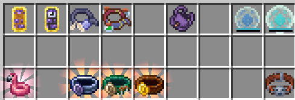

    #### 1. Ars Nouveau & Addons
    *   `Belt of Levitation`: Allows levitation (sneak while falling/jumping).
    *   `Belt of Unstable Gifts`: Grants random temporary potion effects.
    *   **(Ars Additions)** `Warp Index`: Remote access to Storage Lectern (same dimension).
    *   **(Ars Additions)** `Stabilized Warp Index`: Remote access to Storage Lectern (cross-dimension).

    #### 2. Occultism
    *   `Surprisingly Substantial Satchel`: Acts like a backpack.

    #### 3. Nature's Aura
    *   `Aura Cache`: Stores a small amount of Aura that the player can use.
    *   `Aura Trove`: Stores a larger amount of Aura than the Aura Cache.

    #### 4. Reliquary
    *   `Charm Belt`: Holds mob charms.

    #### 5. Artifacts
    *Note: Artifacts share experience earned and level up through use.*

    *   `Helium Flamingo` (`Air Swimmer`): Allows floating after double jump.

    #### 6. Relics
    *Note: Artifacts share experience earned and level up through use.*

    *   `Drowned Belt` (`Load Capacity`+`Dead Height`+`Water Flows`+`Water Attraction`): +Amulet slots, modifies swim/sink speed, increases underwater damage, allows Riptide without water/rain.
    *   `Hunter Belt` (`Load Capacity`+`Training`): +Amulet slots, increases pet damage.
    *   `Leather Belt` (`Load Capacity`): +Amulet slots (up to 8). This is the one that gives more slots.

### Feet Slot

*   **Description:** Slot for footwear. Enhances movement, environment interaction, defense. Can often fit vanilla boots slot.
*   **Compatibility:** Items tagged `#curios:feet`.
*   **Examples:**

    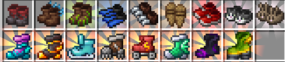

    #### 1. Artifacts
    *Note: Artifacts share experience earned and level up through use.*

    *   `Strider Shoes`: Walk on lava (sneaking), hot floor immunity.
    *   `Aqua-Dashers`: Walk on fluids (sprinting).
    *   `Rooted Boots` (`Herbivory`): Converts grass to dirt below, restores hunger/saturation.
    *   `Flippers` (`Fish Tail`): Increases swim speed.
    *   `Steadfast Spikes` (`Clinging Claws`+`Grip`): Wall slide (negates fall damage), knockback/slip resistance.
    *   `Snowshoes` (`Light Step`+`Snow Walker`): Walk on powder snow, speed boost on snow.
    *   `Running Shoes` (`High Stride`): Increases run speed.
    *   `Kitty Slippers` (`Cat's Gaze`+`Soft Paws`+`Nine Lives`): Scares creepers/phantoms, increases safe fall height, chance to survive fatal damage.
    *   `Bunny Hoppers` (`Jumper`): Hold jump for high jump.

    #### 2. Relics
    *Note: Artifacts share experience earned and level up through use.*

    *   `Aqua Walker` (`Moisture Resistance`): Temporary water walking.
    *   `Magma Walker` (Combined - `Heat Resistance`+`Fiery Tread`): Hot block immunity, temporary lava walking.
    *   `Ice Skates` (Combined - `Skating`+`Ram`): Speed boost on ice, damage on collision while skating.
    *   `Ice Breaker` (Combined - `Sustainability`+`Earthquake`): Faster fall speed, KB resist, no sliding; falling creates damaging shockwave.
    *   `Roller Skates` (`Acceleration`): Speed boost while moving, makes blocks slippery.
    *   `Amphibian Boot` (Combined - `Fins`+`Slipping`+`Gills`): Swim speed boost, speed boost in rain, chance to not consume air.
    *   `Phantom Boot` (`Phantom Bridge`): Creates temporary blocks underfoot.

### Charm Slot

*   **Description:** Slot for small charms. Provides passive utility, protection, conditional effects. Slot count increased by `Leather Belt` (+8) and `Infinity Glove` (+1).
*   **Compatibility:** Items tagged `#curios:charm`. Many `#curios:hostility_curse` items also fit.
*   **Examples:**

    

    #### 1. Ars Additions
    *(Note: These charms have charges and can be recharged, in an Ars Nouveau Imbuement Chamber).*
    *   **`Charm of Emberward`**: Nullifies Fire Damage (walk through fire, swim in lava). Charges: 1000.
    *   **`Charm of Second Wind`**: Prevents death upon receiving fatal damage. Charges: 1.
    *   **`Charm of Unyielding Magic`**: Prevents beneficial effects from being dispelled. Charges: 3.
    *   **`Charm of Featherlight`**: Grants slow falling when falling more than 3 blocks. Charges: 20.
    *   **`Charm of Ocean's Breath`**: Enables breathing underwater (activates after air bubbles depleted). Charges: 1000.
    *   **`Charm of Ender Serenity`**: Prevents angering Endermen by looking at them. Charges: 100.
    *   **`Charm of Decay's End`**: Prevents being afflicted with the Wither effect. Charges: 10.
    *   **`Charm of Gilded Friendship`**: Makes Piglins and Piglin Brutes neutral, allowing safe interaction in Bastions. Charges: 1000.
    *   **`Charm of Darkvision`**: Grants Night Vision in low-light environments. Charges: 20.
    *   **`Charm of Snowstride`**: Enables walking on powdered snow without sinking. Charges: 1000.
    *   **`Resonant Shield`**: Protects from the Warden's sonic boom attack. *(Charges TBC)*.
    *   **`Void's Salvation`**: When falling into the void, teleports you to the last safe surface you were on. *(Charges TBC)*.

    #### 2. L2Hostility & L2Complements
    *(Note: Many L2Hostility items can often be worn in the Hostility Curse slot as well. Effects listed are when worn as Charm. Wearing as Curse might have additional effects or increased difficulty.)*
    *   **(L2Hostility) Looting Charms (`Unpolished`, `Magical`, `Chaotic`, `Miraculous`)**: Enables some hostility trait drops (check JEI for specifics for each tier).
    *   **(L2Hostility) `Curse of Envy`**: Get trait items when killing mobs with traits (2% chance per trait rank). Increases player difficulty by +50.
    *   **(L2Hostility) `Curse of Greed`**: Doubles (x2.0) hostility loot drop chance. Increases player difficulty by +50.
    *   **(L2Hostility) `Curse of Lust`**: Mobs you kill will drop all their equipped items. Increases player difficulty by +50.
    *   **(L2Hostility) `Curse of Wrath`**: Gain 1% attack damage per difficulty level difference against mobs with higher levels. Grants immunity to Blindness, Darkness, Mining Fatigue, Nausea, Slowness, Weakness. Increases player difficulty by +50.
    *   **(L2Hostility) `Curse of Sloth`**: Prevents gaining difficulty by killing mobs. Prevents mobs you kill from dropping hostility loot.
    *   **(L2Hostility) `Curse of Gluttony`**: Get `Bottle of Curse` when killing mobs with a level (2% chance per level).
    *   **(L2Hostility) `Pocket of Restoration`**: Automatically takes sealed items (like `Bottle of Curse`) placed inside, unseals them (applies the effect/curse), and returns the empty container.
    *   **(L2Complements) `Totem of Dream`**: When triggered (likely by fatal damage), returns the player to their home/spawn point, heals to full health, and becomes a `Fragile Warp Stone` to return to the death location. Valid against void damage. (Single use).
    *   **(L2Complements) `Totem of The Sea`**: Stackable (up to 16). Functions like a Totem of Undying, but can only be triggered when in water or rain. (Single use per totem).
    *   **(L2Complements) `Eternal Totem of Dream`**: Reusable version of the `Totem of Dream` with a 120-second cooldown.
    *   **Currently Unobtainable Items (L2Hostility):** *(Note: The following items require traits/materials that are currently disabled or unavailable for crafting in ATMA. This might change in future updates.)*
        *   `Curse of Pride`: Gain 1% health and 1% attack damage per difficulty level. Mob traits will be +100% more frequent.
        *   `Divinity Cross`: Prevents the Cleanse effect from clearing Level 1 beneficial effects.
        *   `Divinity Light`: Keeps your adaptive level at 0.
        *   `Platinum Star`: All melee damage bypasses damage cooldown. (Also fits in **Hands** slot).

    #### 3. Artifacts
    *Note: Artifacts share experience earned and level up through use.*

    *   `Cloud in a Bottle` (`Air Jump`): Grants extra air jumps.
    *   `Obsidian Skull` (`Heat Resistance`): Absorbs fire damage temporarily, regenerates.
    *   `Antidote Vessel` (`Poison Resistance`+`Alchemical Touch`): Reduces negative effect duration, steals positive effect duration on hit.
    *   `Universal Attractor` (`Magnetism`): Toggleable item attraction/repulsion.
    *   `Crystal Heart` (`Will to Live`): Increases Max Health.
    *   `Chorus Totem` (`Temporal Loop`): Chance per missing health to teleport attacker on hit.
    *   `Warp Drive` (`Translocation`): Line-of-sight teleport (activated, cooldown).

    #### 4. Glimmering Tales
    *   **`Charm of Strength`**: +50% Magic Damage.
    *   **`Charm of Capacity`**: +50% Max Mana.
    *   **`Charm of Regeneration`**: +50% Mana Regen.
    *   **`Charm of Nature`**: +10% Mana Regen.
    *   **`Charm of Earth`**: +10% Mana Regen, -20% Damage after Reduction (Reduces final damage taken).
    *   **`Charm of Life`**: +10% Mana Regen, +50% Regeneration Rate (Health).
    *   **`Charm of Flame`**: +100% Fire Damage, +100% Explosion Damage.
    *   **`Charm of Snow`**: -10% Damage after Reduction, +100% Freezing Damage.
    *   **`Charm of Ocean`**: +10% Mana Regen, +50% Magic Damage.
    *   **`Charm of Thunder`**: +20% Mana Regen, +100% Lightning Damage.

    #### 5. Nature's Aura
    *   **`Environmental Eye`**: *(Tooltip missing - Likely displays Aura levels in the surrounding environment).*
    *   **`Environmental Ocular`**: *(Tooltip missing - Likely an improved version of the Environmental Eye, perhaps with greater range or detail).*

    #### 6. Apotheosis
    *   Potion Charms: Provide passive potion effect (matches potion used).

    #### 7. The Twilight Forest
    *(Note: These charms are typically single-use and consumed upon activation).*

    *   **`Charm of Life I`**: Prevents death, consumed on use, grants short health regeneration. Found in loot chests.
    *   **`Charm of Life II`**: Prevents death, consumed on use, fully restores health, grants Regen IV, Resistance, and Fire Resistance for 30 seconds. Crafted from 4x Charm of Life I.
    *   **`Charm of Keeping I`**: Prevents loss of main hand, off-hand, and armor items on death. Consumed on use.
    *   **`Charm of Keeping II`**: Prevents loss of main hand, off-hand, armor, and hotbar items on death. Consumed on use.
    *   **`Charm of Keeping III`**: Prevents loss of all inventory items on death. Consumed on use.

    #### 8. Relics (Reliquified)
    *Note: Artifacts share experience earned and level up through use.*

    *   `Spore Sack` (`Spore Mist`): Releases homing spores on low health (damage, block healing).
    *   `Shadow Glaive` (`Mayhem`+`Cloning`): Chance on damage for bouncing projectile, chance for bounces to duplicate.

    #### 9. Reliquified Ars Nouveau
    *Note: Artifacts share experience earned and level up through use.*

    *   `Quantum Bubble` (`Quantification`): Creates aura that traps hostile projectiles nearby.
    *   `Emblem of Defense` (`Defense`): Automatically applies a linked spell (max 10 components, must start with 'Touch') to an enemy attacking the player, then goes on cooldown (10s). Requires inscribing spell via Scribe's Table.
    *   `Emblem of Assault` (`Assault`): Automatically applies a linked spell (max 10 components, must start with 'Touch') to the attacked target, then goes on cooldown (15s). Requires inscribing spell via Scribe's Table.

    #### 10. Reliquified Twilight Forest
    *Note: Relics share experience earned and level up through use.*

    *   `Cicada in a Bottle` (`Cicada's Curse`): Chance on hit to force nearby mobs to attack target.
    *   `Firefly Queen` (`Glowkeeper`): Generates charges, consumes charge to place temporary light source in darkness.
    *   `Twilight Feather` (`Execution`): Chance to instantly kill low-health targets.
    *   `Bottle of Maple Syrup` (`Sugar Rush`): Eating waffles grants stacking regen, chance to not consume waffle.

### Talent Slot

 / 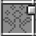

*   **Description:** Slot primarily used by **Traveloptics** (Iron's Spells 'n Spellbooks addon) for items modifying specific spells or granting related passives. Many items also fit other slots (Ring, Necklace, Bracelet).
*   **Compatibility:** Items tagged `#curios:talent`.
*   **Examples:**

    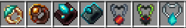

    #### 1. Iron's Spells 'n Spellbooks (Addon: Traveloptics)
    *(Note: These items often fit multiple slots. The descriptions below apply regardless of which compatible slot they are equipped in, unless stated otherwise.)*
    *   **`Aetherial Despair Ring`**: Axe Blades of Despair spell gain vertical trajectory and move 50% faster. (Also fits **Ring** slot).
    *   **`Firestorm Ring`**: Transforms meteors from Meteor Storm spell into exploding flare bombs with flame jets. Spell can no longer directly target entities. (Also fits **Ring** slot).
    *   **`Azure Ignition Bracelet`**: Permanently ignites Ignis-themed spells with soul fire, increasing their damage. (Also fits **Bracelet** slot).
    *   **`Nightstalker's Band`**: Allows the `Reversal` spell to be cast without a weapon. Reflecting a projectile grants the `Assassin` effect for 5 seconds (boosts movement speed and greatly enhances attack damage). Effect ends upon striking an entity. (Also fits **Bracelet** slot).
    *   **`Energy Unbound Necklace`**: Grants the caster freedom to look around while casting Death Laser and allows movement at 80% reduced speed. However, the laser's damage is reduced by 20%. (Also fits **Necklace** slot).
    *   **`Sigil of the Spider Sorcerer`**: Aspect of the Spider spell now allows wall climbing. Casting Aspect of the Spider and striking an enemy grants a 50% chance to poison them for 3 seconds. (Also fits **Necklace** slot).
    *   **`Amulet of Spectral Shift`**: Spectral Blink spell now teleports the targeted entity to *your* location while crouching. (Also fits **Necklace** slot).

### Spell Book Slot

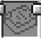

*   **Description:** Slot added by **Iron's Spells 'n Spellbooks** for holding Spell Books. Allows casting via keybinds.
*   **Functionality:** Holds spells, often provides passive bonuses (Max Mana, CDR, Cast Time, Spell Power).
*   **Compatibility:** Items tagged `#curios:spellbook`. Includes books from base mod, addons, All the Wizard Gear.
*   **Examples:**

    

    #### 1. Iron's Spells 'n Spellbooks (Base Mod)
    *   **Tiered Spell Books:**
        *   `Flimsy Journal` (Copper): 5 Spell Slots.
        *   `Ironbound Tome` (Iron): 6 Spell Slots.
        *   `Apprentice's Spell Book` (Gold): 8 Slots, +15% Cast Time Reduction, +50 Max Mana.
        *   `Enchanted Spell Book` (Diamond): 10 Slots, +100 Max Mana.
        *   `Ancient Codex` (Netherite): 12 Slots, +20% Cooldown Reduction, +200 Max Mana.
    *   **Special/Loot Spell Books:**
        *   `Rotten Spell Book`: 8 Slots, **-15% Spell Resistance**, +100 Max Mana.
        *   `Blaze Instruction Manual`: 10 Slots, +10% Fire Spell Power, +200 Max Mana.
        *   `Cursed Doll`: 10 Slots, +1 level to Blood Needles & Acupuncture, +10% Blood Spell Power, +10% Spell Resistance, +200 Max Mana.
        *   `Druidic Tome`: 10 Slots, +10% Nature Spell Power, +200 Max Mana.
        *   `Dragonskin Spell Book`: 12 Slots, +10% Ender Spell Power, +200 Max Mana.
        *   `Villager Bible`: 10 Slots, +8% Holy Spell Power, +8% Cast Time Reduction, +200 Max Mana.
    *   **Unique Spell Books (Often contain pre-inscribed spells):**
        *   `Grimoire of Evokation`: 10 Slots, +10% Evocation Spell Power, +200 Max Mana. (Contains Evoker spells).
        *   `Necronomicon`: 10 Slots, +2 levels to Raise Dead, +200 Max Mana. (Contains Blood/Undead spells).

    #### 2. All the Wizard Gear
    *   `Allthemodium Spell Book`: 13 Slots, +30% Cooldown Reduction, +15% Cast Time Reduction, +300 Max Mana.
    *   `Vibranium Spell Book`: 14 Slots, +40% Cooldown Reduction, +25% Cast Time Reduction, +300 Max Mana.
    *   `Unobtainium Spell Book`: 15 Slots, +50% Cooldown Reduction, +35% Cast Time Reduction, +300 Max Mana.

    #### 3. Traveloptics
    *   `Shellbound`: 12 Slots, +200 Max Mana, +10% Nature Spell Power, +10% Cooldown Reduction.
    *   **Unique Spell Books:**
        *   `Chronicles Of The Firelord`: 12 Slots, +1 level to Burning Judgment, +300 Max Mana, +15% Fire Spell Power, +15% Eldritch Spell Power. (Contains Fire spells).
        *   `The Accused Codex`: 12 Slots, +300 Max Mana, +10% Cooldown Reduction, +20% Ice Spell Power. (Contains Ice spells).
        *   `Archive Of Abyssal Secrets`: 12 Slots, +1 level to Cursed Minefield, +300 Max Mana, +15% Ender Spell Power, +15% Eldritch Spell Power. (Contains Ender/Void spells).

    #### 4. Cataclysm Spellbooks
    *   `Codex of Malice`: 12 Slots, +300 Max Mana, +30% Ice Spell Power.
    *   `Ignis Spellbook`: 12 Slots, +30% Fire Spell Power, +300 Max Mana.
    *   `Book o' R'lyeh`: 12 Slots, +30% Abyssal Spell Power, +300 Max Mana.
    *   **Unique Spell Books:**
        *   `Desert Spellbook`: 10 Slots, +200 Max Mana, +20% Nature Spell Power, +10% Holy Spell Power. (Contains Nature/Sand spells).

    #### 5. GameTechBC's Spellbooks
    *   **Unique Spell Books:**
        *   `GTBC's Magical Repository`: 10 Slots, +200 Max Mana, +15% Spell Power, +10% Cooldown Reduction. (Contains custom spells).

### Bundle Slot

*   **Description:** Slot for pouch-like items offering portable storage.
*   **Compatibility:** Items tagged `#curios:bundle`.
*   **Examples:**

    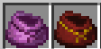

    #### 1. Ars Elemental
    *   **`Trinkets Pouch`**: A magical pouch crafted from Magebloom Fiber used to store items and reduce inventory clutter. Can be opened with the 'J' key (configurable) while equipped in a Curios slot or held in the hotbar.
    *   **`Spellcaster Bag`**: An upgraded, larger version of the Trinkets Pouch. Can also be opened with the 'J' key and can be dyed different colors.

### Heart Amulet Slot

*   **Description:** Slot added by **Baubley Heart Canisters** for `Heart Amulets`.
*   **Functionality:** Holds Heart Canisters, which increase max health. Open via ++rbutton++.
*   **Compatibility:** Items tagged `#curios:heart_amulet`.
*   **Examples:**

    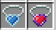

    #### 1. Baubley Heart Canisters
    *   **`Heart Amulet`**: The primary item for this slot. Acts as a container for Heart Canisters, which increase maximum health when socketed. Right-click the amulet in your inventory or Curios slot to open its interface and add/remove canisters. *(Refer to Baubley Heart Canisters guide - WIP for canister details)*.
    *   **`Soul Amulet`**: An upgraded amulet for this slot. It can also be opened via right-click.

---

## Other Artifacts & Relics (Non-Curios)

These items provide effects but are typically held or used directly, not equipped in Curios slots (though some might have niche compatibility).

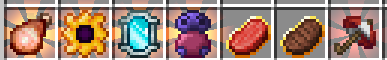

### 1. Relics
*Note: Relics share experience earned and level up through use.*

*   **`Infinite Ham`**: Never-ending food source, can store/apply potion effects, usable as weapon.
*   **`Space Dissector`**: Creates linked portals for entity teleportation (temporary).
*   **`Magic Mirror`**: Teleports player to spawn point (cooldown).
*   **`Blazing Flask`**: Creates temporary restricted flight zone (requires fire nearby).

### 2. Artifacts
*Note: Relics share experience earned and level up through use.*

*   **`Everlasting Beef` / `Eternal Steak`**: Infinite food items (varying hunger/saturation restored).
*   **`Umbrella`**: (`Soft Fall`+`Glide`+`Air Shield`-Activated): Reduces fall speed, grants mid-air dash, pushes entities away when blocking. *(Might fit Back slot)*.

---

> **Curios API** | [CurseForge Curios Link](https://www.curseforge.com/minecraft/mc-mods/curios) | [CurseForge Relics Link](https://www.curseforge.com/minecraft/mc-mods/relics-mod)
