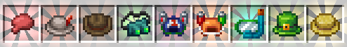
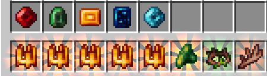
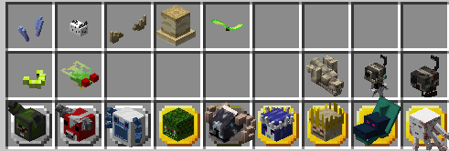
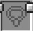
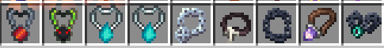
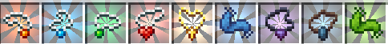
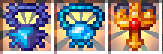

# Guide: Curios Slots & Items

This guide covers the Curios API, how to gain additional slots, and provides details on specific Curios items available in ATMA, with examples from various mods.

## Understanding Curios: The Accessory API

### Overview

**Curios** is a foundational Minecraft mod acting as an **API** (Application Programming Interface) and library. It primarily provides a standardized system for other mods to add **new equipment slots** beyond vanilla armor, off-hand, and hotbar slots. Think of it as a framework enabling accessories and extra gear.

### Key Features for Players:

*   **More Equipment Slots:** Allows mods to add slots for items like rings, necklaces, belts, charms, back items, headgear, hand items, and more.
*   **Centralized Management:** All extra accessory slots are managed through a single GUI, typically opened by pressing the **'G' key** (configurable in Controls). This keeps your main inventory screen cleaner.
*   **Flexibility:** Items can often be equipped into multiple compatible slot types (e.g., some head items might fit in the helmet slot or a Curios head slot).
*   **Compatibility:** Standard Minecraft mechanics like Mending, Unbreaking, and Curses generally work with items in Curios slots.

---

## Getting More Curios Slots

Some specific Curios items grant additional slots of certain types when equipped.

*   **Head:** `Oddeyes Glasses` - When equipped in a Head slot, grants **+2 Head slots**.
    

*   **Back:** `Triple Strip Cape` - When equipped in a Back slot, grants **+3 Back slots**.
    

*   **Hands:** `Infinity Glove` - When equipped in a Hands slot, grants **+5 Ring slots** and **+1 Charm slot**.
    

*   **Belt:** `Leather Belt` - When equipped in the Belt slot, grants up to **+8 Charm slots**.
    

---

## Curios by Slot Type

Here are examples of items that fit into specific Curios slots available in ATMA:

### Spell Focus Slot

*   **Description:** A dedicated slot primarily used by **Ars Nouveau** for its `Spell Foci`.
*   **Functionality:** Equipping a Focus provides passive benefits and enhances certain spells or schools of magic.
*   **Compatibility:** Items tagged `#curios:an_focus` fit here.
*   **Examples:** `Focus of Earth`, `Focus of Water`, `Focus of Fire`, `Focus of Air`, `Focus of Necromancy`, `Focus of Summoning`, `Focus of Block Shaping`, `Focus of Transmutation` (Ars Technica).
*   **Details:** [Click here for an in-depth explanation of Spell Focus](arsnouveau/README.md/#spell-focus)

### Head Slot

*   **Description:** A slot for items worn on the head, often providing utility or visual effects. Items here can typically also be worn in the vanilla helmet armor slot.
*   **Functionality:** Varies greatly depending on the item equipped.
*   **Compatibility:** Items tagged `#curios:head` fit here.
*   **Examples:**

#### 1. Occultism
*   `Otherworld Goggles`: Grants the permanent **Third Eye** effect, allowing the wearer to see hidden Otherworld blocks and entities related to Occultism. This ability, referred to as "seeing beyond the veil," is normally temporary and achieved by consuming `Demon's Dream` herbs.

#### 2. The Bumblezone
*   `Flower Headwear`: Prevents bees from becoming angry and attracts them when worn in the *armor* slot. **Functionality may not work correctly when equipped in the Curios slot**, and it provides no visual change in the Curios slot either.

#### 3. Ars Nouveau & Addons
*   **(Ars Technica)** `Spy Monocle`: Allows zooming in by pressing ++g++ (configurable).
*   `Alchemist's Crown`: Allows opening a potion radial menu by pressing ++g++ (configurable) when `Potion Flasks` are in the inventory.
    

#### 4. L2Hostility
*   `Oddeyes Glasses`: When equipped in a Head slot, grants **+2 Head slots**.
*   `Detector Glasses`: Allows you to see invisible mobs and see mobs even when affected by Blindness or Darkness. Additionally, while holding a `Hostility Detector` in the off-hand, you can use it to clear the difficulty in an area. [Click here for more information](l2hostility.md/#ways-to-decrease-player-difficulty).

#### 5. Create
*   `Engineer's Goggles`: Augments your HUD with information about placed Create components (Stress, Capacity, item/fluid content).

#### 6. Hexerei
*   `Reading Glasses`: Allows zooming in by pressing ++z++ (configurable).

#### 7. Artifacts
*Note: Artifacts share experience earned and level up through use.*

*   `Whoopee Cushion`: Grants`Flatulence`. Chance to knock back nearby entities and apply nausea when taking damage or crouching frequently.
*   `Angler's Hat`: Grants `Generous Catch`. Chance to increase the amount of catch received while fishing, potentially repeating multiple times.
*   `Cowboy Hat`: Increases movement speed, jump height, and safe fall height of mounts. Also grants the `Lasso` ability: When used (activated), allows riding and controlling *any* mob for a short duration (up to 12.5s at max level), followed by a 1-minute cooldown.
*   `Night Vision Goggles`: Grants `Gamma Vision`. Enhances brightness in poorly lit areas and reduces the effectiveness of Blindness and Darkness effects.
*   `Novelty Drinking Hat` / `Plastic Drinking Hat`: Grants `Quick Drink` (Increases drinking speed) and `Life-Giving Sip` (Replenishes hunger when drinking).
*   `Snorkel`: Grants `Clear Vision` (Removes water fog) and `Breath Control` (Grants Water Breathing upon submersion).
*   `Superstitious Hat`: Grants `Big Loot`. Chance to apply an additional level of Looting to defeated mobs, potentially repeating multiple times.
*   `Villager Hat`: Grants `Innocent Appearance` (Prevents Iron Golem aggression) and increases trading discounts.

#### 8. Reliquified Twilight Forest
*Note: Relics share experience earned and level up through use.*

*   **`Lich Crown`**:
    *   Grants `Bone Pact`: All skeletons become friendly towards the player.
    *   Allows socketing `Soulbound Gems` (up to 18 total). Each unique gem unlocks an ability; duplicates increase the level.
        *   **To insert/remove:** ++rbutton++ the Crown while holding the gem / with an empty cursor.
        *   *Note: Gems can be mixed and matched.*
        *   **Available Gems:**
            *   `Absorption Gem` (`Will to Live`): When health is below 20%, drains a percentage of max health from nearby targets for 5s (31.2% drain, 14 block range at max level). 2s cooldown.
            *   `Necromancy Gem` (`Risen Servants`): Every 4s (at max level), spawns a mini-zombie (up to 20 total) dealing 12 damage (at max level).
            *   `Shielding Gem` (`Fortification`): Every 0.7s (at max level), creates a shield blocking one directed attack (up to 23 shields active).
            *   `Frost Gem` (`Frostbite`): Attacks apply stacking frostbite for 14s (at max level). After 7s, target takes 1 armor-piercing damage every 2s.
            *   `Twilight Gem` (`Twilight Touch`): Pressing LMB while looking at a target launches a projectile (3 blocks/sec) dealing 13 damage (at max level). Doesn't work in melee range.
*   **`Thorn Crown`**:
    *   Grants `Goblin Sense` (Activated): Worsens vision but detects valuable ores within 16 blocks (at max level). Can store up to 5 ore blocks internally (++rbutton++ with ore in inventory) to ignore those specific blocks. Extract stored ore with an empty cursor.
    *   Grants `Oak Skin`: Grants full resistance to 'thorn' damage.
*   **`Deer Antler`**:
    *   Grants `Acupuncture`: Touching a target deals 7 damage (at max level) with a 30% chance to paralyze for 6s (at max level).
    *   Grants `On the Horns!` (Activated): Use on a creature (hitbox <= 2048 blocks at max level) to place it on antlers, preventing it from damaging you.

#### 9. Reliquified Ars Nouveau
*Note: Relics share experience earned and level up through use.*

*   `Horn of the Wild Hunter` (`Wild Hounds`): Summons 2 invulnerable wolves that fight alongside the player, dealing +15 damage each (at max level).
*   `Whirlisprig Petals` (`Ascension`): Holding jump key lifts player upwards for 0.5s (at max level). Automatically grants Slow Falling when falling from a dangerous height.

#### 10. Aesthetic ONLY Items
*(These provide no functional benefit when equipped)*

*   Trophies from **Twilight Forest**: `Twilight Lich Trophy`, `Snow Queen Trophy`, `Questing Ram Trophy`, `Naga Trophy`, `Alpha Yeti Trophy`, `Minoshroom Trophy`, `Knight Phantom Trophy`, `Hydra Trophy`, `Ur-Ghast Trophy`
*   Other **Twilight Forest**: `Moonworm`, `Cicada`, `Firefly`
*   **Cataclysm**: `Aptrgangr Head`, `Draugur Head`, `Kobolediator Head`
*   **Starbunclemania**: `Whirly Propeller`, `Alakakrinas Hat`, `Drygme Horns`, `Sea Bunny`, `Starby Ears`

### Necklace Slot

*   **Description:** A slot for necklaces, amulets, and pendants, often providing passive buffs or utility effects.
*   **Functionality:** Varies greatly depending on the item equipped.
*   **Compatibility:** Items tagged `#curios:necklace` fit here.
*   **Examples:**

#### 1. Ars Nouveau
*   `Amulet of Mana Boost`: Increases maximum mana by +50.
*   `Amulet of Mana Regen`: Increases mana regeneration rate by +3.

#### 2. Reliquary (Reliquified)
*   `Coin of Fortune`: Automatically draws in nearby items and experience orbs. Can be activated (++shift+rbutton++) and held (++rbutton++) for a larger vacuum effect.

#### 3. Nature's Aura
*   `Amulet of Wrath`: No provided information.

#### 4. Iron's Spells 'n Spellbooks & Addons

*   `Amulet of Concentration`: Makes long-cast spells uninterruptible.
*   `Conjurer's Talisman`: Increases summon damage by 10%.
*   `Heavy Chain`: Increases spell resistance by 15%.
*   `Amethyst Resonant Charm`: Increases mana regeneration by 15%.
*   `Amulet of Teleportation`: No provided information.
*   **(Traveloptics)** `Energy Unbound Necklace`: Allows free look and slow movement (80% reduction) while casting Death Laser, but reduces laser damage by 20%.
*   **(Traveloptics)** `Sigil of the Spider Sorcerer`: Allows wall climbing while Aspect of the Spider is active. Casting Aspect of the Spider and hitting an enemy gives a 50% chance to poison them for 3 seconds.
*   **(Traveloptics)** `Amulet of Spectral Shift`: Spectral Blink spell now teleports the target entity to your location while crouching.
*   **Special Mention:** Jewelry Crafting. You can craft `Simple Amulets`, `Simple Chains` and `Amulet of Protection`. Refer to the Iron's Spells 'n Spellbooks Guide (coming soon) for more details on crafting.

#### 5. Silent Gear
*   **Special Mention:** `Necklace Blueprint`. This item is used to craft necklaces using Silent Gear's material system. Refer to the Silent Gear Guide (coming soon) for more details on crafting.

#### 6. Artifacts
*Note: Artifacts share experience earned and level up through use.*

* **`Flame Pendant`**:
  *   `Fiery Defense`: Has a chance (up to 60% at max level) to ignite attackers for a duration (12s at max level).
* **`Shock Pendant`**:
  *   `Electric Resistance`: Grants complete immunity to lightning damage.
    *   `Lightning Defense`: Has a chance (up to 40% at max level) to strike attackers with lightning, dealing a set amount of damage (9 at max level).
* **`Thorn Pendant`**:
  *   `Poisonous Defense`: Has a chance (up to 50% at max level) to reflect a portion of damage (30% at max level) back to attackers and apply poison for a duration (16s at max level).
* **`Panic Necklace`**:
  *   `Panic`: Increases player movement speed (by 4% at max level) for each mob within a radius (16 blocks at max level) targeting the player.
* **`Cross Necklace`**:
  *   `Invincibility`: Increases the duration of invulnerability frames after taking damage (by 1.5s at max level).
* **`Scarf of Invisivility`**:
  *   `Silent Step`: Grants complete invisibility. The effect breaks for a duration (2.5s at max level) upon interacting with the world. If a mob targets the player while invisible, the effect won't restore until the mob loses sight.
*   **`Charm of Shrinking`**:
  * `Compression`: Reduces the player's size by 60%
* **`Charm of Sinking`**:
  * `Anchor`: Doubles the player's sinking speed in water.
  *   `Diver`: While standing on the underwater floor, blocks air consumption and slowly restores air supply (by 1.2 seconds worth every second at max level).
*   **`Lucky Scarf`**:
  * `Treasure Hunter`: Has a chance (70% at max level) to apply an additional level of Luck to mined blocks. If successful, the ability repeats, adding another Luck level, continuing until the chance fails, summing all successful levels.

#### 7. Reliquified Amulets
*Note: Relics share experience earned and level up through use.*

*   **`IReflecting Necklace`**:
    *   Accumulates damage taken into an internal buffer (up to 270 units at max level).
    *   Five seconds after the last damage is received, or if the buffer overflows, the relic explodes.
    *   The explosion scatters obsidian shards in all directions. Each shard deals 3 damage and stuns targets for 0.88 seconds per unit of damage stored in the buffer.
*   **`Jellyfish Necklace` (Combined Relic)**:
    *   `Power over the sea`: The wearer does not sink in water.
    *   `Electrical Discharge`: Deals damage (7.5 at max level) to targets upon collision.
    *   `Paralysis`: When `Electrical Discharge` activates, it applies paralysis to the target for a duration (3 seconds at max level).
*   **`Holy Locket`**:
    *   `Faith` Has 2 toggleable modes:
        *   **Holiness (Red Mode):** Steals a percentage (50% at max level) of healing from visible entities within a radius (35 blocks at max level) and transfers it to the wearer.
        *   **Unholiness (Blue Mode):** Deals damage to all visible entities within the same radius, equal to a percentage (450% at max level) of the healing received by the wearer.
    *   `Penitence`: Ignites undead enemies for 10 seconds and increases damage dealt to them by a percentage (200% at max level).
    *   `Ascension`: Killing a target grants the wearer a temporary stacking immortality effect for a duration (2 seconds at max level), stacking up to a maximum duration (60 seconds at max level).

 *(WIP: List other slot types like Back, Body, Charm, Belt, Ring, Hands, Feet as needed, with examples)*

 ---

 ## How to Equip Curios Items

 1.  Press the **Curios key** (Default key: 'G') to open the Curios slots GUI.
 2.  Identify the appropriate slot type for the item you want to equip (e.g., Head, Back, Necklace, Hands, Belt, Charm, Ring, Focus).
 3.  Drag the desired Curios item from your main inventory into a compatible empty slot in the Curios GUI.
 4.  The item is now equipped, and its effects (if any) should be active!

 ---

 > **Curios API** | [CurseForge Link](https://www.curseforge.com/minecraft/mc-mods/curios)
