# Guide: Mob Farms in All The Magic - Arcana

Welcome, aspiring mob farmers! If you're looking to efficiently gather mob loot in the ATMA modpack, you've come to the right place.
This guide will cover various methods for spawning or generating mobs/resources and different techniques for automatically killing them and collecting their drops.

## Fundamental Mob Spawning Mechanics (Vanilla)

Understanding vanilla mob spawning is key for many farm designs:

*   **Player Distance:**
    *   Mobs **cannot spawn** within a **24-block radius** (spherical) of any player.
    *   Mobs **instantly despawn** if they are more than **128 blocks** away from the nearest player.
    *   Mobs **randomly despawn** over time if they are further than **32 blocks** away *and* no players are within 128 blocks.
*   **AFK Spot:** The general 'sweet spot' distance to wait from spawning platforms is often between **24 and 32 blocks** away to maximize spawns within the farm while minimizing spawns elsewhere nearby. Being further (but less than 128 blocks) is also possible depending on the farm design.

*(Note: Apotheosis can override some of these rules for its spawners.)*

---

## Mob Spawning / Resource Generation Methods

ATMA offers several ways to generate mobs or their associated loot:

### 1. Specialized Modded Methods

These mods provide unique ways to generate mobs or resources without traditional spawning platforms.

*   **Ars Nouveau - Drygmy Farms:**
    *   Utilize `Drygmy` charms placed in `Drygmy Houses` near `Source Jars`.
    *   Drygmys automatically "farm" specific nearby mobs *without killing them*, generating their drops over time.
    *   Mobs should be contained nearby, ideally in `Containment Jars` (captured using a `Tablet of Containment` in a `Ritual Brazier` - place a `Source Jar` nearby to sustain the ritual). A dedicated "containment area" with teleportation methods is recommended.
    *   Requires Source generation. More Drygmys speed up generation. Keep them happy with a variety of nearby mobs for optimal rates.
    *   *(This method will be detailed in a specific guide later. For more info, check the official Ars Nouveau Guide: <https://ars.guide/docs/drygmy/guide/>)*
*   **Evilcraft:**
    *   Offers potential mob farming using the `Box of Eternal Closure` with a `Vengeance Spirit` inside a `Spirit Furnace`.
    *   Can be a good alternative for mobs difficult to farm otherwise (e.g., Withers, Twilight Forest bosses).
    *   Requires significant amounts of Blood.
    *   *(This method will be detailed in a specific guide later. For the moment, you can check the in-game **Evilcraft** Guide `Origins of Darkness`)*.
*   **Mystical Agriculture:**
    *   Allows you to grow resource seeds, including seeds for many common mob drops (`Inferium`, `Zombie Essence`, `Skeleton Essence`, etc.).
    *   *(This method will be detailed in a specific guide later.)*
*   **Productive Bees:**
    *   `Amber Bees` can encase nearby mobs in harvestable amber blocks.
    *   Place a `Wannabee` addon in a `Beehive` and feed it the amber-encased mob block to automatically "farm" drops from that mob type over time.
    *   *(This method will be detailed in a specific guide later. For the moment, you can check the in-game **Productive Bees** Guide `Big Book of Bees`. You can also refer to the [ATM9 - Productive Bees Guide](../atm9/productivebees.md) for more information on bees)*.

### 2. Spawner-Based Farms

These rely on block entities that explicitly spawn mobs or vanilla mechanics.

*   **Apotheosis Spawners:** Found in dungeons or crafted. **Apotheosis** significantly enhances vanilla spawners, allowing pickup (with Silk Touch) and changing the spawned mob with a spawn egg (use the `Capturing` enchantment to get the egg). You can modify their behavior by right-clicking the spawner with specific items:

    | Upgrade Item           | Effect                                                                                                                                                                                          |
    |:-----------------------|:------------------------------------------------------------------------------------------------------------------------------------------------------------------------------------------------|
    | `Sugar`                | -10 Ticks Minimum Spawn Delay                                                                                                                                                                   |
    | `Clock`                | -20 Ticks Maximum Spawn Delay                                                                                                                                                                   |
    | `Fermented Spider Eye` | +2 Spawn Count (Mobs per spawn event)                                                                                                                                                           |
    | `Ghast Tear`           | +2 Max Nearby Entities (Limit before stopping spawns)                                                                                                                                           |
    | `Prismarine Crystal`   | +4 Blocks Player Activation Range                                                                                                                                                               |
    | `Nether Star`          | +Ignore Players Condition (Spawns regardless of players)                                                                                                                                        |
    | `Soul Lantern`         | +Ignore Light Condition                                                                                                                                                                         |
    | `Conduit`              | +Ignore Conditions (Light, Space, etc.)                                                                                                                                                         |
    | `Echo Shard`           | +Echoing (Mobs drop extra loot)                                                                                                                                                                 |
    | `Campfire`             | +Burning (Mobs spawn on fire)                                                                                                                                                                   |
    | `Comparator`           | +Redstone Control (Requires signal to spawn). For wireless activation, you can use **Create** `Redstone Link` (best option) or **Ars Nouveau** `Redstone Relay` (works within a certain range). |
    | `Turtle Egg`           | +Youthful (Spawns babies if possible)                                                                                                                                                           |
    | `Piston`               | +2 Blocks Spawn Range (Area around spawner mobs appear)                                                                                                                                         |
    | `Wool`                 | +Silent (No spawning sound)                                                                                                                                                                     |
    | `Chorus Fruit`         | +No AI (Mobs spawn without AI, good for kill chambers)                                                                                                                                          |
    | `Pointed Dripstone`    | -5% Initial Health                                                                                                                                                                              |

    *Note: Holding `Quartz` in your off-hand while clicking with an upgrade item will **invert** its effect (e.g., Quartz + Sugar = +10 Ticks Minimum Spawn Delay).
    For more information on the Apotheosis spawners, you can check the quest line or use JEI/EMI.*

*   `Source Spawners` from **Ars Nouveau**: They can be used to farm a designated mob located in a `Containment Jar` under the spawner. Require Source. Cannot be upgraded like **Apotheosis** ones. Might be easy to use for farming specific mobs for which you do not have the spawn egg.
*   **Enderman Farms:** Classic vanilla design, often built in the End dimension. Relies on attracting Endermen (e.g., with an Endermite) and dropping them to their death or a kill chamber. *(Specific ATMA build details are covered in the L2 Mobfarm at the end of the guide).*

---

## Ways To Move The Mobs

Once you have mobs spawning, you may need to move them to a comfortable killing area, potentially even across dimensions. Here are some methods:

*   **Vanilla:** Use water or lava streams to push mobs. Remember water and lava flow distance limits and that water cannot be placed in the Nether. *(Note: We will not be explaining vanilla mob farms in this guide)*
*   **Ars Nouveau:** `Warp Portal` blocks and `Warp Scrolls` can teleport entities.
*   **Ars Nouveau:** Activate a `Ritual of Attraction` in a `Ritual Brazier` and feed it with Source. This will attract mobs and items within an 8-block radius.
*   **Ars Nouveau:** Use the `Glyph of Summon Decoy` to summon a decoy, trap it in a `Containment Jar`, power it with redstone, and place the jar where you want mobs (with AI) to move towards.
*   **Primal Magick:** A `Zephyr Engine` will push mobs away from the direction it faces. A `Void Turbine` will pull mobs towards the direction it faces.
*   **Create:** An `Encased Fan` will push or pull mobs depending on the direction of its rotational force.
*   **Data and Essence:** `Laser Emitter` with an `Acceleration Lens` will push mobs away from them.
*   **Reactive:** *(Investigation needed)* - This mod might offer mob manipulation tools.
*   **Modular Golems:** *(Investigation needed)*

### Setup Examples (Mob Movement)

=== "Ars Nouveau Warp Portal (Recommended)"

    First, you need to set up the area where you want to kill the mobs. A minimum 2x2 area is recommended to avoid mobs clipping through blocks.
    Then, with a `Warp Scroll` (for same-dimension movement) or a `Stabilized Warp Scroll` (for interdimensional movement) in your hand, ++shift+rbutton++ in the middle
    of that killing area to set the teleportation destination.

    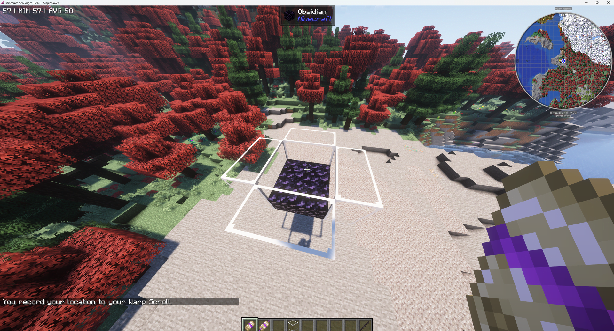

    After that, build the platform where the mobs will spawn. The portal size should accommodate the spawner's spawn range.
    In this example, we are using an 8x8 area for a 7-block spawn range. The first layer should be any solid block (where mobs will spawn).
    Then make a border using `Sourcestone`, `Mirrorweave`, or `Ghostweave` blocks (the last two can mimic the appearance of other blocks).
    On top of this border, you can place slabs, leaves with water (useful for Endermen to prevent teleporting), or simply build solid walls.
    The spawner should be elevated in the middle of the platform based on its spawn range (to prevent mobs spawning below the portal).
    Place solid blocks above the spawner as well to prevent mobs from getting stuck there.

    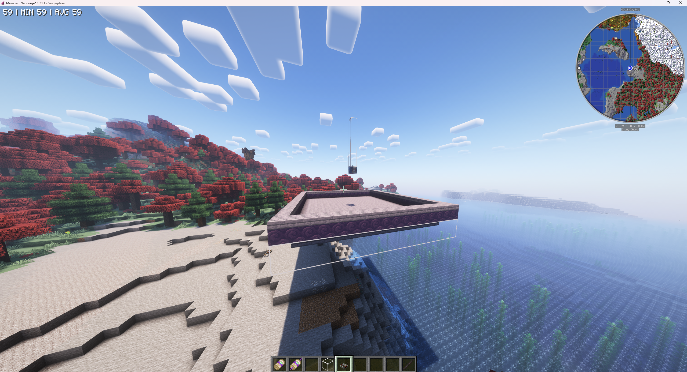

    To activate the portal, ensure a `Source Jar` is nearby and throw the configured scroll (linked to the killing area) into the portal frame.

    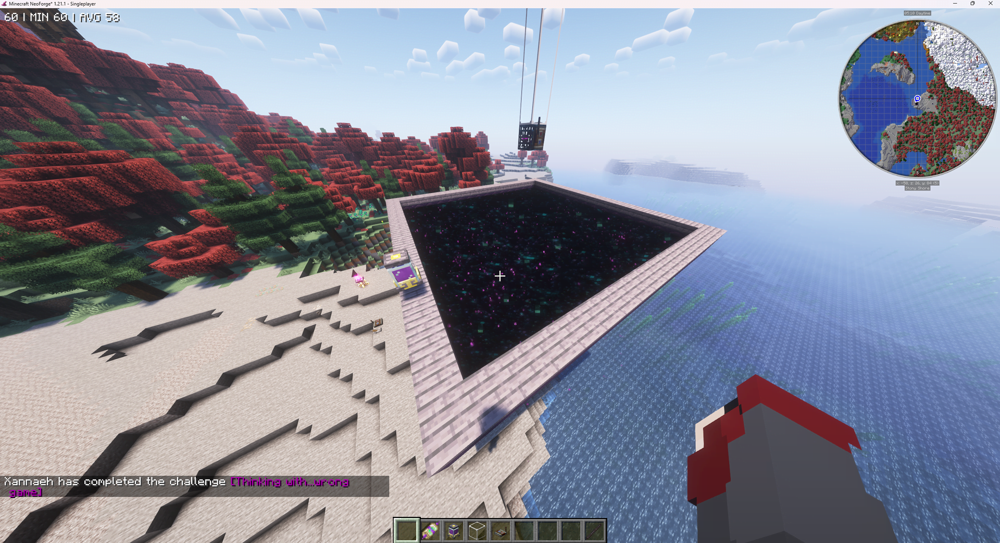

    With this setup, mobs will spawn in one location/dimension (allowing you to benefit from dimension-exclusive drops) and be teleported to your preferred killing area
    on any dimension (if a `Stabilized Warp Scroll` is used).

=== "Ars Nouveau Ritual of Attraction"

    First, you need to craft a `Tablet of Attraction` and a `Ritual Brazier`. Place the Brazier in a central location near the spawner.
    It's recommended to place it somewhat elevated so mobs gather below it. Activating the ritual (using the Tablet on the Brazier and then ++rbutton++) requires a continuous supply of Source.

    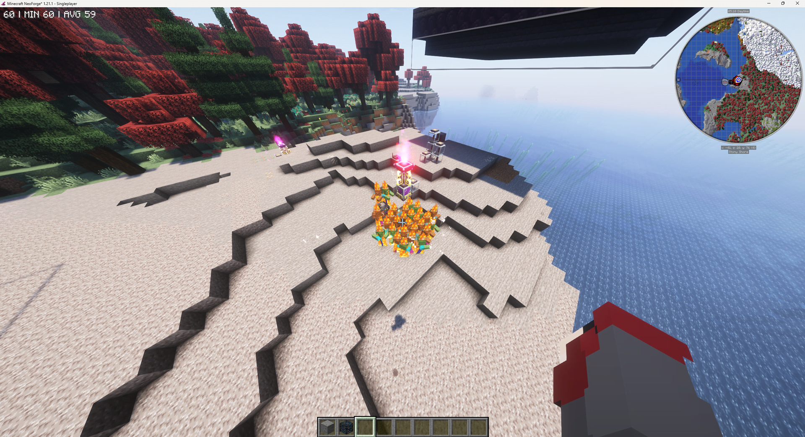

=== "Ars Nouveau Decoy"

    First, you need to create the spell `Touch -> Decoy` (or similar) to summon a decoy.

    

    Once you have done that, set up a `Tablet of Containment` on a `Ritual Brazier` powered by Source and trap the decoy in a `Containment Jar`.

    Finally, place the jar containing the decoy where you want to attract the mobs (works with or without AI) and power it with redstone.
    *(Note that this method is generally more efficient than the Ritual of Attraction because you are not continuously spending Source after setup)*

    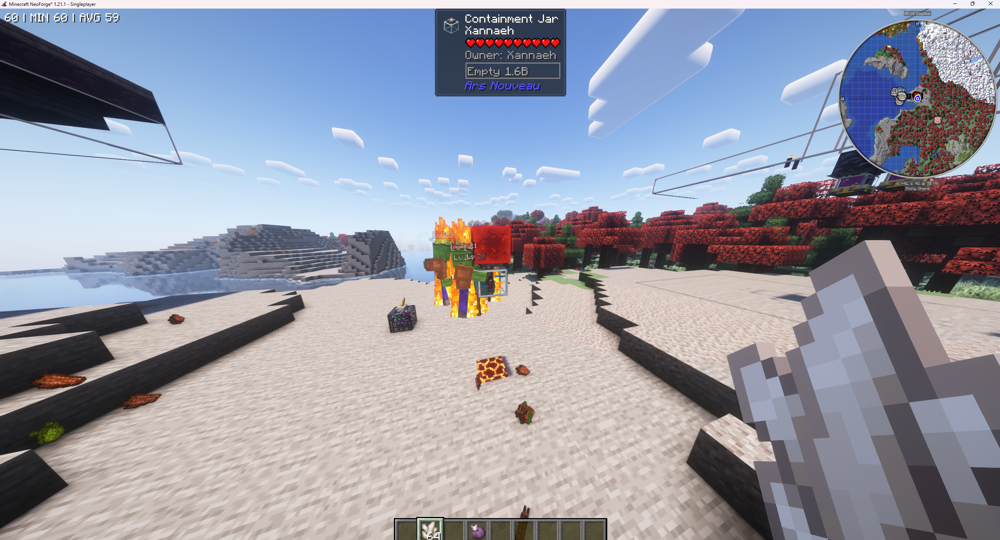

    *(Note: Ritual of Attraction will attract both **mobs** and **items**, while the Decoy only attracts **mobs**.
    The Ritual tends to keep mobs on the ground below it, while the Decoy can pull mobs towards it even if it's floating, so design your kill chamber accordingly.)*

=== "Primal Magick"

    First, you will need `Zephyr Engines` and `Void Turbines`, as well as a redstone power source.
    You can then design an arrangement similar to the image below to push/pull mobs towards a desired corner (a `Magma Block` in this example).
    Be aware that the spawner must be centered within the setup with an appropriate spawn range to ensure mobs spawn correctly.
    Zephyrs repel mobs, and Void Turbines attract them.

    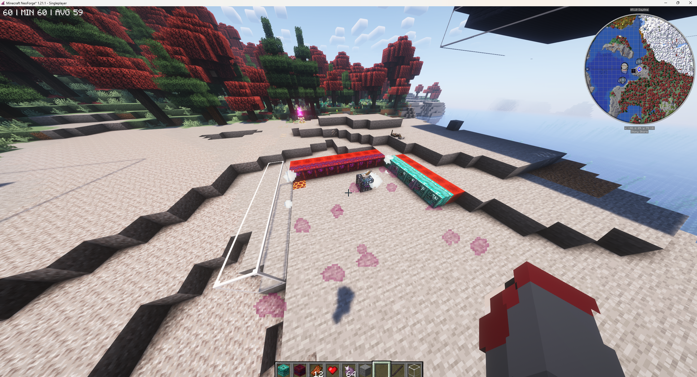

    *(Note: You cannot place one Zephyr directly facing another, as they will nullify each other's effect. The same applies to Void Turbines.)*

=== "Create"

    Create Fans can be used in a similar design to the Primal Magick setup, using `Encased Fans` to push or pull mobs towards a desired area based on their rotation direction.
    Ensure the spawner is centered with an appropriate spawn range for the mobs to spawn within the fan's influence.

    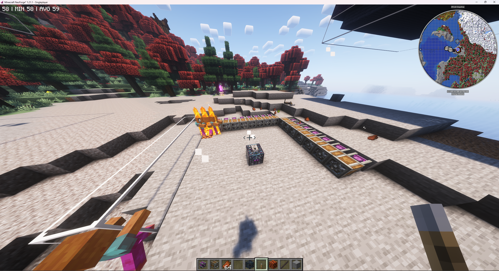

    *(Note: This method is less convenient than the Primal Magick one because it requires rotational force.)*

=== "Data and Essence"

    First, you need to have an essence generation going on (More details in the DnE Guide).
    Craft a few `Laser Emitters` and `Acceleration Lens` and place the lens on the laser, also connect the lasers to the essence network.
    The design is similar to the Primal Magick and Create ones. Ensure the spawner is centered with an appropriate spawn range for the mobs to spawn within the laser's influence.
    Lasers with this lens will push mobs away from them at a high speed.

    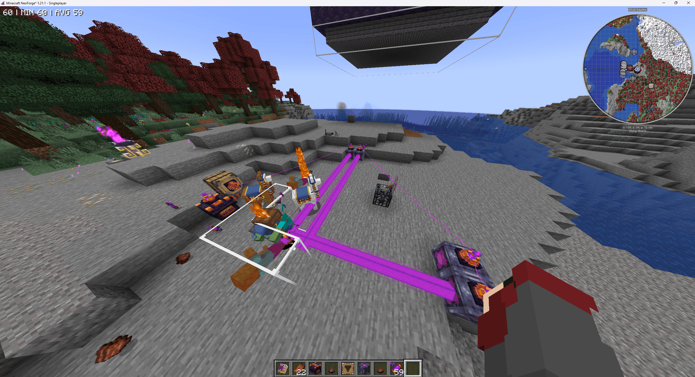

    *(Note: This method is less convenient than Primal Magick because it consumes essence.)*

=== "Reactive"

    *(Work In Progress - come back later)*

=== "Modular Golems"

    *(Work In Progress - come back later)*

---

## Automated Killing Methods

Once you have the mobs in place, you need ways to kill them automatically:

*   **Ars Nouveau Runes/Turrets:** Create automated spell systems using `Spell Turrets` or triggered `Runes` (e.g., `Damage`, `AoE`, `Explosion`) powered by Source.
*   **Modular Golems:** Design and build custom golems equipped with combat weapons to kill mobs in a designated area. Works particularly well with spawners set to ignore AI (`No AI` upgrade).
*   **Reliquary Pedestals:** Use a pedestal equipped with a weapon (like a sword) to attack mobs in range.
*   **Mahou Tsukai:** Utilize the `Boundary of Drain Life` scroll for AoE slow damage and Mahou accumulation (up to the cap).
*   **Data & Essence (DnE):** Utilize the `Essence Leech` block/mechanic to slowly kill mobs and generate DnE Essence.
*   **Data & Essence (DnE):** Utilize a `Laser Emitter` with a specific lens depending on your needs:
    *   `Harming Lens`: General damage.
    *   `Burning Lens`: Sets mobs on fire.
    *   *(Note: `Healing Lens` from DnE only heals; it doesn't harm undead like vanilla splash healing potions.)*
*   **Evilcraft:** Place `Spikes` on the floor to kill mobs and collect blood.

*Note: Multiple killing methods can often be combined for faster kills or to gain different types of resources simultaneously (e.g., Mahou, DnE Essence).*

### Setup Examples (Killing Methods)

=== "Combination of Methods (Recommended)"

    For learning how to set up this, you should check the individual methods.

    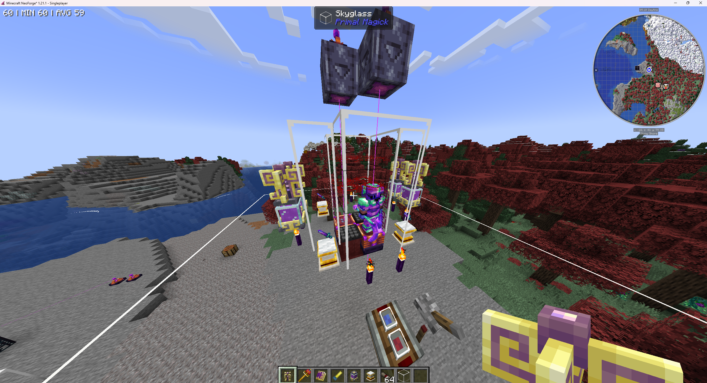

    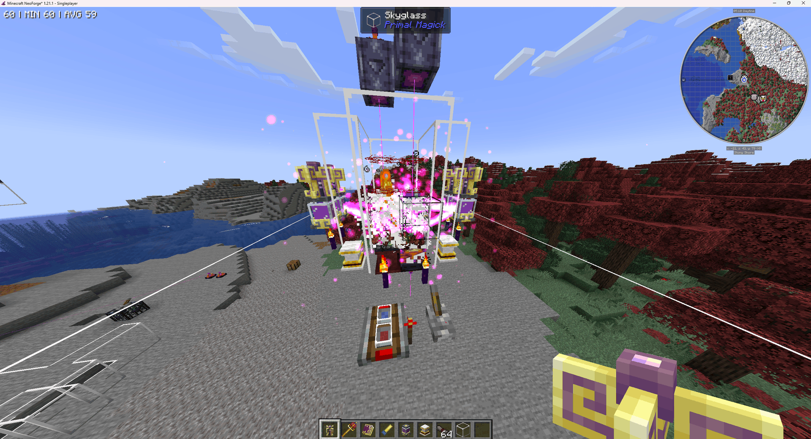

=== "Ars Nouveau Runes"

    For setting up the runes, place them in the killing destination area with a Source Jar nearby.
    I recommend using a spell like `Touch -> Rune -> Sensitive -> Spark -> Discharge` (or similar AoE damage spells), but feel free to explore other combinations.
    *(Note: Sensitive makes the rune act as a player)*

    

    To make a rune permanent, use `Runic Chalk` and ++rbutton++ on the placed rune. *(Note: For more information on runes, refer to the Ars Nouveau guide or in-game documentation.)*

    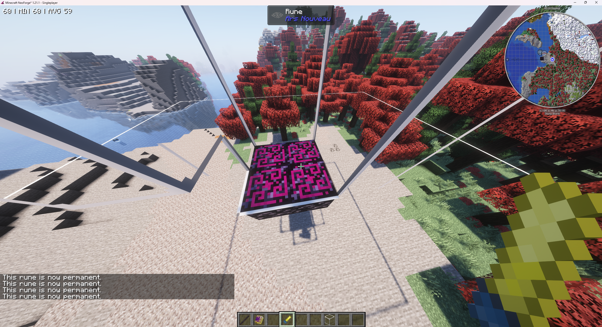

    Be aware that mobs killed using runes count *as if the player killed them*. This means:

    -   They can increase your L2 difficulty.
    -   They apply effects from Curios you have equipped.
    -   Your player stats (like critical hit chance/damage from held items) may apply to the rune damage.
    -   They will drop items that require a player kill, like `Grave Dust` from **Corail Tombstone**.

    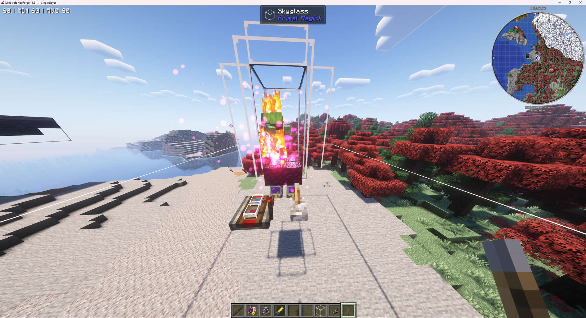

    To increase rune damage, consider equipping Ars Nouveau related gear with appropriate threads, using potions, and other methods explained in the Ars Nouveau guide.
    It's also beneficial to hold a weapon with high crit chance/damage and looting enchantments while AFKing, as these stats can apply to rune kills.
    This concept is better explained in the "[Dealing Super High Amounts of Damage](tips.md)" section of the Tips page.

=== "Ars Nouveau Turrets"

    *(Work In Progress - come back later)*

=== "Modular Golems"

    For this setup, you are going to need a `Humanoid Golem`.
    *(Note: This guide will not explain how golems work; refer to the in-game book for more information or come back later when the **Modular Golems** guide is added)*.
    The golem needs to benefit from `Immunity` from an `Eternium Humanoid Body` or `Eternium Humanoid Legs`.
    It's recommended to install the maximum amount of upgrades possible on the golem for maximizing damage.
    The golem needs to have a weapon equipped (preferably with max enchantments and max **Apotheosis** affixes and gems) that has sweeping damage.
    My personal recommendation is the `Unobtainium Scythe` (or any other scythe).
    You can also equip `Curios` items to enhance the golem's damage even further.

    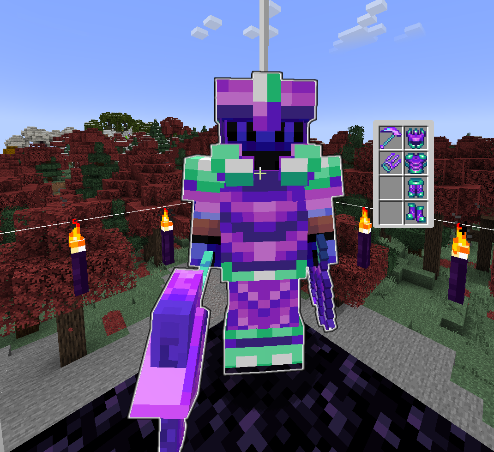

    Place the golem inside the killing area and command it to wander around. *(Note: The area must be enclosed so the golem doesn't run away)*

    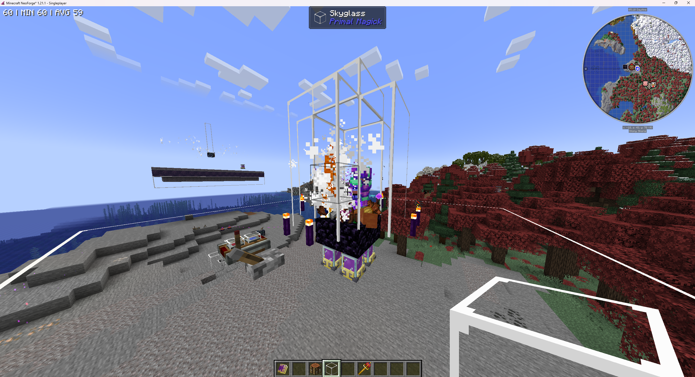

    Be aware that mobs killed using golems count *as if the player killed them*. This means:

    -   They can increase your L2 difficulty.
    -   They apply effects from Curios you have equipped.
    -   Your player stats (like critical hit chance/damage from held items) may apply to the golem damage.
    -   They will drop items that require a player kill, like `Grave Dust` from **Corail Tombstone**.

=== "Reliquary Pedestals"

    This method is simple: you need a `Pedestal` (not the display version), power it with redstone, then place any weapon in the altar and enjoy a slow killing process.
    Sweeping edge weapons work better. Remember to maximize enchantments, Apotheosis affixes, and gems on the weapon to maximize damage. Right now L2 weapons are not compatible with this functionality.

    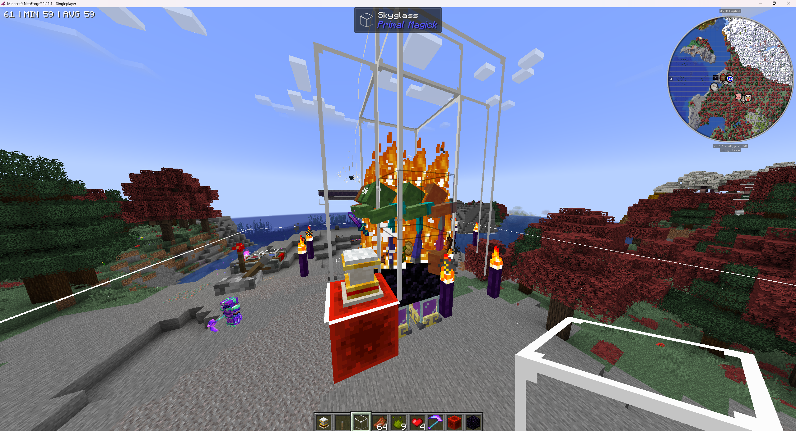

    Be aware that mobs killed using pedestals **DO NOT** count *as if the player killed them*. This means:

    -   They **CANNOT** increase your L2 difficulty.
    -   They **CANNOT** apply effects from Curios you have equipped.
    -   Your player stats (like critical hit chance/damage from held items) **CANNOT** be applied to the pedestal damage.
    -   They will **NOT** drop items that require a player kill, like `Grave Dust` from **Corail Tombstone**.

=== "Mahou Tsukai"

    You can place `Scrolls of the Boundary of Drain Life` to slowly kill the mobs. *(Note: This guide will not explain how Mahou Tsukai works; for more information refer to the in-game guide / quest book)*.

    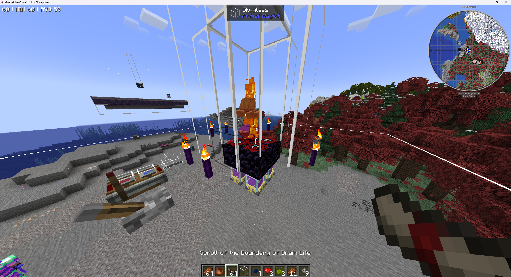

    Be aware that mobs killed using this boundary **DO** count *as if the player killed them*. This means:

    -   They can increase your L2 difficulty.
    -   They apply effects from Curios you have equipped.
    -   Your player stats (like critical hit chance/damage from held items) may apply to the boundary damage.
    -   They will drop items that require a player kill, like `Grave Dust` from **Corail Tombstone**.

=== "Data and Essence"

    You can place `Essence Leech` blocks as the floor of the mob farm to slowly exchange the mobs' health for essence. Leeches work in a 3x3x3 area above themselves.

    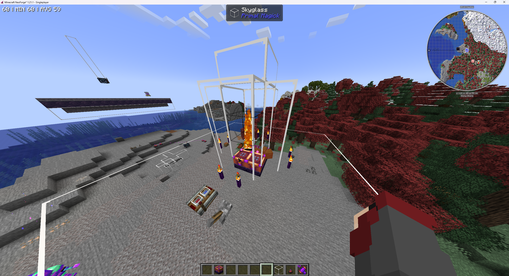

    With that generated essence, you can feed `Laser Emitters` to kill mobs even faster. For that, apply the `Harming Lens` to the `Laser Emitter`.

    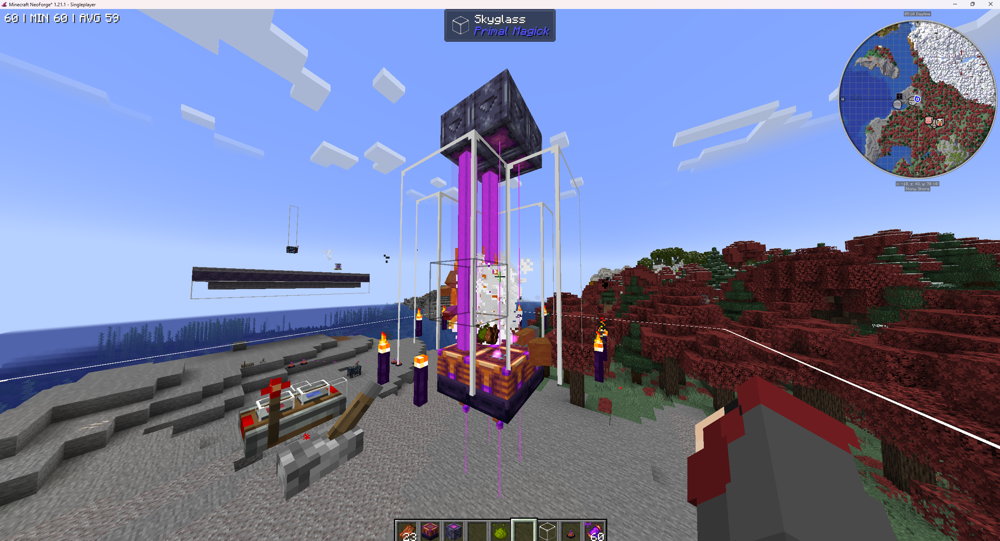

    Be aware that mobs killed using DnE lasers or leeches **DO NOT** count *as if the player killed them*. This means:

    -   They **CANNOT** increase your L2 difficulty.
    -   They **CANNOT** apply effects from Curios you have equipped.
    -   Your player stats (like critical hit chance/damage from held items) **CANNOT** be applied to the laser/leech damage.
    -   They will **NOT** drop items that require a player kill, like `Grave Dust` from **Corail Tombstone**.

=== "Evilcraft Spikes"

    Place a `Powered Sanguinary Pedestal` with some `Spiked Plates` on top of them on the floor and start collecting the blood as mobs die on them.

    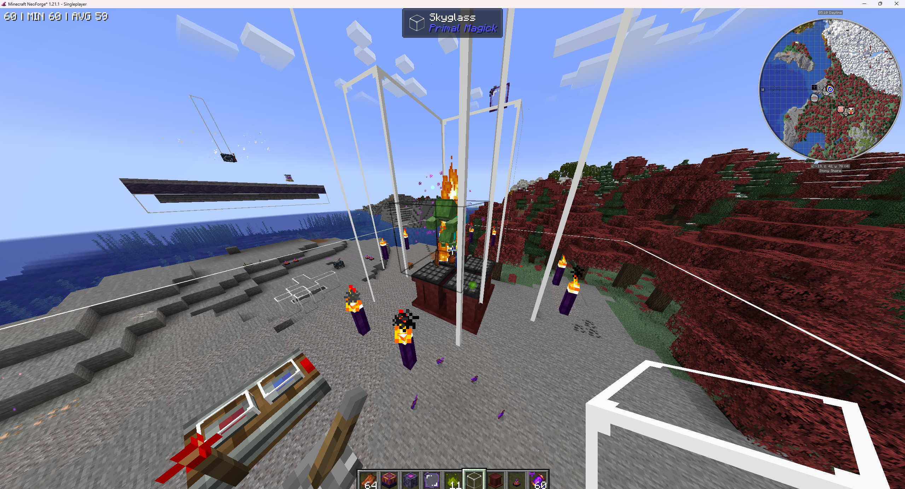

    Be aware that mobs killed using `Spikes` **DO NOT** count *as if the player killed them*. This means:

    -   They **CANNOT** increase your L2 difficulty.
    -   They **CANNOT** apply effects from Curios you have equipped.
    -   Your player stats (like critical hit chance/damage from held items) **CANNOT** be applied to the spike damage.
    -   They will **NOT** drop items that require a player kill, like `Grave Dust` from **Corail Tombstone**.

---

## Loot Considerations & Extra Resources

Farming in ATMA involves more than just vanilla drops. Consider these potential outputs:

*   **L2 Hostility Drops:**
    *   Mobs affected by the L2 Hostility system (based on player difficulty) can drop unique items like `Cursed Droplets` and `Trait Symbols`, crucial for L2 progression.
    *   Ensure the appropriate **Looting Charms** are equipped, as explained in the [L2 Hostility Guide > Expected Progression](l2hostility.md#expected-l2-progression-path).
    *   Farm design might need to account for player proximity to maintain difficulty or target specific traits.
    *   Only killing methods that count as player kills will trigger these drops reliably.
*   **Apotheosis Drops:**
    *   Mobs spawning from Apotheosis spawners or naturally can drop equipment with powerful Apotheosis affixes and `Affix Gems`.
    *   Higher-level mobs (influenced by Apotheosis world tier) have better chances of dropping rarer loot.
    *   *(Press ++ctrl+t++ (default keybind) to see the current world tier)*.
*   **Evilcraft Blood:** Killing mobs near appropriate Evilcraft blocks/setups (like Spikes) can generate Blood for the mod's mechanics. *(More on blood generation in the **Evilcraft** guide)*.
*   **Ars Nouveau Source:** Using a `Vitalic Sourcelink` near a killing area can generate Source from mob deaths.
*   **Data and Essence Essence:** Using an `Essence Leech` in the killing area will slowly drain Essence from the mobs.
*   **Mahou Tsukai Mahou:** Can be generated using the `Boundary of Drain Life` killing method.
*   **Experience (XP):** Mobs drop XP orbs.
*   **Reliquary Charm Fragments:** Can occasionally drop from mobs.
*   **Occultism Mobs:** Can also be farmed in spawners and with Drygmys. Be aware that rituals like **Occultism's** `Wild Breeze` (the 3 levels of it) spawn multiple mob types, not just the Breeze, and the `No AI` upgrade from Apotheosis may not apply to all spawned entities. Drygmy farms are potentially simpler for `Wild Breeze` farming.

*(This guide will be expanded with more specific details and build examples for each method.)*

---

## Collection and Filtering Methods

Efficiently handling the large volume of drops from mob farms is crucial. Here are some tools and techniques:

*   **Ground Item Collection:**
    *   **Sophisticated Storage:** Backpacks or chests/barrels with `Magnet Upgrade` (pulls items in range) and optionally `Advanced Magnet Upgrade` (wider range, requires power). Can be combined with `Stack Upgrade` for more capacity per slot. Use `Tank Upgrade` + `Experience Pump Upgrade` to store XP.
    *   **Create:** `Conveyor Belts` to move items, `Chutes` for vertical transport, `Encased Fans` can blow items towards collection points.
    *   **Occultism:** `Foliot Item Collector` spirit job can pick up items in an area. Requires summoning and assigning the spirit.
    *   **Vanilla:** Hoppers and Hopper Minecarts (less efficient for large volumes but simple).
    *   **Ars Nouveau:** `Starbuncles` can move items to designated chests or inventories. *(See Ars Nouveau guide for details on configuration).*
    *   **Ars Nouveau:** `Spell Turrets` or `Runes` using spells with the `Pickup` effect (AoE pickup) with a container placed next to the turret.
    *   **Productive Bees:** `Hoarder Bee` placed in a `Beehive` with range upgrades can collect nearby items. *(Note: Not recommended, as bees can die from collateral damage in many killing setups).*
    *   **Ars Nouveau:** Activate a `Ritual of Attraction` in a `Ritual Brazier` and feed it with Source. This will attract mobs and items within an 8-block radius.
    *   **Ars Nouveau:** A `Containment Jar` with an `Allay` inside will work as a vacuum hopper and deposit the items in an adjacent inventory. They work every 40 ticks. ~~They work instant.~~
    *   **Data and Essence:** A `Vacuum` with a container on top. Can attracts items 10 blocks in all directions and collects them in a 3x3x3 area placing them on the container on top.
* **Item Transport:**
    *   **Data and Essence:** Use `Item Nodes` for transport. *(See DnE guide for configuration).*
    *   **Theurgy:** `Mercurial Item Inserter` and `Mercurial Item Extractor` can move items when connected with `Mercurial Copper Wire`.
    *   **Ars Nouveau:** `Starbuncles` can transport items between inventories based on configuration. *(See Ars Nouveau guide).*
    *   **Ars Nouveau:** `Spell Turrets` using spells with `Toss` (requires precise aiming), `Pierce` might also be applied to split the loot in different containers.
    *   **Create:** `Conveyor Belts`, `Chutes`, `Mechanical Arms` (for precise sorting/movement), `Item Vaults` for bulk storage/transport on contraptions.
    *   **`Ender Chests`**: Useful for long-distance transport or buffering items before processing/storage.
*   **Filtering & Sorting:**
    *   **Sophisticated Storage:** `Filter Upgrade` (basic filtering), `Advanced Filter Upgrade` (more complex logic), `Void Upgrade` (destroys excess items). Apply directly to storage or backpacks.
    *   **Create:** `Andesite Funnel` / `Brass Funnel` with filter items set in the UI. `Attribute Filter` for specific NBT/tag filtering. `List Filter` for multiple item types.
    *   **Theurgy:** `Mercurial List Filter` and `Mercurial Attribute Filter` work like Create filters but can be applied in Theurgy inserters/extractors.
    *   **Ars Nouveau:** `Starbuncles` can be configured with filters to only pick up or deposit specific items. *(See Ars Nouveau guide).*
*   **Storage Solutions:**
    *   **Sophisticated Storage:** Upgradable Chests, Barrels, and Backpacks. High capacity and utility with upgrades.
    *   **AE2:** Mass digital storage using `Storage Cells` in `ME Drives`. Access everything via terminals (`Crafting Terminal` or `Wireless Crafting Terminal`).

### Specific Mob Farms and Filtering Methods

=== "Apotheosis Affix Item Filtering"

    In this section of the guide, we will explain how to filter Apotheosis affixed items.

    *(Note: This is just one example; there are multiple ways to achieve this.)*

    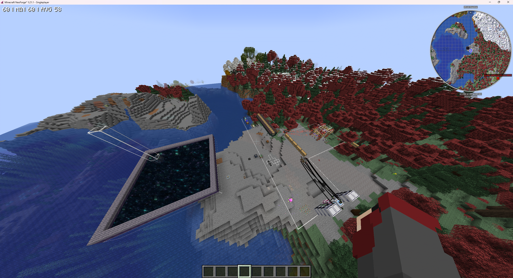

    First, set up the mob farm the way you want. In this case, we will be using **Ars Nouveau** portals and **Runes** for mob transportation and killing.
    For item collection, we are using a **Sophisticated Storage** `Netherite Double Chest` with a `Magnet Upgrade`, and a few `Void Upgrades` to filter out things we do not want to store on our main system.

    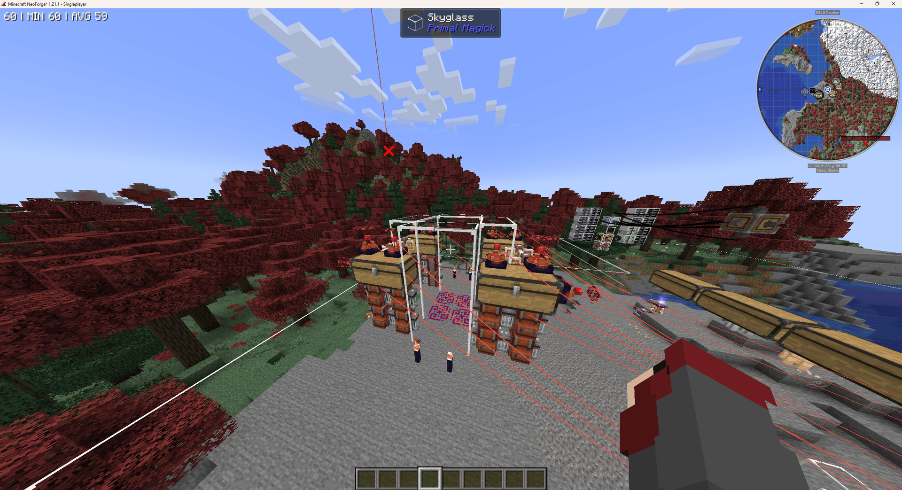

    We also placed a few **Sophisticated Storage** `Netherite Backpacks` with `Advanced Magnet Upgrade` (filtered to not pick up items), `Stack Upgrade` for more capacity per slot, `Tank Upgrade` + `Experience Pump Upgrade` to store XP.

    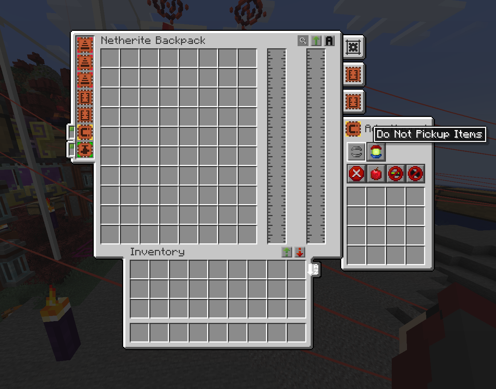

    *(Note: Ensure to disable the pickup items option in the `Magnet Upgrade` settings in the backpacks.)*

    As you can see, we are also using **Data and Essence** `Item Nodes` with `Universal Sigil Upgrade: Speed` to move the items from the mob farm to another place.
    You can use any preferred way of moving items.

    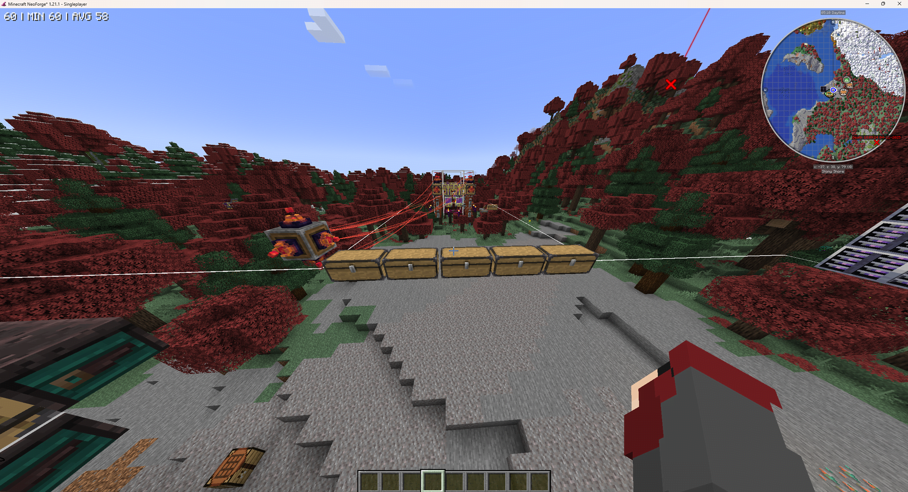

    *(Note: All items from Sophisticated Storage can be linked together using a `Storage Tool`.)*

    Then, we are using an intermediate storage system (**Sophisticated Storage** chests in this example) to store items from the mob farm before separating the items that will go to our main network versus those to be destroyed or salvaged.
    A `Storage Controller` is required here for connecting all the chests and enabling full functionality.

    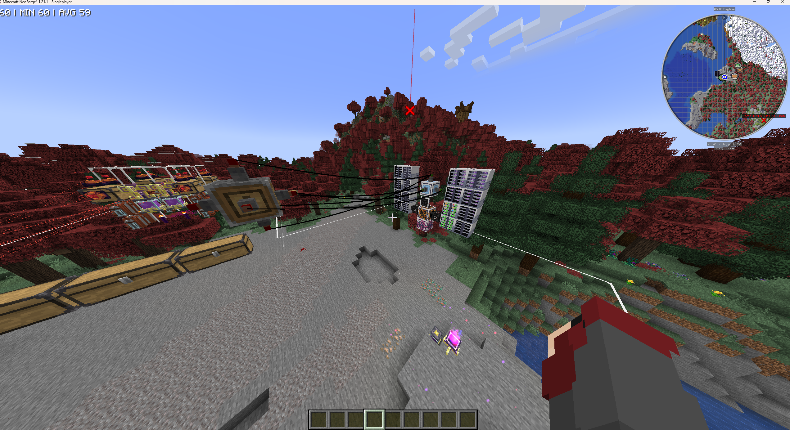

    For selecting the Items that we want to move to the main network (**AE2** in our case), you need to do some filtering.
    We are using a **Theurgy** `Item Extractor` to pull items from a `Storage Output` (linked to the intermediate chests via the controller) and inserting them with an `Item Inserter` into an **AE2** `ME Interface`.

    *(Note: For speeding up the item transportation, you can add more extractors/inserters and more ME Interfaces.)*

    We are also using a **Theurgy** `Mercurial Attribute Filter` to select items with the tags `#c:tools` and `#c:armors`, and we set the filter to `Deny-List` to **prevent** these items from going directly to our main AE2 network.
    Applying the filter in the extractor should be enough; if not, you can add it to the inserter as well.

    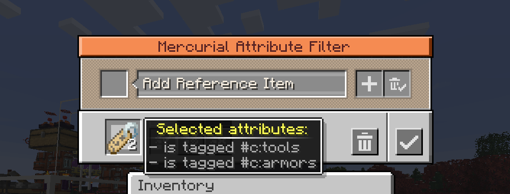

    Now, our intermediate storage should only contain tools and armors.
    We will use the same filter type (`Mercurial Attribute Filter` with `#c:tools` and `#c:armors`) but set to `Allow-List (Any)` to **extract only** these items.
    Use extractors and inserters to move these items into the first barrel of the salvaging line.

    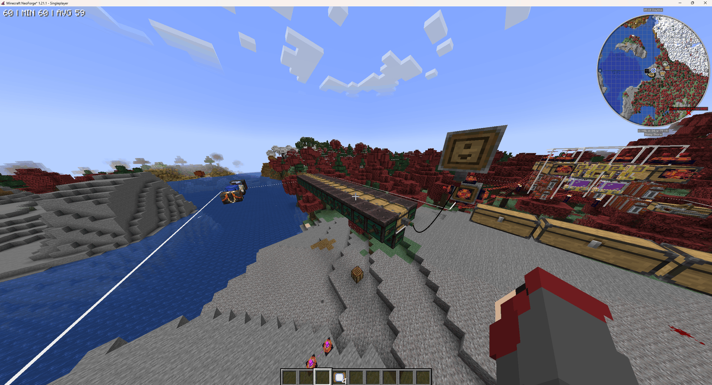

    The solution that has worked best for me to filter and salvage **Apotheosis gear** is shown in the image.
    A **Sophisticated Storage** `Netherite Barrel` is surrounded by **Apotheosis** `Salvaging Tables`.
    All the barrels in the line have the same configuration:
    Use an `Advanced Hopper Upgrade` configured to `Pull/Push` to the necessary sides (this depends on your build orientation - the image is just an example).
    This setup makes items with `Affixes` go into the `Salvaging Tables`, and the resulting salvage materials return to the chest.
    Then, set the upgrade to `Push` towards the next barrel in the line to send the salvage results, as well as any tools/armor that couldn't fit into the first set of salvaging tables (this depends on your mob farm speed and salvaging speed).

    *(Note: This salvaging line can be scaled in any direction as much as needed.)*

    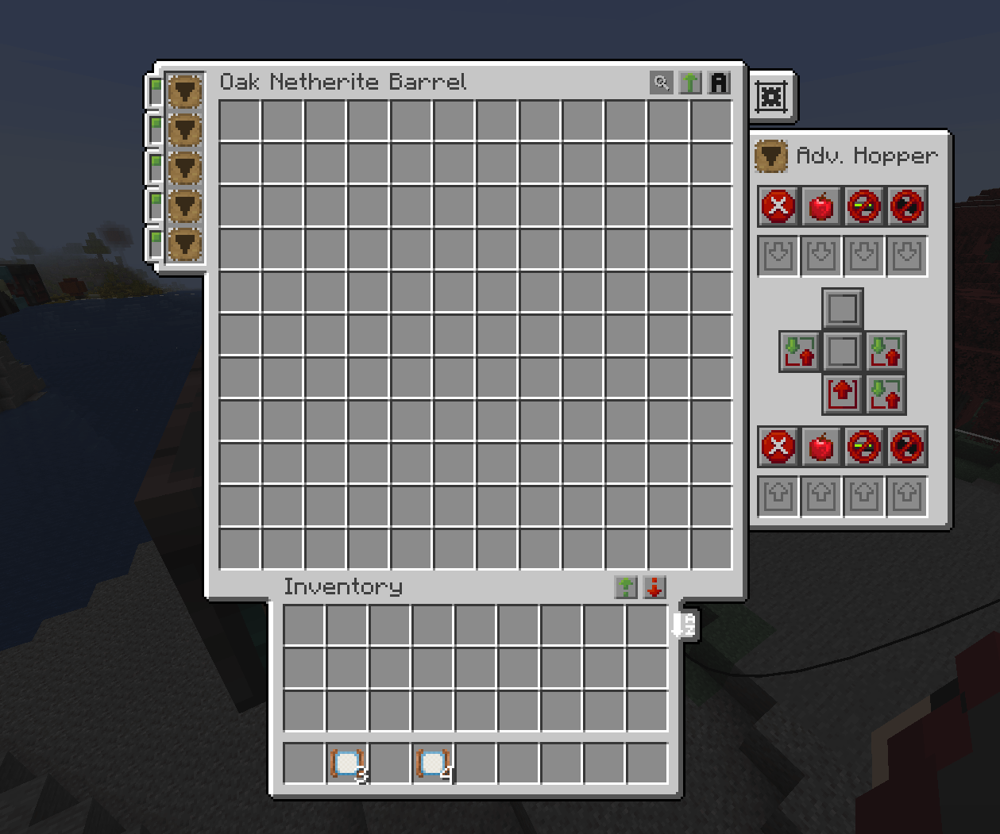

    The last barrel in the line does not have `Salvaging Tables` attached because it's our final output barrel for the salvaged materials.
    In this case, we can put an `Advanced Void Upgrade` in `Block Mode` with the specific Apotheosis materials you want to store (e.g., Gem Dust, Salvaged Materials).
    This barrel can then be linked back to your main storage system if desired, as it will only contain the filtered salvage materials.

    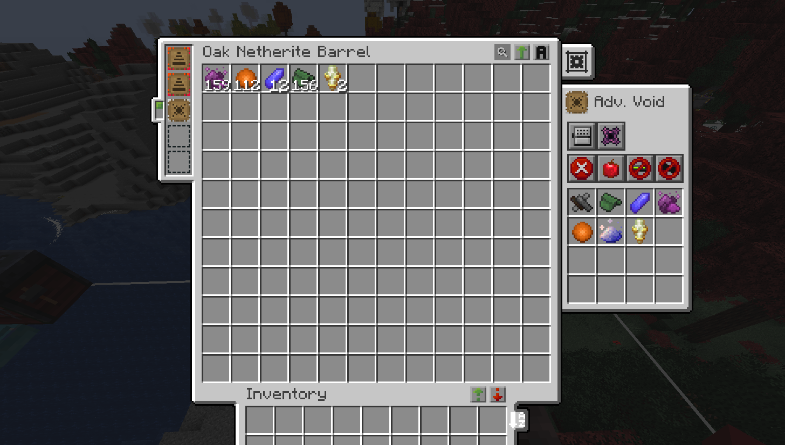

    *(Note: In this example, we are farming Zombies with No AI from an Apotheosis maximized spawner. Ideally, hold a max upgraded weapon with `Looting`, `Scavenger`, and `Loot Piñata` enchantments while AFKing to maximize drops.)*

=== "L2 Trait Symbol Filtering"

    *(Work In Progress - come back later)*

---

## Other Tips and Tricks!

*   For avoiding the spawn of `Vengeance Spirits` from **Evilcraft**, place `Gemstone Torches` from **Evilcraft** around the killing area.
*   If you are not trying to farm **L2** `Trait Symbols` or other difficulty-scaled drops, it's recommended to clear the chunk difficulty where the spawner is located using a `Hostility Orb` to potentially reduce lag or unwanted mob strength increases.
