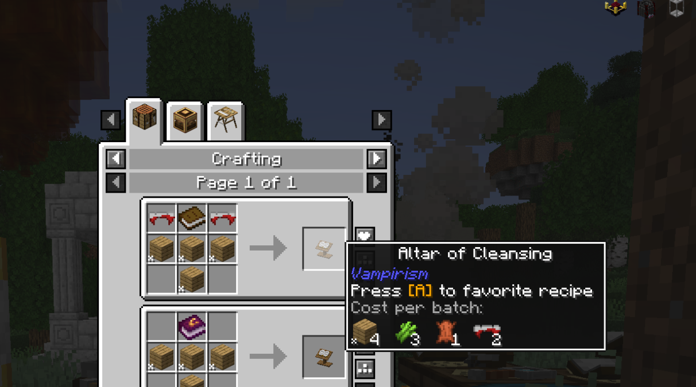
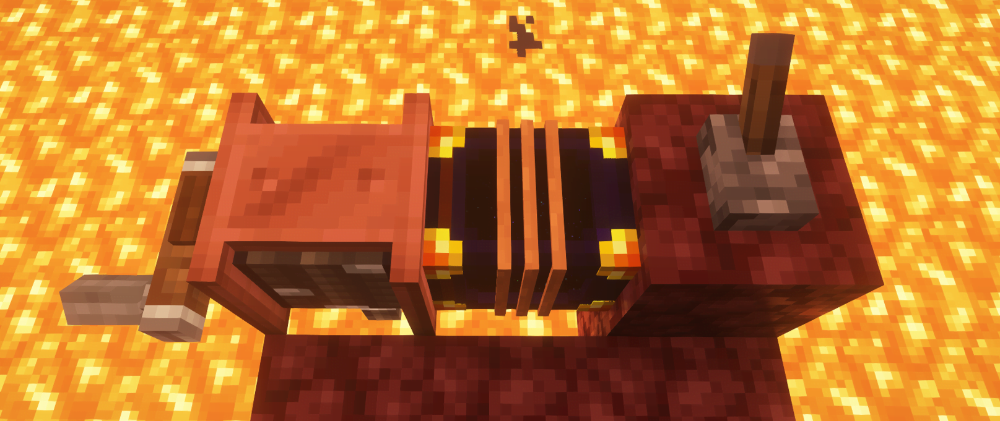
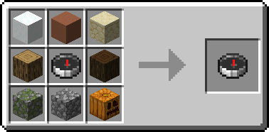
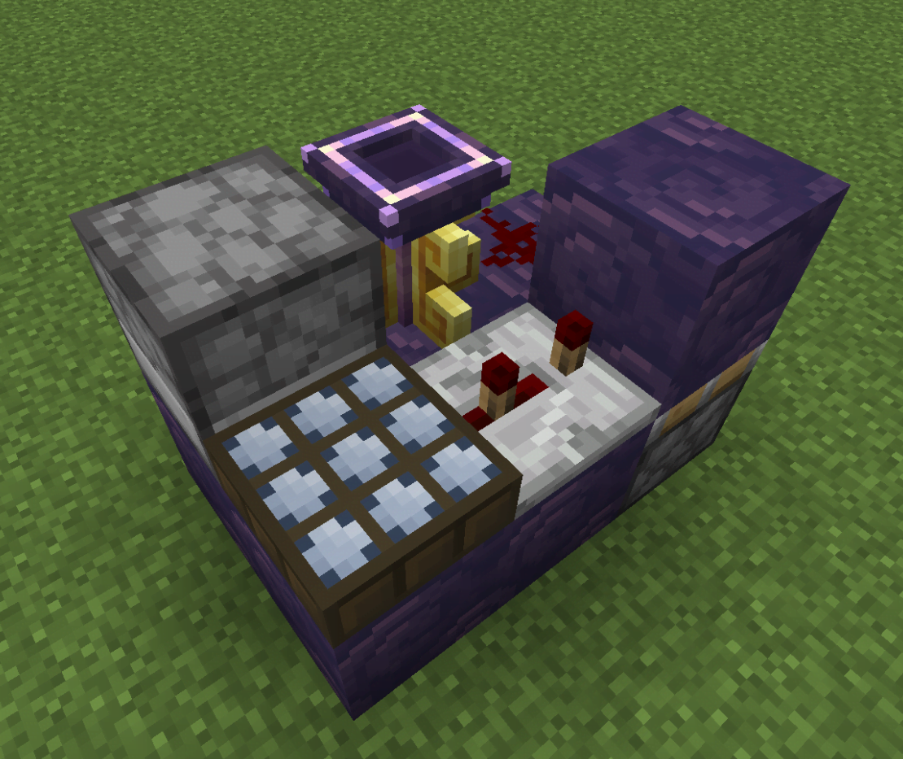

---
title: "ATM: Arcana Tips"
description: "ATM: Arcana Useful Tips"
authors:
---

# ATM: Arcana Tips

These are a bunch of useful tips from the community and the team. You can find the fully up-to-date list in the **ATMA - FAQs & Tips** Thread within the **#arcana-general** channel If you have any tips, please share them in the [ATM Discord](https://discord.com/invite/allthemods) and we will add them here.

???+ Abstract "Gameplay"

    ??? Question "How to get rid of **Vampirism**?"
        Seek out your local **vampire hunter village** to be cleansed. There is also a **cleansing alter** you can use, please **remove all gear** from yourself before using or all your armor **will break**

        

    ??? Question "How to leave the **Werewolf** faction?"
        You have to get a **Strange Injection** by `right-clicking` on a werewolf with an **Empty Syringe** and then inject it to yourself at an injection table.
        The strange effect you receive cleanses you from being a werewolf after 100 seconds.

    ??? Question "Want to store your XP?"
        XP Tome or Sophisticated Backpack tank

    ??? Question "How to tame your **Dragon**?"
        **For Dragon Mounts Remastered**

        - Feed your dragon **Raw Vanilla Fish** to tame it and to make it grow faster.

        **For Ice and Fire**

        - Feed your dragon **Dragon Meal** to make it grow faster

    ??? Question "How to get **Infinite Lava**?"
        Items needed:

        - Hand Crank (or some other form of getting rotational power)
        - Hose Pulley
        - Ender Tank
        - Lever

        You can also upgrade the Ender Tank with **Pistons** and **Ender Pearls** (Pistons for the Pump so it pumps 4B/second and Ender Pearl for more internal storage, up to 256B)

        

    ??? Question "How to find a **Specific Structure**?"
        Use the Structure Compass

        

    ??? Question "How do I get more **Curio Slots**?"

        - Oddeyes Glasses [L2 Hostility]
        - Triple Stripe Cape [L2 Hostility]
        - Infinity Glove [L2 Hostility]
        - Leather Belt [Relics]

        [More Information Here](curios.md/#getting-more-curios-slots)

    ??? Question "How do I keep it **Permanently Day**?"
        

    ??? Question "How do I repair my items easily?"
        Use the **Blood Chest** from Evil Craft

    ??? Question "How do I remove **Curses** from my Items?"
        Use the **Prismatic Cobwebs**

    ??? Information "Dealing super high amounts of damage"
        - Get any weapon
        - Roll ancient apotheosis to get 5 stockets
        - Get max crit stats
        - Get enchantments (books)
        - Merge 2 max lvl enchanted books in occultism anvil
        - Apply individual enchantment to weapon in occultism anvil
        - Repeat until u have all the enchantments
        - Use the weapon in the main hand and any magic wand / spellbook in the off hand

        - If using Ars armor get unobtanium one and put threads in it to amplify dmg
        - Max your artifacts (Shadow glaive strongly recommended)
        - Equip mod related curios items

    ??? Information "EnderChests and EnderTanks"
        They allow transfer through **Dimensions** or an **infinite distance**.

        For both:
        - You can set the **Frequency** to which an inventory is linked by **Color-Codeding** them with Dyes.
        - Set them to **Private** by using **Diamonds**
        - Set them to **Teams** by using **Emeralds** (Teams are a bit more complex and it's better to check the Mod's page for help)

        All of the upgrades are applied with `Shift + Right-Click` on the Ender Tank/Chest with the item in your hand.

        For **Ender Chests**:

        - Ender Pearls: **3 more Slots** (For all linked Chests)
        - Eyes of Ender: **9 more Slots** (For all linked Chests)

        For **Ender Tanks**:

        - Ender Pearls: **8 more Buckets** (For all linked Tanks)
        - Eyes of Ender: **16 more Buckets** (For all linked Tanks)
        - Pistons: **More Buckets/Second** up to 4 Buckets/Second (Only for the placed Tank)
            - To activate the Pump-feature use a redstone signal
            - Place the Tank on the block **opposite** of the one you want to pull from for it to work.

        Ender Pouches and Ender Buckets can be linked by Right-Clicking them.

???+ Abstract "Technical"

    ??? Question "Strange **Noise** in the **Desert**?"
        That's the wind of **Pharaoh's Legacy**. Turn down your ambient sounds.

    ??? Question "Don't want to pick up **Blocks and Villagers**?"
        Set a key bind for the Carryon mod. This will allow you to pick up villagers easier

    ??? Question "How to disable the **FPS Counter**?"
        Open your **Escape Menu**, open the create config by clicking on the **Goggle Icon**, then "Access Configs from other mdos"
        and under `Sodium Extras > Client > General` you can disable the FPS Display

    ??? Information "To remove any of the features below, **Remove Immersive UI!**"
        - Trail of particles for a carried item (item in the cursor) with non-common rarity
        - Wiggle carried item when you move it quickly in your inventory
        - Item scaling under the cursor
        - Smooth hotbar selector animation
        - Floating for items in the container that match to the item in the cursor

    ??? Information "To remove **Screen-Shaking**"
        To remove the screen-shaking effect caused by certain sounds, disable the perceptions mod
