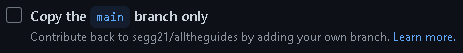
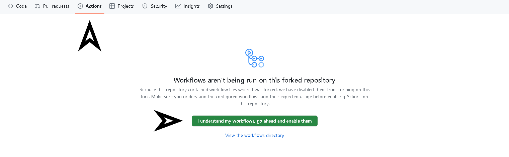

# All The Guides [](https://github.com/segg21/alltheguides/actions/workflows/ci.yml) [](https://github.com/segg21/alltheguides/actions/workflows/di.yml)

    

---

## Guidelines

??? Information "MUST READ"

    !!! Warning "As this guide is currently work-in-progress, guidelines are expected to change."

    1. You may **NOT** publicly republish **All The Guides** live on another website.
    2. You may **NOT** delete or entirely change another author work (except typos / incorrect information), unless given permission to do so from the original **Author**. 
    3. No warnings or errors that prevents `mkdocs serve | build`.
        1. If you get any errors or warnings, try/get help resolving them before pushing. 
        2. You may **NOT** disable `strict` mode(s) for any reason.
    4. Your document(s) **MUST** contain a `title` and `description` variable. If you created a page, you may add `authors:`, and additional variables if necessary. [Read Below](#document-headers)
    5. Limit or prevent the use of outside links to content (documents or imagery). If possible in the most minimal and or compressed way, include the content with your document.
        1. This would ensure that content will always remain with the guides, for preservation and offline use.
        2. Assets may be included with document(s) within folders in an organized way.
    6. No profanity, and assets and or links to outside websites that contains adult like content, paid material, and or in-appropriate things.
        1. You'll be **banned** from future **PR's**.
    7. You shall **NOT** touch `mkdocs.yml`, `requirements.txt`, or workflow files, _unless authorized, and you know what you're doing_.
    8. Documentation should ONLY be related to **All The Mods**, if it needs to be.
    9. Javascript is **NOT** allowed.
    10. Folders must be in `lowercase` letters, with no spaces.
---

**All The Guides** is using ~~[Github Pages](https://pages.github.com/)~~, [MkDocs](https://www.mkdocs.org/) & [Material](https://squidfunk.github.io/mkdocs-material/).

---

## Local Serve / Build 

We use **Github** for our Packs, Mods, and Guides for Collaboration, and CI/CD purposes.

You will be required to [Serve](#serve), and [Build](#build) this guide, which comes with some minimal [Requirements](#requirements). 

---

### Requirements

- [Python](https://www.python.org/downloads/) 3+
- Git ([Git Cli](https://cli.github.com/), or [Github Desktop](https://desktop.github.com/))
    - _Your editor may already have Git integrated_
    - For quick edits, you could open a codespace on your forked repo using [Github Web Editor](https://docs.github.com/en/codespaces/the-githubdev-web-based-editor).

> You're **not** required to have knowledge of them (_specifically **Python**_), but they must be installed..

---

## Setup

Fork [All The Guides](https://github.com/segg21/alltheguides).

!!! Note "Please Uncheck 'Copy the main branch only'"
    {style='display:block'}

### Clone / Checkout `dev` branch

The __`dev`__ branch is the live - up to date branch that should be used _primarily_. You will not be able to submit a **Pull Request** to `main`, or `dev` > `main`, vice versa. 

Depending on current setup, you may have an editor (_Visual Studio Code_), that has **Git** integration. You're free to use this, Github Desktop, or Git _which we'll be using_.

??? Information "Clone Branch"

    ``` title="Change `USERNAME` to your name"
    git clone -b dev https://github.com/USERNAME/alltheguides
    ```

    If you've already cloned without specifying a branch, make sure you've changed too `alltheguides` directory (`cd alltheguides`) before running this command.
    
    ```
    git checkout -b dev
    ```

### Enable Workflows

??? Warning "Please make sure Workflow is enabled, otherwise PR's will **NOT** be accepted."

    

---

### Python Dependencies

The Guide requires some Python dependencies that's used to build, and provide features to the Guide itself. 

``` title='To Install'
pip install -r ./requirements.txt
```

``` title="To Uninstall"
pip uninstall -r ./requirements.txt
```

---

## Serve

Serve will launch a server locally to test changes live @ [`localhost:8000`](http://localhost:8000). Importantly, it will provide warnings, errors, and mistakes (_spelling errors_). Once changes are satisfied without issues, test [Build](#build) before you commit / make a Pull Request.

!!! Information "2 methods in serving MkDocs locally"

    ```
    mkdocs serve
    ```

    ```
    python -m mkdocs serve
    ```

> `mkdocs serve --help`

---

## Build

Build will finalize compiling **Markdown** and output **HTML** files in the `site` folder. This folder should be _ignored_. The build should succeed without any warnings or errors before **Committing** and submitting a **Pull Request**.

!!! Information "2 methods in building MkDocs locally"

    ```
    mkdocs build
    ```

    ```
    python -m mkdocs build
    ```

> `mkdocs build --help`

---

## Commit (Updating)

Once you're _committed_ to your changes, you can then **Commit** your changes, then make a **Pull Request** against both `dev` branches / repositories.

### Committing Changes

Depending on current setup, you may have an editor (_Visual Studio Code_), that has **Git** integration. You're free to use this, Github Desktop, or Git _which we'll be using_.

??? Information "Making Github Commit"

    Add files to Commit.
    ```
    git commit .
    ```

    Add a message to your Commit. We recommend being more descriptive about your Commit(s).
    ```
    git commit -m "update"
    ```

    Push changes
    ```
    git push
    ```

---

## Pull Request

When submitting a [Pull Request](https://github.com/segg21/alltheguides/compare), you're requesting us to **Pull** changes from your Repository (Fork) to be approve & merged into the official Guide. This is done in browser by going to our repository and creating a [Pull Request](https://github.com/segg21/alltheguides/compare) from your `dev` branch to ours.

---

## Making a Document

!!! Warning "Before we begin, make sure you've read the [Guidelines](#guidelines)."

Documents must be Markdown (`.md`) files. They can also contain **HTML**. 

This Guide is a mix of [Markdown](https://github.com/adam-p/markdown-here/wiki/Markdown-Cheatsheet), [Material](https://squidfunk.github.io/mkdocs-material/reference/), and [PyMarkdown](https://python-markdown.github.io/) features. Simply placing a `.md` file within `docs/`, that file can then be viewed as a page. **Note**: `.md` files MUST contain content.

Markdown files should have headers at the start to identify document (_Meta / SEO Purposes_), and to credit author(s). Without, it's subjected to be generated based off page content, or be without at all.

---

### Document Headers

!!! Warning ""

    !!! Note ""

        Highlighted lines are required!!

```yaml title='example.md' hl_lines="2 3"
---
title: Title Of Your Document
description: How to make a Document
authors:
  - John Doe
  - Second Name
  - Florida Man
date: 2023-24-08
comments: false
---

# Page Header

  Page Content
...
```

??? Information "Descriptions"

    `title:`
    : The page title of your document

    `description:`
    : The Description of your page / what it's about

    `authors:`
    : The list of Authors that have contributed to this document.

    `date:`
    : The current date when the document was created (_YYYY-DD-MM_)

    `comments:`
    : Enable / Disable the use of comments on your page. Default: `false`


> **Note** Your page should start with a `H1` (`#`) page header!

---

### Configure Pages and Navigation (Optional)

Per directory, you can create a `.pages` file. This can be used to list each and all pages you want to show up on navigation, in your own order.

```yaml

nav:
  - page1
  - page2.md

  - dir/
  - dir/README.md

  # Can change page titles
  - "3 Is better" : page3

  # Navigation link to another website
  - "Google" : https://google.com

  # custom sub navigation
  - 'MORE PAGES':
    - page1
    - page2

  - page1
    - page2
    - page3
  
  # 3 dots will auto generate the rest of the pages you've not defined from current directory
  - ...
```

---

### Directory / Page Layout

This is the directory layout that **MkDocs** uses.

- **`docs`** | Main folder **MkDocs** will build site contents
    - **`cats`** | Custom site directory that can be accessed from **`/cats/`**
        - **`.pages`** | Optionally can be used to organize sidebar pages/hierarchy.
        - **`README.md`** | Root directory file that **should** be in each folder.
        - **`food.md`** | A page that can be accessed from **`/cats/food`**
    - **`.pages`** | Optionally can be used to organize sidebar pages/hierarchy.
    - **`README.md`** | Root directory file that **should** be in each folder.
    - **`name.md`** | Your unique page name.

`README.md`
: Is the root directory file, if no page is visited specifically.

---

### More Resources

> Most of all necessary plugins are installed and can be used from Material / PyMarkdown, however consult to team for any additions.

- [Examples of most of all Markdown features](examples/README.md)
- [Writing Your Docs](https://www.mkdocs.org/user-guide/writing-your-docs/)
- [Material MarkDown](https://squidfunk.github.io/mkdocs-material/reference/)
- [PyMarkdown Extension](https://python-markdown.github.io/extensions/)

> All The Mods | [GitHub](https://github.com/AllTheMods) | [Discord](https://discord.com/invite/allthemods) | [Akliz Server Hosting](https://www.akliz.net/allthemods)