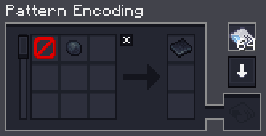
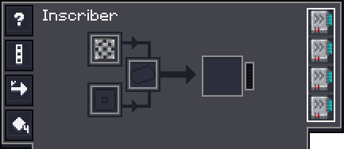
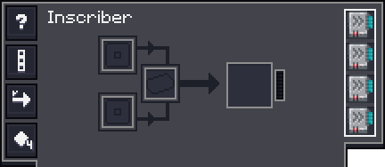
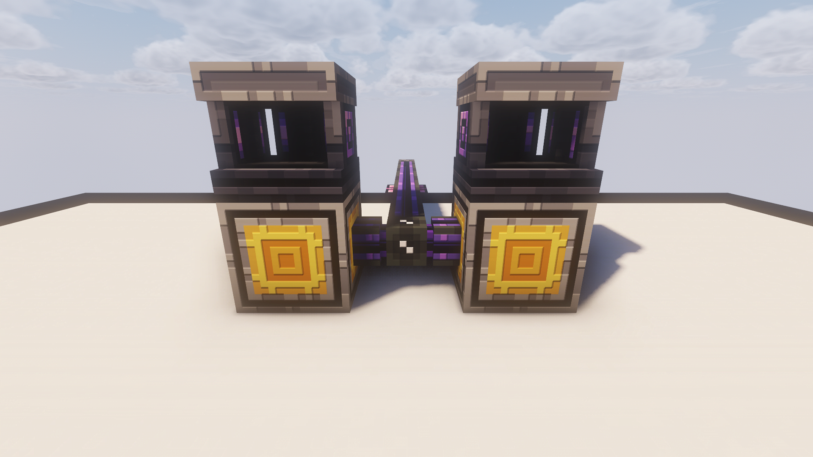
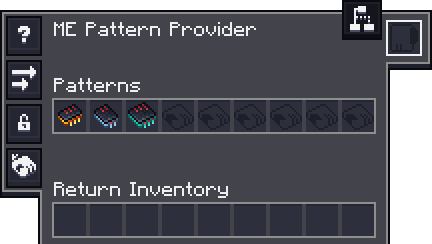

# Inscribers

Here you'll find some example setups for automating Inscribers.

---

## Easy Setup using AE2

This setup is incredibly easy, because it takes almost **no effort** to set up and is technically **infinitely expandable**.
A drawback is that it takes quite **a lot** of Channels if you want to scale it up.

### Items required

??? list "Items required"
    - [ ] 2x Inscribers
    - [ ] 2x Pattern Providers
    - [ ] 1x Universal Press
    - [ ] Patterns
    - [ ] AE2 Cables

### Patterns
For the **Circuit Patterns**

!!! warning "Remove the **Inscriber Press** if you copy the recipe from EMI!"

For the **Processor Patterns** copy straight from EMI. You don't have to edit anything

### Inscribers
For the Inscriber making the **Circuits** add a **Universal Press**.

For the Inscriber making the **Processors**.

??? info "Using Extended Inscribers"
    - If you'd rather use **Extended Inscribers**, make sure they are locked to "Stack to 1"
    - Make the Pattern so that **Batches of 4** get made each time. `Middle-Click` to change the amount

Place two inscribers, one with **Universal Press** and one **without**

!!! warning "Always make **sure** that you have auto-export through any extraction side enabled"

### Pattern Provider
For the Pattern Provider **with** the Press

For the Pattern Provider **without**

### Expansion
You want to expand the setup?

- You can add up to **4 Inscribers** around a **single** Pattern Provider
- **Repeat** all the steps above and make a **second** setup. AE2 will use **both** for autocrafting

---

> Applied Energistics 2 | [CurseForge](https://legacy.curseforge.com/minecraft/mc-mods/applied-energistics-2)
