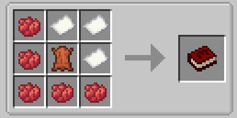
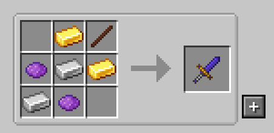
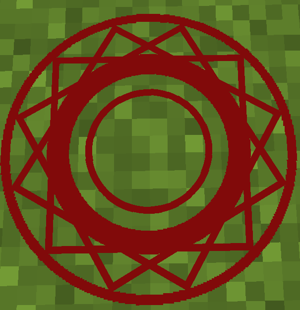
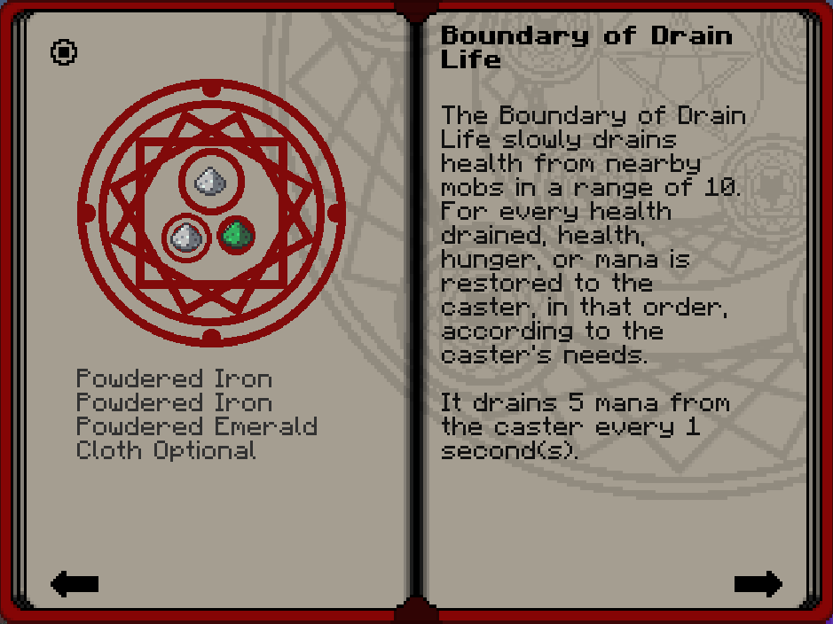
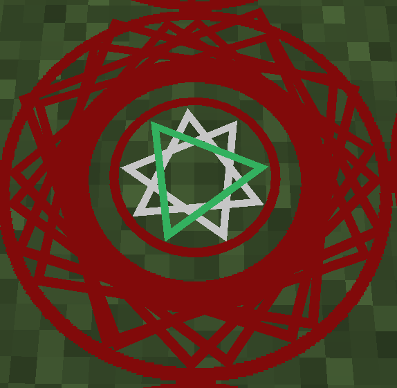

# Mahou Tsukai

Mahou Tsukai Morgan and You, **Originally created by Xarrah, BigFire, & Ultramega**



### Set your keybinds for `Draw Mahoujin` ( _mine is set to `numberpad 3`_)




### Craft a Dagger ( _From Mahou Tsukai_)

1. Use the dagger (hold in main hand and right click anywhere) to inflict ‘Bleeding’ (lasts 15 seconds)
2. Quickly slap the hotkey you’ve assigned your ‘Draw Mahoujin’ keybinding to

This will create a Mahou blood projection!

**For each Boundary of Drain Life, you will need:**

* 2 Powdered Iron
* 1 Powdered Emerald (From **MAHOU**! NOT DUSTS)



### Discover Blood Projections

Right click the blood projection with the two Powdered iron, and one powdered emerald. Then right click to activate

 



### Notes

> Fastest to set up is probably durability drain, where you cycle a bunch of low tier gear/tools across a bunch of chests, and set your storage system to keep them in stock (or pipe them out right before they break to a diamond anvil) - **BigFire**
>
> another one is the popular life drain with mob farm. you’d probably want 20-40 of these circles down and a really quick spawner. need good garbage collection and xp collection for this else it’ll lag/crash server. also not so good for server performance - **BigFire**
