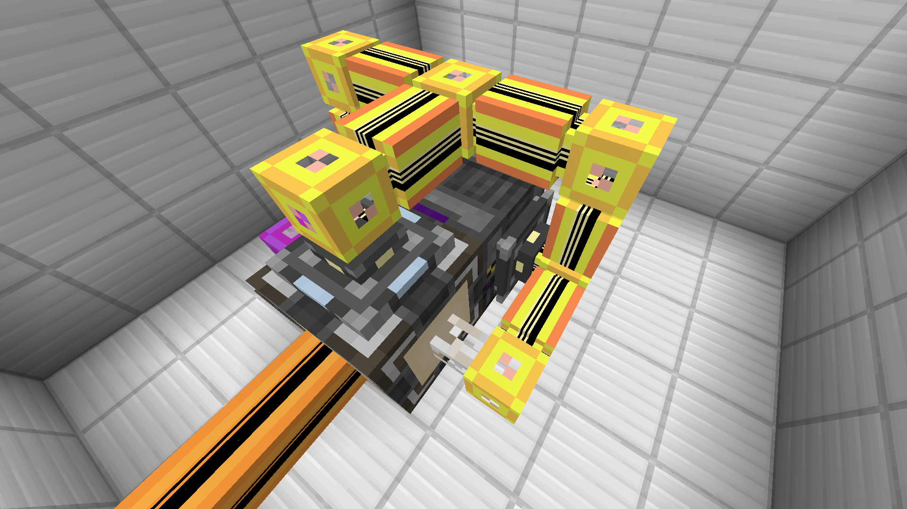
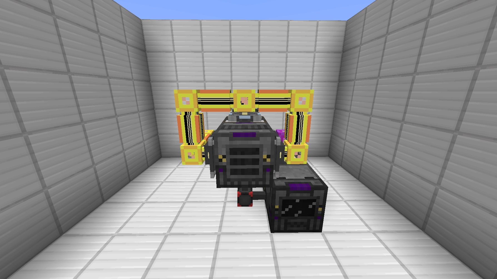
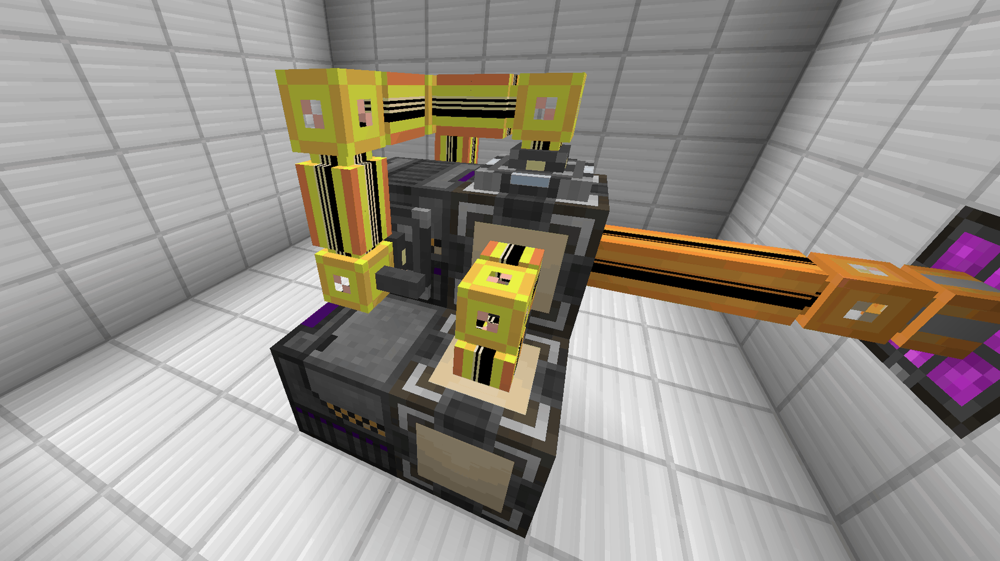
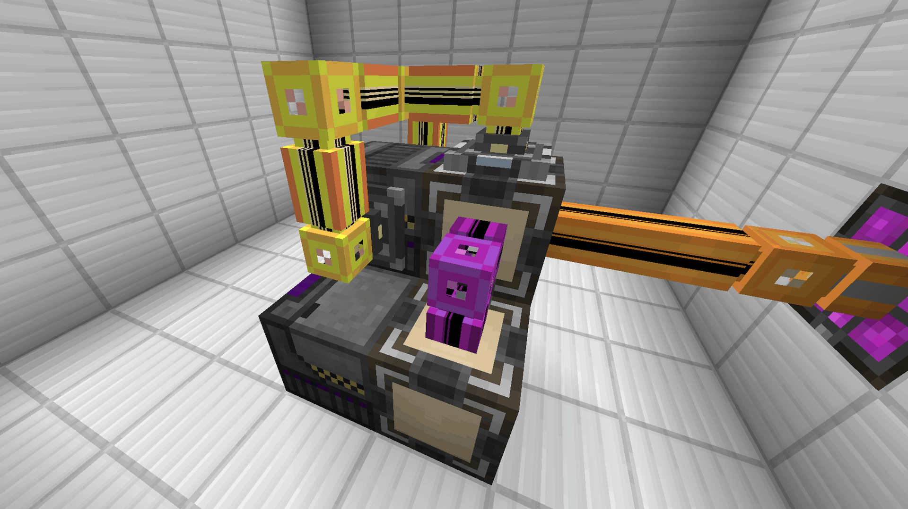
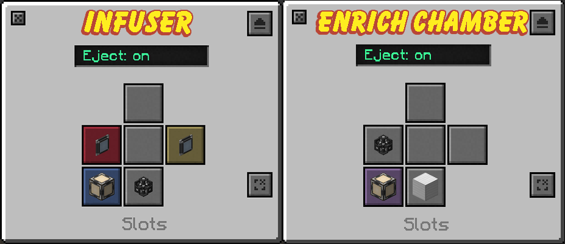
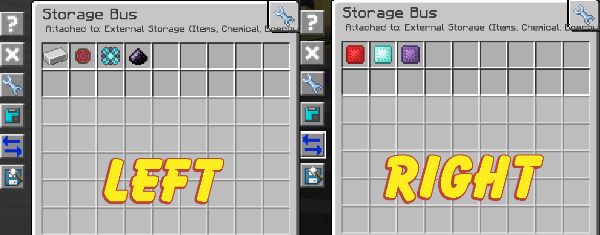
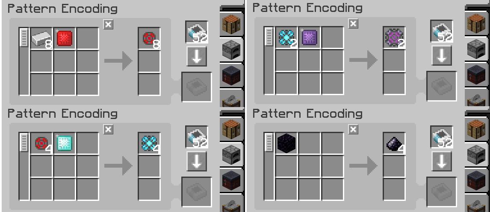
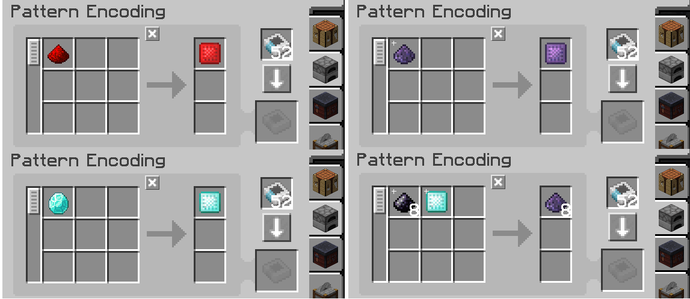
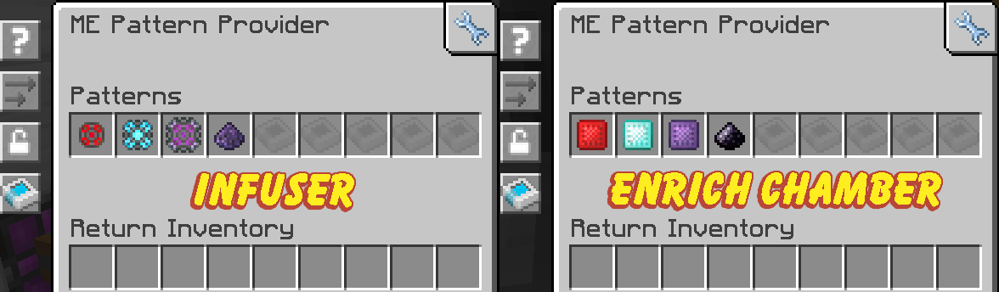

# Mekanism

## AE2 Mekanism Infuser Auto-Crafting

Using **ME Pattern Providers**, we can fully automate the **Metallurgic Infuser** (Left) and **Enrichment Chamber** (Right). This setup will only use 2 channels of your main network.

**Materials**

* 1x Metalluric Infuser (higher the level, the better)
* 1x Enrichment Chamber (higher, the better)
* 1x Quartz Fiber
* 8x AE2 Cables
* 2x ME Pattern Provider (Block form)
* 1x ME Interface (Panel form)
* 2x ME Storage Bus
* 8x Blank Patterns


Do you have Refined Obsidian automated already?

You can skip the **Obsidian Dust** filter on the left storage bus and the **Refined Obsidian Dust Pattern** and instead make a processing pattern to turn **Refined Obsidian Ingots** into **Refined Obsidian Dust** and put that in **Pattern Provider** connected to a **Crusher**.


### Building and Configuring



### Place the Metallurgic Infuser

Put down your **Metallurgic Infuser** and place an **ME Storage Bus** on both sides of the infuser.



### Add the pattern provider, interface, and quartz fiber

Place an **ME Pattern Provider** right behind the infuser and put an **ME Interface** on **top**, then place a **Quartz Fiber** on the side.



### Connect the AE2 devices

Place **7 AE2 cables** (Yellow in the example) connecting _all_ AE2 devices. The orange cable connects to your main AE2 network.




### Add the Enrichment Chamber

Adjacent to the Infuser, place an **Enrichment Chamber** and a **Pattern Provider** behind it and place a cable connecting **both** pattern providers.

If you’re using the same colored cables, place a **Cable Anchor** between them or use a different color.




### Set the machine inputs and outputs

Set the **Infuser** & **Enrichment** inputs/outputs like the images below.

The **Infuser** will input items on the left (Red Slot) and Extra Items on the right (Yellow Slot) while the **Enrichment Chamber** will input/output the back (Purple).



### Configure the storage bus filters

For the **ME Storage Buses** item filters have **Iron**, **Infused Alloy**, **Enriched Alloy**, and **Obsidian Dust** on the _left_ side and **Enriched Redstone**, **Diamond**, and **Obsidian** on the _right_.




### Processing Patterns

Now, we’ll encode the **Processing Patterns**. These patterns are made so there will be a _(essentially)_ 0% chance of clogging the Infuser due to leftover materials.


Make sure to set the patterns to **Process** (Furnace icon) instead of **Crafting** (Crafting Table icon).




**Infuser Patterns**

* 8 Iron + 1 Enriched Redstone = 8 Infused Alloy
* 4 Infused Alloy + 1 Enriched Diamond = 4 Enriched Alloy
* 2 Enriched Alloy + 1 Enriched Obsidian = 2 Atomic Alloy
* 1 Obsidian = 4 Obsidian Dust




**Enrichment Chamber Patterns**

* 1 Redstone = 1 Enriched Redstone
* 1 Diamond = 1 Enriched Diamond
* 1 Refined Obsidian Dust = 1 Enriched Obsidian
* 8 Obsidian Dust + 1 Enriched Diamond = 8 Refined Obsidian Dust




Then you’ll put patterns in each pattern provider as shown below.

Make sure to give both machines power and to enabled `Auto-Split`.

> Mekanism | [CurseForge](https://legacy.curseforge.com/minecraft/mc-mods/mekanism)
