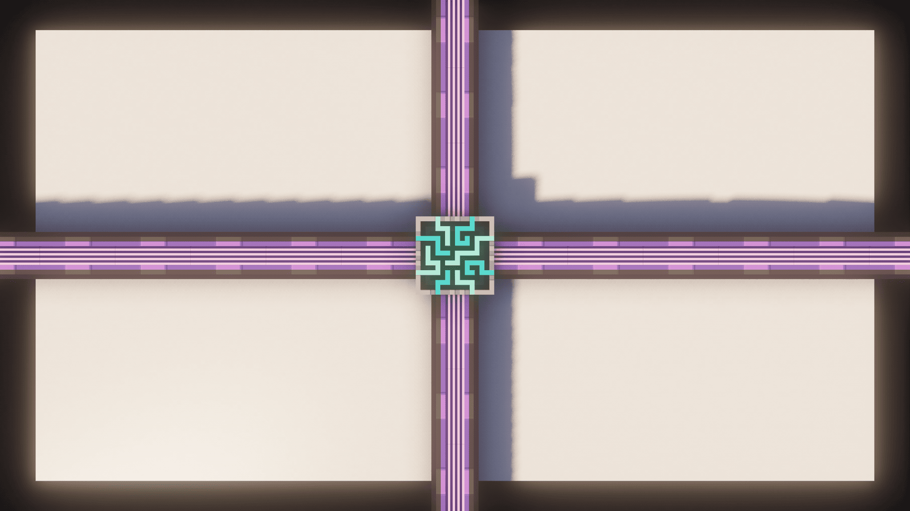
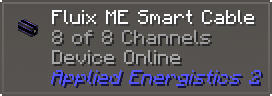
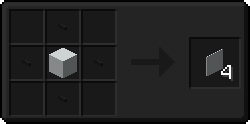
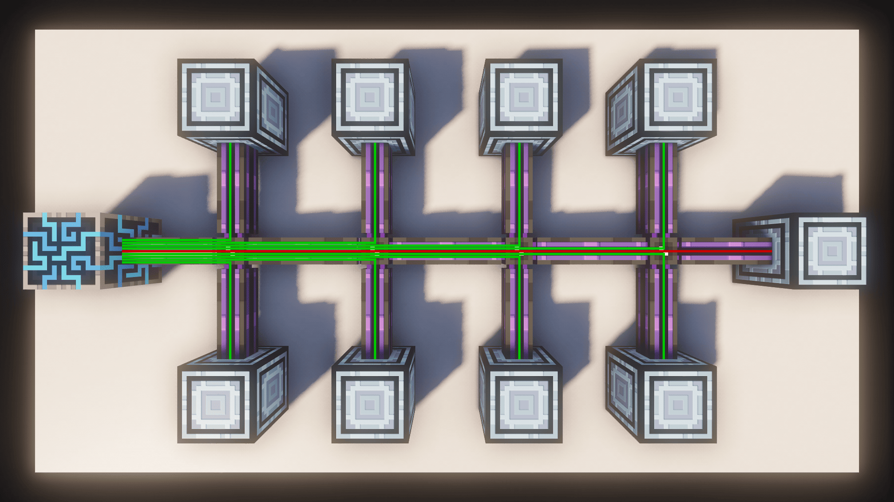
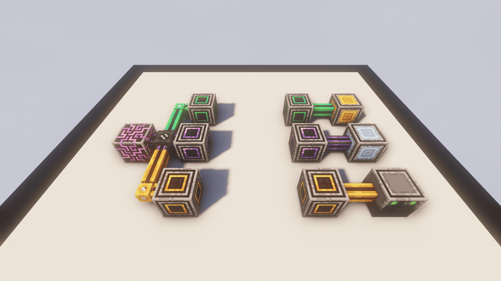
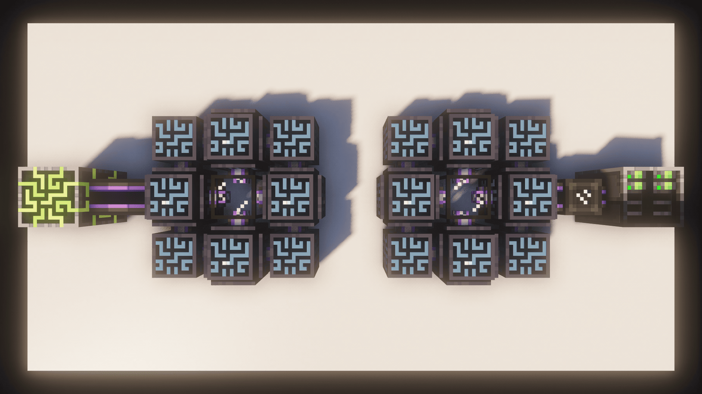

# Channels

Here, I’m going to teach you all about **Channels**, how to **wirelessly** move them, as well as how **P2P** works.

***

## Obtaining Channels

To even get some Channels, you’ll need the **ME Controller** which will provide you with **32 Channels** per face.

### Ad-Hoc Network

You can have a Network **without** a controller, but you can only have a maximum of **8 Devices** in it. Such a network is commonly referred to as an **Ad-Hoc-Network**. You’ll need to supply power to it through somthing like the **Energy Acceptor** or the **Crystal Resonance Generator**, a device that can directly connect to AE2 Cables and produces a small amount of free Energy.

***

## Moving Channels

To get your channels to where you want, you’ll obviously need some **Cables**. There are **Small Cables** which carry **8 Channels** and **Dense Cables** which carry **32 Channels**.

| Name                | Channels | Shows Channel Usage |
| ------------------- | -------- | ------------------- |
| Glass Cable         | 8        |                     |
| Covered Cable       | 8        |                     |
| Smart Cable         | 8        |                     |
| Dense Covered Cable | 32       |                     |
| Dense Smart Cable   | 32       |                     |

### Internal

Full Block Devices, like the **Interface** or the **Pattern Provider** can move up to **8 Channels** through them, acting as a **small Cable**.

### Cable Variants

Additionally, there are also a handful of **subcategories** of cables.

* **Covered Cables** are purely visual and offer no gameplay advantage.
* **Smart Cables** will display the **Amount of Channels** currently used at the top of the screen. (Required is WAILA / TOP / Jade / etc.)

### Colored Cables

All Cables are available in **17 different Colors**, all vanilla colors and **Fluix**, which is the “default” color.

* **Colored Cables** will **not** connect to each other.
* **Fluix Cables** will connect to **any** cable.
* To completely prevent cables connecting to each other, use **Cable Anchors**.

### Hiding Cables

You can hide Cables using **Facades**. Surround any block with **Cable Anchors**.

### Moving Power, but not Channels

To power something without giving it **Channels** use a **Quartz Fiber**.

***

## Channel Usage

Every device connected to your **ME Network** will need a **Channel** to function. If you don’t have enough Channels on a Cable, the device will no work.

Imagine **Channels** as **USB-Cables**.

* You have a bundle of **USB-Cables**. (ME Cable)
* You get those Cables from your **PC**. (ME Controller)
* Each Device you plug in, needs one **USB-Connection**. (one Channel)
* If you run out of **USB-Connections** you still have your Bundle, but no more connections. (No more channels on the cable)

***

## Wirelessly moving Channels

When it comes to moving Channels **without** Cables, you have two options.

### Wireless Connector (added by ExtendedAE)

The **ME Wireless Connector** can move up to **32 Channels** over a short distance and can also be **colored**. They use an **exponential amount** of **Energy** for every block and they do **not** work **cross-dimensionally**. They need to be connected via the **ME Wireless Setups Kit**.

### Quantum Ring

The **Quantum Ring** is a **3x3x1 Multiblock** that can transfer up to **32 Channels** over an **infinite distance** and also functions **cross-dimensionally**. To link two **Quantum Rings** you will need **Quantum Entangled Singularities**, of which you get two by **blowing up** an **Enderpearl** and a **Singularity**.

> Applied Energistics 2 | [CurseForge](https://legacy.curseforge.com/minecraft/mc-mods/applied-energistics-2)
