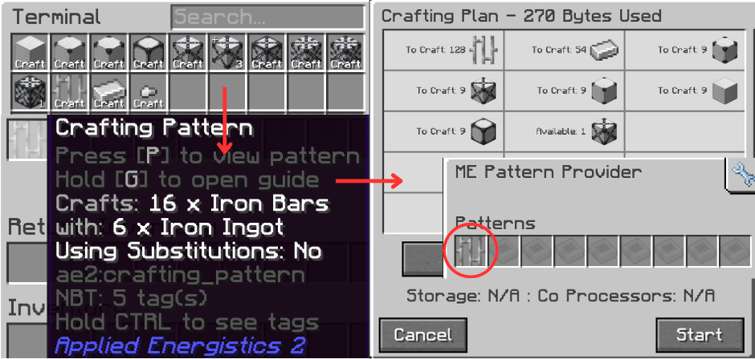
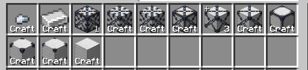

# How Does Bulk Cell Works

Disclaimer

This subchapter may not explain the code logic 1:1, it only gives you a rough idea on how it works.

**The Compression Card & Decompression Module is mandatory** for the network when autocrafting. It enables the network to do compression/decompression, otherwise your Bulk Cells are just a **fancy infinite chest**

## Compressing/Up Crafting

It has been mentioned before that **Bulk Cells can compress items automatically**.

With the analogy of having to make patterns to craft `nuggets` to `ingots`, then `ingots` to `blocks`, then `blocks` to `1x blocks` etc. this can add up a lot in a **pattern provider**.

Instead, we can use **Compression Card** inside bulk cells to enable compression. This will **allow the network** to automatically make a _ghost-pattern_ that handles **all compression**. Yes, _**everything**_. From as small as nuggets, up to 9x variants of compressed block (if possible).

## Decompressing/Down Crafting

Borrowing the previous analogy, we also want to down craft those `1x blocks` back into `blocks` and smaller. The bulk cells also **handle decompressing similar to compressing**.

For example crafting 9 `iron blocks` but we only have `3x compressed iron blocks`

The system also makes a _ghost-pattern_ that handles `crafting 3x iron into 2x`, `2x into 1x` until it reaches the desired amount from the system.

This is what I meant

Even though the system has enough iron ingots (in form of a compressed blocks), when we request **128 Iron Bars** the system needs to decompress the `5x compressed iron block` into `ingots`. We **do not** have any patterns related to this decompression. Hence the name, **Ghost Patterns**.

But WHEN does it do the compression/decompression?

Generally it happens **when the network interacts with item amounts**. This includes, but not limited to:

1. Items **entering and leaving** the network
2. **Crafting Requests** from automation/player-requests for certain compressed item variants
3. You, the player, directly taking out/dumping items in the **Terminal**

For regular players (meaning Me, & **YOU**), you don’t need to really worry about all of this. Don’t sweat it :)

If you insert/extract items within the network, it will always get **unified with other compressed variants** (when possible). Then the system will show the **highest compressed form possible** in the network (here, it’s 1 `9x iron` & 3 `5x iron`)

## Regarding Energy Usage

It is also worth noting that **every item/gas/fluid/etc. movement inside an AE2 network requires energy** and it’s relative to the amounts moved per tick. Compressing/Decompressing **is no exception**. In rare cases, you will stumble upon **not enough network buffer** when doing any item compression, oftentimes resulting in a **failed Crafting Request**.
