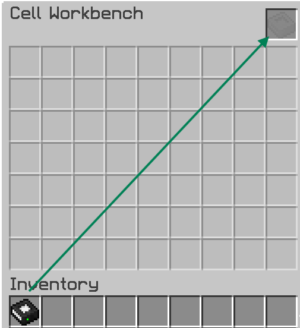
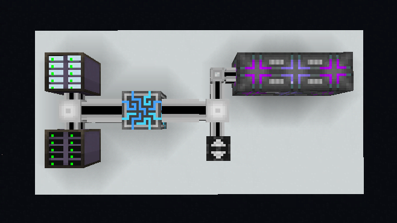

# How To Use?

Here comes the main dish

Up to this point, you should already know what bulk is and why it matters as well as the **items required** for it (refer to the requirements in the [Concepts](concepts.md) Chapter)

## Partition



You need a Cell & Cell Workbench




Move your cell into the slot on top-right corner




Move your desired items to partitions into the 7x9 empty slots (it’s only 1 for Bulk Cells). You can drag from **inventory or JEI/EMI**


You can do `Shift` + `Left Button` to quickly assign the items into the empty slot.




This step will vary, depending on what cell you used. Generally this is when you install **Card Upgrades** for the partitioned cells. Mainly **Overflow Destruction** and/or **Equal Distribution**

Bulk Cells only accept **Compression Cards**

They can’t do any compression if there’s no compression card installed

 

The `Shift` + `Left Button` trick also applies when installing card upgrades



## Basic Functional Setup

With the importance of **Decompression Module** & **Priority System**, at the very least your network should look like this.

* Top-left drive bay is for ‘General Storage’ with the lowest/lower priority
* Bottom-left drive bay is for ‘Bulk Storage’ with \*\* the highest priority\*\*/higher than the general storage’s
* **Decompression Module** is crucial to allow this network to decompress items stored inside a bulk cell
* Because they make a _ghost-pattern_, a basic **CPU multiblock** required (otherwise you can’t decompress things)

> Applied Energistics 2 | [CurseForge](https://legacy.curseforge.com/minecraft/mc-mods/applied-energistics-2)
>
> MEGA Cells | [CurseForge](https://legacy.curseforge.com/minecraft/mc-mods/mega-cells)
>
> ExtendedAE | [CurseForge](https://legacy.curseforge.com/minecraft/mc-mods/ex-pattern-provider)
