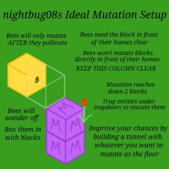

# Resourceful Bees

With extra centrifuge tiers, up to creative, you’ll be processing combs a long time. We highly recommend you make the in game bee guide called the beepedia, bee quests and of course the manual, fifty shades of bees (in your akashic tome) for more info.

## Finding Bees

Make some bee jars for your adventuring. When you’re out in the world, jar some bees. Keep an eye out for certain bees like the cobbee, oreo bee, and beediddy!

## Bee Mechanics

You can either craft a hive or get one from out in the world. Bees will anger if they are inside or see you mine a hive. You can smoke a hive with a smoker or campfire underneath to calm the bees. Bees will retreat to thier home if its raining or at nighttime. Bees need a specific flower to pollinate before they will produce combs. Once a hive reaches honey level 5 you can use a scraper to harvest the combs.

### Mutating Bees

* Dragon Egg
* All The Modium
* Vibranium
* Unobtainium
* Soul Lava
* Netherite
* Wither
* Dragonic
* Dragonic
* All The Modium
* All The Modium
* Vibranium
* Vibranium
* Unobtainium
* Unobtainium
* Soul Lava
* Gold
* Netherite

[Bee Breeding Chart](https://miro.com/app/board/o9J_lLqaxQ4=/?invite_link_id=68812950259)

## Resourceful Bees Tutorial (ATM6)

[CruzaComplex](https://www.youtube.com/channel/UCyZrtN9oAsg0B_Ll7jGk0ow?embeds_referring_euri=https%3A%2F%2Fallthemods.github.io%2F)



## All The Mods 6 Ep. 8 Resourceful Bees Automation - YouTube

[ChosenArchitect](https://www.youtube.com/channel/UClmdJ2bwqHjZONP9rIK7geA)



> Resourceful Bees | [CurseForge](https://legacy.curseforge.com/minecraft/mc-mods/resourceful-bees)
